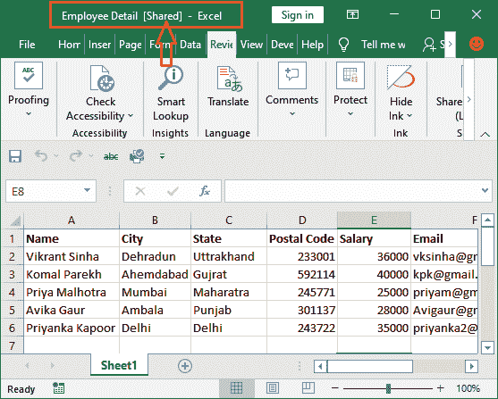

# 如何共享 Excel 工作表？

> 原文:[https://www.javatpoint.com/how-to-share-excel-sheet](https://www.javatpoint.com/how-to-share-excel-sheet)

微软 Excel 是目前最常用的管理工作表数据的软件之一。有时，人们希望与其他用户共享存储在 Excel 工作表中的数据。当人们想要与其他用户共享数据时，可能需要共享 Excel 工作表。他们还可以使用电子邮件服务与用户共享工作表。

在本章中，我们将分享与其他用户共享 Excel 工作表的不同方法。所以，他们也可以使用相同的数据。虽然电子邮件是与他人共享工作表的好方法，但我们也有其他方法。

## 在 Excel 中共享文件

Microsoft Excel 2010 和更高版本使工作簿的共享和协作变得容易。通过与其他用户共享工作簿，当您向他们提供使用权限时，他们也可以使用同一工作簿。共享的文件所有者不仅允许其他用户看到数据，还允许编辑和删除数据。

共享工作簿可以节省用户在多个版本中跟踪工作表的时间。

在使用 Excel 共享功能之前，Excel 用户必须发送电子邮件附件才能与其他用户共享文件。电子邮件附件不允许在 Excel 文件中实时更新。它还会创建文件的多个副本和同一文件的多个版本，因为不同的用户使用不同的版本编辑文件。所以，最终很难组织所有的练习册。

**通过 Excel 共享工作簿的优势**

当通过 Excel 软件而不是电子邮件共享工作簿时，用户可以访问共享的完全相同的文件。这意味着 Excel 允许您和员工编辑同一个工作簿，而不需要同一文件的多个版本。

### 本章中的主题

现在，您可以通过本章中的以下主题来学习与用户共享工作表:

*   [共享工作簿时共享什么？](#What)
*   [多用户共享 Excel 工作簿](#Share)
*   [在查看选项卡](#Add)中添加共享工作簿命令
*   [停止共享工作簿](#Stop)

共享工作簿并不像用户想象的那么容易。这是因为共享工作簿命令在功能区中可能不直接可用/不可见。不用担心；我们会详细说明，以免你受苦。

## 共享工作簿时共享什么？

共享 Excel 工作簿时，Excel 用户必须知道共享了哪些数据。记下以下几点:

1.  当工作簿与其他用户共享时，不能共享表或映射。因此，在共享工作簿之前，请删除 XML 映射。
2.  文件的所有者需要禁用一些隐私设置，以便与您共享文件的用户可以查看和编辑其中的数据。
3.  **禁用隐私设置**
    1.  Excel 用户可以从**文件> Excel 选项>信任中心>信任中心设置中禁用设置。**
    2.  在**信任中心下，点击信任中心设置>隐私选项。**
    3.  取消选中【保存时删除属性中的个人信息】复选框。

## 为多个用户共享 Excel 工作簿

本章的这一节将帮助您与多个用户共享 Excel 工作簿。将文件保存在本地网络位置，以便共享该文件的其他用户可以访问该文件并对其进行更改。

共享者可以跟踪文件中数据的变化，也可以接受或拒绝这些变化。

执行以下步骤与多个用户共享工作簿:

**第一步:**打开要与 Excel 其他用户共享的工作簿。我们有以下工作表，将与其他用户共享。

**第二步:**导航至**查看**选项卡，点击**共享工作簿**按钮*共享*组部分。

#### 注意:如果您的 Excel 在“审阅”选项卡中没有“共享工作簿”选项，请在前进之前，在“审阅”选项卡中执行“添加共享工作簿”命令。

**第三步:**将出现*共享工作簿*对话框。在此对话框中，您可以在“编辑”选项卡中查看当前谁打开了此工作簿。

此外，选中“编辑”选项卡上出现的复选框。

**第四步:**现在，在打开的对话框中切换到**高级选项卡**并选择设置，无论你想更改什么都可以继续跟踪更改，点击**确定。**

**第五步:**最后，将文件保存在你的本地网络位置，其他用户允许后可以访问。点击**确定**继续保存文件。

您可以简单地使用 **Ctrl+S** 键，然后在本地计算机中选择一个位置，将文件保存在那里。这是保存文件最快的方法。

**第 6 步:**如果所有步骤都执行正确，顶部工作簿名称旁边会出现一个单词**【共享】**。

共享文件时，它将如下图所示:

现在，您和与您共享文件的人可以同时处理同一个文件。更改也会反映出来，您(文件的所有者)可以接受或拒绝更改。一旦进行了更改，您也可以停止共享工作簿。

## “审阅”选项卡中的“添加共享工作簿”命令

默认情况下，共享工作簿选项不会添加到 Microsoft Excel 功能区中。在功能区的任何地方都找不到它，甚至在“审阅”选项卡中也找不到它。用户必须明确地添加它。

您的 Excel 可能还没有在功能区中添加“共享”命令。可以通过自定义 Excel 功能区来添加。

按照给定的步骤自定义功能区，添加**共享工作簿**选项:

**步骤 1:** 右键单击功能区上的任意位置，选择**自定义功能区。**

**第二步:**一个 Excel 选项面板将打开，在下拉列表的选择命令下选择**所有命令**。

将出现一个新的选项列表，从中将**共享工作簿**命令添加到选项卡。

**第三步:**首先，为这个命令创建一个新的组，添加到一个选项卡中。例如，我们将在*评论*标签内创建一个名为*共享*的新群组。

选择或展开**查看选项卡**，点击选项卡列表下方的**新建组**按钮。

**步骤 4:** 添加了一个默认名称为(新组(自定义))的新组。将其重命名为共享。

**第五步:**选中后点击**重命名**按钮，更改组名。

**第 6 步:**输入新名称，点击**确定。**

**第七步:**继续选择共享组。现在，从命令列表中选择**共享工作簿**命令，点击**添加**按钮。

**步骤 8:** 请注意，该命令位于“审阅”组中。现在，点击该面板上的**确定**。

**步骤 8:** 将选项卡控件更改为**查看**选项卡，并看到共享工作簿(旧版)命令显示在最后一个名为*共享的组中。*

## 如何停止共享工作簿

一旦工作完成，其他用户需要做的所有编辑都完成了，文件的所有者就可以停止共享工作簿。您现在想知道用户如何停止共享工作簿。它要么遵循相同的步骤，要么遵循其他任何步骤。

Excel 用户现在会发现如何停止共享工作簿。您可以看到具有“工作簿立即打开”列表的人的列表。您可以从此处删除该用户。您可以在“共享工作簿”选项的“编辑”选项卡中找到此选项。

### 方法 1:删除用户

当用户想要从共享列表中删除特定用户时，此方法很有帮助。您可以从共享列表中删除一个或所有用户。

**停止共享工作簿的步骤**

**第 1 步:**打开上一步的共享工作簿。导航到**查看**选项卡，并单击*共享*组部分中的**共享工作簿**按钮。

**步骤 2:** 将打开*共享工作簿*面板，在该面板上选择您要在编辑选项卡中删除的用户，并点击**删除用户。**

**“除了文件所有者之外，您可以按照相同的步骤删除其他用户。这意味着共享文件的用户不能从共享列表中删除自己。”**

**步骤 3:** 工作簿将停止与您删除的用户共享。假设你试图让自己远离分享。

**第 4 步:**对除自己以外的其他用户重复同样的步骤，一次删除访问权限。取消标记**允许多个用户同时更改**以停止共享。

如果您在此面板上看不到此复选框，您必须从工作簿中删除保护。您的工作簿受到保护，这就是为什么您看不到此复选框的原因。所以，先去掉保护，再往前走。

**第五步:**最后，点击共享工作簿面板上的**确定**。与该文件共享的所有用户现在都已被删除。

### 方法 2:使用取消共享

我们还有一种方法可以取消共享工作簿。你可能会发现比上一个更容易。取消共享是 Excel 的一个命令，可以在*保护*组下的*查看*选项卡中找到。

当您想要从共享模式中移除工作簿时，此方法有效。这意味着当您取消共享工作簿时，它将停止在您共享的用户之间共享。完成取消共享共享工作簿的步骤。

**第一步:**打开共享工作簿，进入**查看**选项卡。

**第二步:**在**保护**组内，点击**取消共享工作簿。**

**步骤 3:** 您的工作簿已取消共享。您不会在工作表顶部的工作簿名称附近看到[共享]。

我们更喜欢这种方法来取消共享工作簿，因为它比前一种方法更容易。

## 使用一个驱动器共享工作簿

Excel 的内置功能使用户可以使用 **OneDrive 轻松共享和协作工作簿。**在早期版本的 Excel 中，共享在 Excel 中是不可能的。

在使用 Excel 共享功能之前，Excel 用户必须发送电子邮件附件才能与其他用户共享文件。电子邮件附件不允许在 Excel 文件中实时更新。它还创建文件的多个副本和同一个文件的多个版本，因为不同的用户使用不同的版本编辑文件。所以，最终很难组织所有的练习册。

当通过 Excel 而不是电子邮件共享工作簿时，用户可以访问共享的同一文件。这意味着 Excel 允许您和其他人编辑同一个工作簿，而不需要同一文件的多个版本。

请记住，您想要共享的工作簿必须保存到 OneDrive(云端)。

**共享工作簿**

**第一步:**打开想要共享的工作簿，点击**文件**选项卡，进入 Excel 后台查看。

**第二步:**在后台视图中，从左侧面板点击**分享**。

**第三步:**将出现**共享**面板。如果您已经在 OneDrive 上保存了文档，请继续下一步。

如果您的工作簿没有保存在 OneDrive 上，请使用您的 Microsoft 帐户登录并在那里保存您的工作簿。

**第四步:**系统会自动提示您将文档保存到云端。点击这里的**存到云端**。

**第 5 步:**在此选择 **OneDrive** ，然后登录到您的 Microsoft 帐户，并将工作簿保存在上面。

**步骤 6:** 文件保存到云端后，导航回共享面板。

**步骤 7:** 在 OneDrive 上保存文档后，单击“共享”面板上的**与人共享**按钮。

**第 8 步:** Excel 将返回工作表，工作表窗口一侧将出现一个共享面板。

在此共享面板窗口中，您可以邀请他人共享该文档，查看有权访问该文档的人，并设置他们是否只能查看或编辑该文档的权限。你可以给个人访问权。

## 通过电子邮件共享文件

与用户共享文件是一种经久不衰的方法。当用户没有找到所有其他容易共享 Excel 文件的方法时，他们可以选择这种方法。电子邮件是一种与其他用户共享任何附件(图像、文件、zip、rar)文件的旧方法。

Excel 用户需要将文件作为附件发送给他们想要与之共享文件的其他用户。另一方面，这些用户需要下载文件才能使用它。通过这种方式，文件共享是通过电子邮件完成的。

* * *