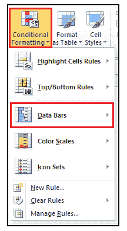
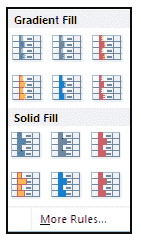
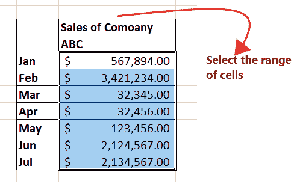
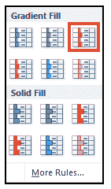
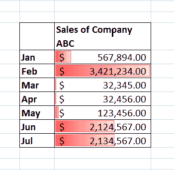
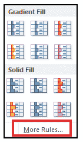
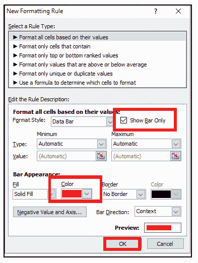
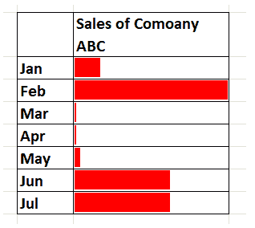

# Excel 中的数据栏

> 原文：<https://www.javatpoint.com/data-bars-in-excel>

**Excel 数据条**是一个非常强大的功能，可以可视化一系列单元格中的值。根据某些条件，它可以帮助您突出显示工作表中的单元格或数据区域。为了使其更清晰可见，建议将列中的栏变宽。

本教程解释了 Excel 数据栏功能的基础。您将发现如何在 Excel 中添加不同的数据条，如何在任何版本的 Excel 中编辑数据条。

## 什么是数据条？

> Excel 数据条功能是一种条件格式选项，它将单元格内的数据和条形图结合在一起。此工具指示选定值的百分比或选定数据在单元格内条上的位置。

excel 中的数据条属于允许我们插入条形图的条件格式功能，但使数据条不同于条形图的主要原因是数据条被插入到单元格内，而不是不同的位置。条形图被插入到新位置，它们是 excel 的对象，但数据条位于单元格中，不是 excel 的对象。

在下表中，我们列出了在竞争性考试中获得不同分数的 7 名学生。使用条件格式数据条，我们在单元格中插入了数据条来突出显示分数。

如上图所示，单元格值越高，数据条线越大，单元格值越小，数据条越小。这样，用户可以很容易地可视化数字数据值，即使他们可以立即区分负数，因为负数的条远离轴。

Excel 中的数据栏条件格式功能可以从“条件格式”菜单中访问，通常列在功能区栏的“主页”选项卡的“样式”组中(参见下图)。

## 数据栏填充类型

一旦进入条件格式数据栏部分，Excel 将选择一个显示两组数据栏选项的辅助窗口，即渐变填充和实体填充。两者都有独特的功能，让你的酒吧看起来更有视觉吸引力。

*   **实心填充:**如果数字数据值隐藏在单元格中，并且只显示条，用户可以选择实心填充数据条选项
*   **渐变填充:**如果单元格的数字数据值可见，用户会选择渐变填充数据条选项。渐变末端的颜色越浅，单元格内的数字数据值越易读。

#### 注意:如果您要插入数据条和数字数据值，请将数字更改为粗体，这样它们更易读。

如果以上选项都不符合您的要求，您可以点击 ***【更多规则】*** 选项，并创建一些条件来插入数据条。使用 ***【更多规则】*** 还可以创建自己的自定义条形图，带有 2 色条或 3 色条，添加边框，以及执行其他不同的样式选项。

## 示例#1 -在您的 Excel 工作表中实现数据条以及下表中的值

|  | 中航公司的销售 |
| 一月 | $ 567,894.00 |
| **2 月** | $ 3,421,234.00 |
| **Mar** | $ 32,345.00 |
| **4 月** | $ 32,456.00 |
| **5 月** | $ 123,456.00 |
| **君** | $ 2,124,567.00 |
| **圣诞节** | $ 2,134,567.00 |

Excel 中的数据栏有助于用户将数字可视化，并帮助他们节省时间。它们在 Excel 工作表中非常容易实现。我们将逐步介绍添加数据条和值的过程:

**第一步:选择单元格或单元格范围**

在 Excel 工作表中，选择要为其添加数据条的数据区域。不同的是，在我们的例子中 ***我们选择了数据单元 D5 到 D11。*T3】**

请参考下图:

**第二步:点击条件格式高亮单元格规则**

1.  转到 Excel 功能区的**主页**选项卡。单击 Excel“样式”组中列出的**条件格式**。
2.  它将打开以下选项窗口；点击**数据栏**选项。
    T3】

**第三步:选择数据栏填充类型**

1.  单击数据栏后，会出现另一个显示填充类型的辅助窗口。
2.  由于我们想使用渐变颜色选项，所以我们将选择**渐变填充**类型，并选择某个颜色选项。
    参考下图。
    

#### 注意:你也可以点击更多的规则，来编辑和格式化现有的数据条规则，条外观(颜色、大小、格式样式、值)根据它们的值格式化单元格等。

**第四步:数据条将被插入你的工作表**

在给定的月度销售报告 Excel 表中， ***所有单元格都将插入数据条，数据条的长度取决于它们的值。*T3】**

在下面给定的图像中查看结果输出:

哇哦！！数据单元看起来不错，视觉上更有吸引力。但是等等，我们有更令人印象深刻的图形，它显示了相应单元格内的数据条。在下面的教程中，我们将介绍更高级的示例。

## 示例 2 -在没有值的 Excel 工作表中实现数据条(只显示条，不显示数字)

**这里，我们稍微扭曲了一个问题。现在，我们将在您的月度销售报告表的单元格中插入不带值的数据条。我们将使用相同的 Excel 表格(参考上面的月度销售报告 Excel 表格)。**

在单元格内显示数据条并不是数据条技术的唯一部分；它有更多有趣的模块。在我们的例子中，因为我们不想看到值，而只想看到表格单元格中的数据条，所以我们可以选择只显示条，而不是同时显示条和数值。

要仅显示条形，您可以在 Excel 工作表中按步骤操作:

**第一步:选择单元格或单元格范围**

在 Excel 工作表中，选择要为其添加数据条的数据区域。不同的是，在我们的例子中 ***我们选择了数据单元 D5 到 D11。*T3】**

请参考下图:

**第二步:点击条件格式高亮单元格规则**

1.  转到 Excel 功能区的**主页**选项卡。单击 Excel“样式”组中列出的**条件格式**。
2.  它将打开以下选项窗口；点击**数据栏**选项。
    T3】

**第三步:选择数据栏填充类型**

3.单击数据栏后，会出现另一个显示填充类型的辅助窗口。

4.因为我们要求在问题中插入不带值的条。由于显示无值栏的直接选项不可用，因此我们将*点击**“更多规则”**选项。*

参考下图。

**第四步:选择无数值栏选项**

1.一旦您点击“更多规则”，它将选择“新格式规则”窗口框。

2.在“编辑规则描述”部分，您会发现“仅显示栏”复选框。用鼠标光标 ***在上面划勾。*T3】**

3.接下来，我们将从条形外观部分将条形的颜色更改为红色。

#### 注意:您可以自定义条形，使其在视觉上更有吸引力，但可以添加边框、更改颜色等。,

4.完成后，单击确定。

**第五步:Excel 会插入没有数值的数据条**

在给定的月度销售报告 Excel 表中， ***数据条将在没有数值的单元格中以纯红颜色实现。*T3】**

在下面给定的图像中查看结果输出:

***示例#3 -使用条件格式数据条表示数据工作表中的各种负数。*T3】**

**Excel 数据条在 Excel 工作表中也只能显示负数。在下面给出的表格中，我们有七个不同学生的考试分数，因为竞争性考试也有负分数，所以很少有学生也有负分数。**

| 学生姓名 | 考试成绩 |
| Rahul | Fifty-six |
| 瓦伦 | -6.00 |
| 喜马偕尔邦 | Twenty-one |
| 蒂娜（号外乐团成员） | Thirty-four |
| 杰克林 | Fifty-six |
| 出汗了 | Twenty-one |
| 穆罕默德 | -8.00 |

通过直接查看 Excel 数据，没有人能瞬间分辨出哪个学生在竞争性考试中得了负分。为此，您必须专注于工作表。我们要求突出显示负数，以便快速识别每次考试的分数。条件格式中的数据栏技术可以满足上述要求。

**第一步:选择单元格或单元格范围**

在 Excel 工作表中，选择要为其添加数据条的数据区域。不同的是，在我们的例子中 ***我们选择了数据单元 D5 到 D11。*T3】**

请参考下图:

**第二步:点击条件格式高亮单元格规则**

1.  转到 Excel 功能区的**主页**选项卡。单击 Excel“样式”组中列出的**条件格式**。
2.  它将打开以下选项窗口；点击**数据栏**选项。
    T3】

**第三步:选择数据栏填充类型**

1.  单击数据栏后，会出现另一个显示填充类型的辅助窗口。
2.  由于我们想使用渐变颜色选项，所以我们将选择**渐变填充**类型，并选择某个颜色选项。
    参考下图。
    

#### 注意:你也可以点击更多的规则，来编辑和格式化现有的数据条规则，条外观(颜色、大小、格式样式、值)根据它们的值格式化单元格等。

**第四步:数据条将被插入你的工作表**

在给定的分数图中， ***所有单元格将插入数据条，数据条的长度取决于它们的值。对于负值，图表将远离坐标轴绘制。*T3】**

在下面给定的图像中查看结果输出:

* * *