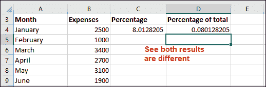
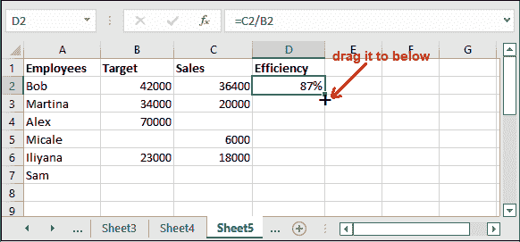

# Excel 中的合计百分比公式

> 原文：<https://www.javatpoint.com/formula-for-percentage-of-total-in-excel>

百分比计算是 Excel 中的一项基本任务。每次用户想知道做了多少工作。通过计算到目前为止完成的工作占总工作量的百分比，很容易找到它。本章基于在 Excel 中计算总百分比的公式。


你会发现百分比计算是一项必不可少的操作。要找到数据占总数的百分比，您应该知道它的公式。在本章中，您将了解公式，并学习如何计算存储在 Excel 工作表中的数据占总数的百分比。

**计算百分比的基本公式**

我们在数学中通常使用的计算百分比的基本公式如下:

```

=(part of work done/total work)*100

```

这个公式也可以在 Excel 中用来计算百分比。但是百分比和总数的百分比是不同的术语。所以，总百分比的公式是不同的。

**合计百分比公式**

总公式的百分比比百分比公式略有变化。下面是计算总百分比的公式-

```

=(part of work done/total work)

```

在这个公式中，完成的部分功除以总功，但不乘以 100。

**比如**一个月费用 3000(小区 A3)，总费用 24800(小区 B3)。因此，在应用总公式的百分比，即=A3/B3 后，它在对结果值应用百分比格式后返回 12%。

## 百分比的基本介绍

百分比是 Excel 用户在计算 Excel 数据上的百分比时可能需要的数学基本公式之一。百分比是用数学的基本运算(乘法和除法)来计算的，我们上面已经描述过了。

人们在日常生活中使用百分比计算。分数通过乘以 100%转换成百分比。这里，100%实际上等于 1。

## 计算总百分比的示例

我们在 b 栏有一个一年(1 月到 12 月)的差旅费清单，在这里，我们将计算每个月的费用百分比。在此之前，你需要费用的总和(总费用)，这样我们就可以计算总费用的百分比。


**第一步:**首先，我们计算所有月份的总和。为此，写出公式，求出 B16 单元格中给定月份的总和。

=SUM(B4:B15)


**第二步:**点击**进入**键，得到计算出的和，即 31200。


现在，计算第一个月的简单百分比和总额百分比。在 C 列中，我们将存储百分比结果，在 D 列中，我们将存储总百分比结果。

**第 4 步:**对于 1 月份，使用以下公式，其中 1 月份的金额除以总额。这个公式用于简单的百分比计算。

=(B4/B16)*100


**第五步:**点击**进入**键，从月总额中查看一月费用的贡献。它目前不是百分比形式。


**第六步:**现在，用下面的公式求出总数的百分比，看看它和简单的百分比有什么不同。

=B4/B16


**第七步:**点击**进入**键，查看一月费用占全年总额的比例。



目前，两个结果值都是十进制形式，而不是百分比。在计算了所有其他月份之后，我们稍后会将其更改为百分比。

现在，使用与其他月份费用相同的公式来计算百分比。或者按照以下步骤进行快速计算。我们将自动填充其他月费用的公式(直到第 15 行)。

### 将分母设为绝对

我们希望所有百分比计算的分母都是固定的，以便每个月的费用除以相同的总额。所以，我们想让分母成为绝对参考。为此，通过在分母行和列中添加$对公式进行一点修改。

公式中单元格引用前的$将固定该值。将$添加到公式后，公式如下所示:

=(B4/$B$16)*100


这里， **$B** 表示不重写列， **$16** 表示不重写行。$符号使值为绝对值。这是最重要的一步。所以，即使错了也不要忘记。

将百分比公式设为绝对值后，您将得到相同的结果。现在，把公式总分母的百分比也算出来。


现在，所有百分比计算的分母都是固定的。

### 计算其他月份的百分比

现在，我们将找出其他月份占总数的百分比。选择一月份(C4)的简单百分比和合计百分比单元格，并将光标放在单元格的右下角。

**第一步:**会出现一个加号(+)。将下面的+号拖到 C16 单元格。请注意，百分比是使用几个简单的步骤从 1 月到 12 月计算的。


**第 2 步:**您会注意到结果是以十进制值接收的，这是一个长数字。如果要将两位数后的值四舍五入，可以在 Excel 中轻松实现。


### 将小数更改为百分比(百分比格式)

我们已经计算了所有月份的总百分比，但它目前是长十进制数。我们希望将计算数据显示为百分比。

遵循一个小点击过程，将小数更改为百分比:

**第一步:**选择 c 列的所有计算值，然后点击 ***首页*** 标签内的**风格百分比(%)** 按钮。


**步骤 2:** 请注意，所有十进制值都转换为百分比格式。


您还可以增加和减少小数点后显示的小数值。为此，您可以使用功能区上的**增加小数**和**减少小数**。如果需要，可以用。

除了百分比和合计百分比之外，您还可以看到两种计算结果的差异。

## 例 2

这是一个计算学生在不同科目中得分占总成绩百分比的例子。每个科目的最高分是 100 分。这是一张包含 6 名学生成绩的电子表格。


按照以下步骤计算总数的百分比。

**第一步:**首先，写下下面的公式，在相应的一栏中分别计算每个学生的总成绩-

=SUM(B2:F2)


**第二步:**点击**进入**键，得到第一个学生的计算总和。


通过仅更改单元格引用或在下面的单元格中拖动 G2 单元格公式，应用相同的公式计算所有学生的总分。


**步骤 3:** 现在，将计算出的总和除以 500(5 名受试者的最大分数总和)，并将结果存储在另一个单元格中。公式是-

= G2/500


**第四步:**点击**进入**键，得到占总数百分比的结果。


**第五步:**对其他单元格使用同样的公式，最后看结果。


**应用百分比格式**

**第 5 步:**要应用百分比格式，请选择计算出的总百分比的所有单元格，然后单击“主页”选项卡中“数字”组内的**百分比(%)** 按钮。


**第 6 步:**总百分比见最终结果。


## 示例 3:处理#DIV/0 错误

下面是一个通过员工数量实现销售和目标的例子。表中的一些值也可以为空，这会引起 **#DIV/0** 错误。所以，在这个帮助下，你将学习 Excel 如何处理这个错误。

对于这个例子，我们有以下一组数据，我们将计算其占总数的百分比。


按照以下步骤查找带有一些空值的总数的百分比。

**第 1 步:**在 D3 单元格中写出公式(=销售额/目标)。

=C2/B2


**第二步:**点击**进入**键，得到单元格内计算的结果。然后，通过选择百分比格式来更改结果数据的格式。


#### 注意:要将数据从十进制格式化为百分比，您需要选择目标值，然后单击主页选项卡中的百分比(%)符号。

**第三步:**看到小数结果变成了百分比。现在，选择单元格并拖动下面的 **+** 符号，以复制其他相应数据单元格的相同公式。



**第五步:**看到了吗——我们得到了所有数据的结果。看到了吧，有些成绩还可以，但有些是用 **#DIV/0！**错误。这叫做百分比误差。


该错误是针对那些目标(分母)或目标和销售额都为空的计算百分比。

> 如果得到百分比误差，可以使用 IFERROR 函数将其删除。

**第 6 步:**要消除此误差，请在公式中得到百分比误差的地方进行更改。例如，对于 D5 单元误差结果，公式将为-

= ifror(C5/b5.0)


**第七步:**现在，点击**回车**键，查看使用带有公式合计百分比的 IFERROR()函数后返回的结果。


#DIV/0！错误被 0 替换。同样，您可以使用 IFERROR()函数来移除百分比误差。

## 百分比的关键收获

*   百分比是百分之一的比例。
*   如果您得到了百分比误差，您可以使用 IFERROR 函数删除它。
*   百分比的计算方法是分子除以分母，然后将其结果乘以 100。
*   通常，用户会得到以十进制计算的百分比。Excel 用户必须在主页>数字中使用%明确地将其更改为百分比形式。
*   或者用户可以直接使用 **Ctrl+Shift+%** 快捷命令将数据更改为百分比。
*   除此之外，你还会看到*增加小数*和*减少小数*以适当的方式查看百分比。

## 百分比变化公式是什么？

百分比变化的公式是用新值和初始值之差除以初始值而得到的。公式就像-

```

=(New value - initial value)/ initial value

```

百分比变化公式帮助用户找到两个值之间的百分比增加和百分比减少。正百分比表示百分比增加，负百分比表示百分比减少。

## 在 Excel 中计算百分比变化

百分比变化公式可能是用户在 Excel 中最常用的公式之一。百分比变化的 Excel 公式，或者说百分比增加和百分比减少。

**例如**如果要计算 A 值和 B 值之间的百分比变化，可以使用以下百分比变化公式。

```

Percent change = (B-A)/A

```

这里，在将公式应用于 Excel 数据时，应该正确确定值 A 和 B。**比如**，昨天苹果的价格是 80，现在是 100。意味着苹果价格上涨了 20%，也就是 25%。在下一个场景中，如果昨天苹果的价格是 100，但是现在变成了 80。意味着价格降低了 20%，即降低了 20%。

如果考虑这些值的上述公式，百分比变化的公式如下:

```

Percent change = (New value - Old value)/ Old value

```

现在，让我们尝试在 Excel 数据上应用这个公式，看看这个公式在百分比变化的情况下是如何工作的。

### 示例 1:两列之间的百分比变化

**第一步:**我们有一个 Excel 电子表格，在 B 栏中包含水果的上个月价格，在 c 栏中包含当月价格。


**步骤 2:** 在单元格 D2 中输入以下百分比变化公式，以查找新值和旧值之间的百分比变化。

=(C2-B2)/B2


**第三步:**点击**进入**键，获得本月与上月相比的增减百分比。


我们的数据已经是百分制了。如果您的数据是十进制样式，请选择结果单元格，然后单击**百分比样式**按钮，将十进制结果更改为百分比。

**第五步:**现在，要在其他单元格中复制相同的公式，只需转到上一个结果单元格，并将光标移动到它的右下角。你会在它附近看到一个+号。


**第 6 步:**现在通过复制百分比变化的公式，您将看到其他单元格的结果。

此示例用于计算两列之间的百分比变化。


### 示例 2:行与行之间的百分比变化

在前面的例子中，我们计算了上个月和当前月价格的两列之间的百分比变化。这一次，我们只有一个栏目。因此，我们将计算两行之间的百分比变化。


**步骤 1:** 假设我们有一个包含周销售额或月销售额的列。使用以下公式计算行数据之间的百分比变化。

=(B3-B2)/B2


在这里，你可以把 B2 作为旧价值，把 B3 作为新价值。

**第二步:**现在，按下键盘上的**回车**键，得到百分比变化结果。

我们的数据已经是百分制了。如果您的数据是十进制样式，请选择结果单元格，然后单击**百分比样式**按钮，将十进制结果更改为百分比。


**第三步:**以百分比样式格式查看两行的百分比变化结果。


* * *