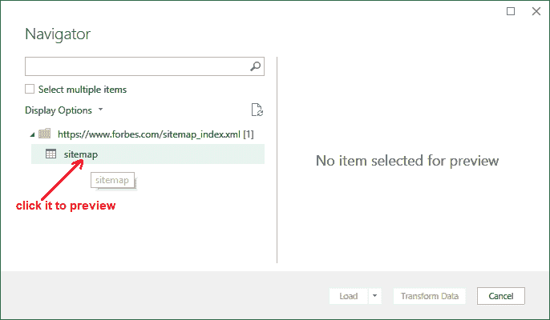
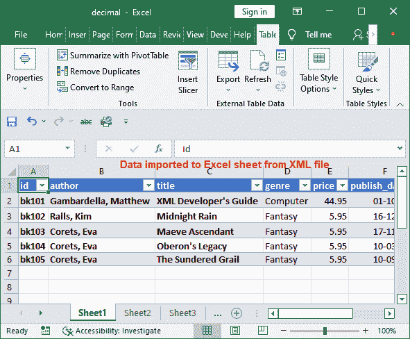

# 如何在 Excel 中打开 XML？

> 原文：<https://www.javatpoint.com/how-to-open-xml-in-excel>

XML 是一种可扩展标记语言，在标签中包含文本格式的数据。这是一种在网络上广泛使用的传输格式。XML 中的数据不如 Excel 中的可读性强。Excel 以更易读的表格格式存储数据。

这一章是关于 XML 文件以及如何在 Excel 软件上打开它们。为此，我们将探索不同的方法。XML 用户可以使用微软 Excel 软件导入其中的 XML 数据。

我们将在本章中介绍这些从 XML 到 Excel 的主题:

*   [什么是 XML？](#What)
*   [在哪里打开 XML 文件？](#Where)
*   [为什么要用 Excel 做 XML？](#Why)
*   [将 XML 文件导入 Excel](#Import)
*   [将 XML 文件转换为 Excel 格式](#Convert)
*   [将 XML 文件从 web 导入 Excel](#web)
*   [从开发人员选项卡](#developer)导入 XML

## 什么是 XML？

XML 是一种类似于 HTML 的标记语言。标记基本上是一种在标签(<>)中定义文本的计算机语言。换句话说，你可以说 XML 是一种基于标签的语言。每个文件。xml 扩展名是一个 XML 文件。

XML 文件用**保存。xml 扩展**。XML 很容易阅读，但对于非技术用户来说并不总是如此。下面是一个简单的 XML 代码片段示例:

```

<?xml version= "1.0" encoding= "UTF-8"?>
<colour-list>
<colour1> Yellow </colour1>
 <colour2> Black </colour2>
</colour-list>

```

请记住，XML 文件的第一行应该包含下面一行代码:

**<？xml version= "1.0 "编码= "UTF-8 "？>**

## 在哪里打开 XML 文件？

您可能会想到一个问题:如果您从未处理过 XML 数据，如何打开 XML 文件。哪个应用程序可以用来打开 XML 文件？你不需要担心它。打开 XML 文件非常简单。

有几种方法可以打开 XML 文件，比如在 Chrome、任何文本编辑器(比如记事本、写字板)、XML 资源管理器以及微软 Excel 中。除此之外，XML 文件还可以在线打开/读取。这意味着在线的 XML 编辑器工具也可以打开和读取 XML 文件数据。

我们这一章的目标是 **MS Excel** 。在本章中，我们将学习如何在微软 Excel 中打开一个 XML。

## 为什么要用 Excel 做 XML？

XML 是在互联网上传输数据的好格式，开发者可以使用。但是对于非技术用户来说，通常很难解释 XML 文件中的数据，因为它是一个简单的基于文本的文件。

我们知道 Excel 有一个表结构来保存数据。因此，这种类型的数据可以很容易地用微软 Excel 处理。当 XML 文件导入到 Excel 中时，通过 Power Query 编辑器在 XML 数据和 Excel 表之间进行映射。

在 Excel Power Query Editor 中，只需点击几下鼠标，就可以获得易读格式的数据。

## 将 XML 文件导入 Excel

我们将通过一个例子来学习将 XML 文件导入到 Excel 中。如果您已经有了一个 XML 文件，您可以按照下面的步骤操作。对于这个例子，我们采用了一个简单的 XML 文件，我们将把它导入或转换成微软 Excel。

**第一步:**看下账面明细的 XML 数据。它有诸如书名、描述、价格、出版日期等数据。


我们将把这些 XML 数据转换成 Excel 格式。打开一个新的 Excel 文件，在其中导入 XML 数据。

**第二步:**选择一个单元格开始放置数据，并移动到 Excel 工作表 Excel 功能区的**数据**选项卡。


在这里，您可以看到*获取&转换*数据组内的**新查询**下拉按钮。

**第三步:**点击*里面的**新建查询**获取&变换*数据组。从列表中选择文件中的**，然后选择 XML 中的**。****

**

这将允许用户从本地存储中选择要导入 Excel 的 XML 文件。

**第五步:**在本地存储中查找 XML 文件并选择它(XML 文件)，然后点击**导入**。


选择的 XML 文件将加载到 power query(Excel 的高级功能)中，您可以从这里将它带到 Excel。

**在查询编辑器**中展开字段

**步骤 6:** 将打开一个带有选定 XML 文件的导航器。在这里，单击左侧面板中的 XML 文件。选择图书以预览插入的 XML 文件数据。


**第 8 步:**数据现在被转换到 Excel Power 查询编辑器。


如果您的 XML 数据不包含子字段，用户可以跳过 Power Query 步骤，直接点击**加载**按钮，将该数据加载到 Excel 中。


请注意，xml 数据已经导入到 Excel 工作表中。总共有五行已加载到 Excel 工作表中。


如果它有子字段，你必须再往前走几步。

### 当 XML 数据有子字段时的步骤

当数据没有在 PowerQuery 中完全显示时，您必须先将其展开，然后将数据加载到 Excel 表中。最后，当数据准备就绪时，将数据加载到 Excel 表中。

1.  在此之前，单击数据未显示的列的右上角图标。
2.  与之相连的一个小窗口将打开，选择**展开**单选按钮，点击**确定**。
3.  在电源查询编辑器中，点击**首页**中的**关闭&加载**按钮，将数据成功导入 Excel 表格。
4.  请参见本示例末尾的 Excel 工作表中的导入数据。

我们没有这样的带有子字段的列。只有当数据有子字段时，才需要执行这些步骤。

当 xml 文件在您的系统上可用时，可以使用这些步骤。如果您的系统上没有创建或下载 XML 文件，则必须在 Excel 中使用另一种方法。此方法仅适用于存储在本地存储上的文件。

## 将 XML 文件转换为 Excel 格式

您可以使用另一种方法，而不是将 XML 文件数据直接导入 Excel。他们可以使用文件转换软件或在线转换网站将 XML 文件转换为 Excel 格式。

互联网上的几个网站，您可以从中将 xml 文件转换为 Excel 格式。**Xmlgrid.net**是一个在线的 xml 到 excel 转换器网站。您可以使用此网站将 XML 数据转换为 Excel 格式。

[转换工具](https://conversiontools.io/convert/xml-to-excel)是一个免费使用的 XML 到 Excel 文件转换工具。用户可以转换多达 100 GB 的 XML 数据。对于非注册用户，它每天提供 10 次转换。让我们也看看这个工具的步骤。

**第一步:**点击链接，在线打开 XML 到 Excel 转换工具。在这里，点击**浏览**按钮，用户可以在本地存储器中搜索文件。


**第二步:**选择要转换为 xlsx 格式的 XML，点击该窗口的**打开**按钮。


XLSX 是针对 Excel 2007+版本的。对于以下版本，请选择 XLS 格式。

**第三步:**将选中的 XML 文件插入到转换工具中。现在，选择**。XLSX** 因为我们使用的是 Excel 2016 版本。


**第四步:**点击**运行转换**将数据转换成 Excel。


**第五步:**上传的 XML 文件已经转换为 5.76 KB 的大小。点击**下载文件**(绿色高亮按钮)下载。


**第六步:**下载转换后的 XML 文件数据后，可以将其打开到 Excel 应用程序中。查看转换后的数据。


同样，您可以将更多的 XML 文件转换为 xlsx 格式，以后可以在 Excel 软件中打开。

## 将 XML 文件从网站导入到 Excel

在上面的例子中，您已经看到我们要么将 XML 文件导入到 Excel 中，要么将其在线转换为存储在本地计算机上的 Excel 格式。在这两个例子中，您的系统上都有一个 XML 文件。

如果您的系统中没有存储任何 XML 文件，该怎么办？您在网上有一个 XML 文件，您想直接导入并打开到 Excel 软件中。**例如**，你有一个该 XML 文件的网址(https://www.forbes.com/sitemap_index.xml)。为此，您必须使用不同的流程。

”**记住这一点，不需要下载那个 XML 文件，然后导入 Excel。**“通过连接 Power Query，可以直接从 web 导入文件。

### 将网页 XML 文件导入 Excel 的步骤

下面是通过将 web XML 文件连接到 Power Query 和 XML 文件 web URL，将 web XML 文件导入 Excel 软件的步骤。

**第一步:**打开 web 导入 XML 数据的 Excel 文件或工作表。

**第二步:**在工作表中选择一个单元格，移动到**数据**选项卡，然后点击*获取&变换*组下的**新建查询**。


**第三步:**从列表中选择【其他来源的 T2】，然后选择【网络的 T4】。


**第四步:** MS Excel 可能会询问与任何外部数据源连接的安全潜力。点击**确定**前进。


**第五步:**选择**基本**单选按钮后，将打开*来自网络*对话框，输入 XML 文件的网络网址。然后点击**确定**。


**步骤 6:** 将打开一个匿名窗口，用于访问网络内容。点击**连接**进入本网站。


**第 7 步:**一个导航器将打开一个 web XML 数据站点地图。点击包含可扩展标记语言数据的**网站地图**，从网上预览可扩展标记语言数据。



**第 8 步:**查看包含链接的 web XML 数据预览，点击此导航器上的**转换数据**按钮。


*   如果要在将数据加载到 Excel 工作表之前转换数据，请使用*转换数据*。因此，您可以添加或删除列和行，也可以更改列名。
*   如果不想做任何修改，直接加载到 Excel 表中，选择*加载*。

**步骤 9:** 将打开一个带有 web XML 数据的 Power Query 编辑器，您可以在其中添加或删除行/列。所有链接都已加载到超级查询编辑器中。


**第 10 步:**根据需要进行更改，点击*首页*标签内的**关闭&加载**按钮。


**步骤 11:** 看到数据现在成功导入到步骤 1 中从所选单元格开始的 Excel 表中。这里从 web XML URL 导入了 25 行。


如果您提供了 weblink 的 XML 文件中的数据发生了变化，您只需刷新查询即可获得最新更新的数据。

## 从开发人员选项卡导入 XML

还有一种方法是通过开发人员选项卡将 XML 文件数据导入 Excel。在“开发人员”选项卡中，将 XML 数据导入到 Excel 工作表中所需的步骤比上述方法少。

要将 XML 数据从“开发人员”选项卡导入 Excel，请按照给定的步骤操作:

**第一步:**打开 web 导入 XML 数据的 Excel 文件或工作表。

**第二步:**移动到里面的**开发者**标签，点击最后出现的 **XML** 下拉按钮，然后选择**导入**。

开发人员> XML >导入


**第三步:**浏览系统中的 XML 文件并选中，然后点击**导入**将选中的文件加载到 Excel 中。


**第 4 步:**指定的 XML 格式没有引用模式。Excel 将为源数据本身创建架构。点击该面板上的**确定**。


**第 5 步:**工作表中的单元格已被自动选择。您也可以选择新的工作表。在该窗口中点击**确定**。


**第 6 步:**查看数据已经成功加载/导入到 Excel 表中。



现在，您可以读取数据并关闭文件。

* * ***