# Excel 中的边框和阴影

> 原文：<https://www.javatpoint.com/borders-and-shades-in-excel>

MS Excel 是功能强大的电子表格软件，可帮助用户跨多个工作表存储数据。每个工作表包含几个由行和列交叉形成的单元格。默认情况下，Excel 单元格没有边框，使用白色阴影。然而，当我们有大量数据集时，边框或阴影有助于使数据易于阅读或突出显示。

除此之外，当我们打印没有边框的工作表数据时，它变得太复杂而无法阅读。Excel 允许我们为工作表中的一个或多个所需单元格添加边框和颜色阴影。

## 边框和阴影(底纹)

在 Excel 中，边框是指横跨工作表中单元格的任意或全部四条边的线条。向一个或多个单元格添加边框时，我们可以选择要包括或排除的特定边。此外，我们还可以手动为单元格的自定义边或所需边绘制边框。例如，我们可以在单元格的顶部和底部添加(或绘制)边框，而让其他边保持开放。

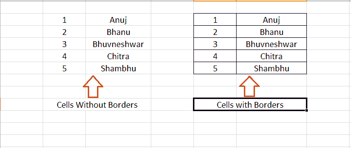

此外，底纹是指用作工作表中单元格背景的艺术设计或颜色。为一个或多个单元格添加底纹(背景色)时，我们可以选择为特定单元格设置的预定义颜色之一。此外，我们还可以为所需的单元格选择自定义颜色。

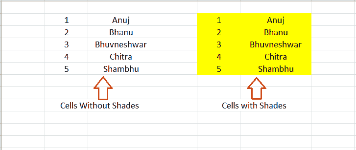

现在让我们讨论如何在 Excel 工作表的单元格中添加/删除颜色或底纹:

## 在 Excel 中应用边框

在 Excel 中创建边框是最简单的事情之一。虽然有几种方法，但通常使用以下两种方法:

### 从功能区应用边框

Excel 功能区是访问大多数现有命令或工具的主要区域。在 Excel 中创建边框时，我们可以利用 Excel 功能区，通过以下步骤将边框应用于所需的单元格:

*   首先，我们需要**选择想要插入边框的有效 Excel 单元格**。我们可以按住鼠标左键，将选定的阴影从一个单元格拖到其他单元格。此外，在 Excel 中选择不相邻(或不连续)的单元格时，我们必须在按住 **Ctrl** 键的同时点击单个单元格。
    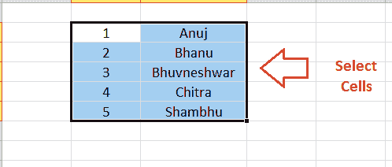
*   选择有效单元格后，我们需要进入功能区的**首页**选项卡，点击**边框旁边的**下拉**图标，**如下图所示:
    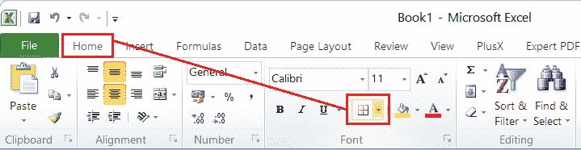
*   在下一个窗口中，Excel 将显示各种预定义的边框样式。我们必须**点击想要的边框样式**来应用它。
    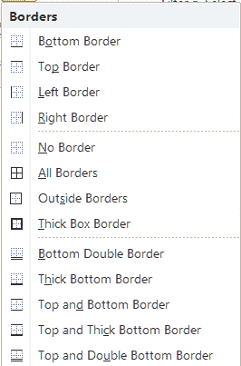
    从列表中点击想要的边框(例如，全部边框)后，同样会瞬间插入到选中的 Excel 单元格中。
    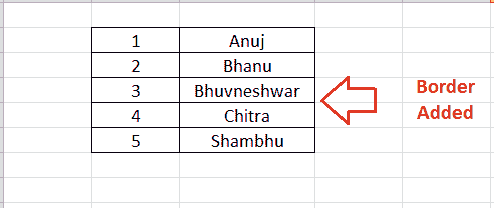
    虽然有很多现有的边框选项，但有时候，我们可能需要手动在单元格的特定边上插入边框。例如，假设我们需要在任何单元格的左侧和右侧添加或插入边框。在这种情况下，我们可以使用下拉列表中的**绘制边框**选项手动绘制边框。
    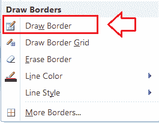
    选择【绘制边框】选项后，我们的鼠标光标会转换成铅笔图标。我们可以点击或拖动所需的网格来绘制相应的边框。
    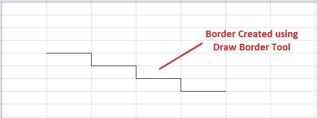
    同样，我们可以选择**线条颜色**或**线条样式**选项来为所需的边框上色，或者选择像单线、多线等边框样式。

### 应用单元格格式对话框中的边框

由于添加边框是 Excel 格式工具的一部分，我们还可以使用“设置单元格格式”对话框应用边框。我们可以执行以下步骤来访问“设置单元格格式”对话框，并在所需的 Excel 单元格中插入边框:

*   首先我们需要**选择/高亮工作表中的有效单元格**。
*   一旦选择了想要的单元格，我们需要启动**设置单元格格式**对话框。访问/打开它最简单的方法是使用快捷键**‘Ctrl+1’。**但是，我们必须只从键盘区域按下键‘1’，而不是数字键盘。
*   在单元格格式对话框中，我们需要点击**边框**选项卡，如下图:
    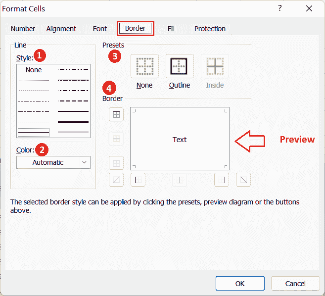
    我们可以使用上面对话框中显示的不同部分以多种方式调整单元格的边框:
    调整边框设置后，我们必须点击**确定**按钮关闭对话框并应用工作表中的更改。
    1.  **线条样式**部分帮助我们选择想要的边框设计，如单线边框、虚线边框、双线边框等。
    2.  线类别下的**颜色**部分或下拉列表允许我们为边框选择任何想要的颜色。我们可以选择预定义的颜色，也可以使用“更多颜色”选项选择自定义颜色。
    3.  **预设**部分帮助我们将快速边框应用到工作表中的选定单元格。使用预设，我们可以在**无**(无边框)**轮廓**(所有边边框)或**内部**(单元格连接边的边框)之间进行选择。
    4.  **边框**部分帮助我们选择不同的边框样式。我们可以点击显示的块来选择上边框、下边框、左边框、右边框、对角线边框等。预览部分根据对话框中选定的首选项或设置显示边框样式。After adjusting the settings for the borders, we must click the

## 在 Excel 中删除边框

要删除 Excel 工作表中的边框，我们可以使用以下方法之一:

*   首先，我们需要选择要移除边框的单元格。接下来，我们必须去**家>边境>无边境。**这将删除选定单元格的边框。要选择要去除边框的特定单元格，我们可以在单击相应单元格时按住 **Ctrl** 键。
*   我们也可以使用擦除边框工具删除边框。为此，我们必须前往**首页>边框>清除边框。**这将把鼠标光标转换成橡皮擦图标，使用它我们可以擦除或删除工作表中想要的边框。
*   我们可以选择单元格并转到**主页>清除>清除格式。**虽然这种方法有助于去除边框，但它也去除了其他格式，如字体颜色、背景颜色等。因此，这种方法可能不适用于所有情况。

## 在 Excel 中应用阴影

在 Excel 中应用阴影就像创建边框一样简单。以下是对 Excel 单元格或工作表应用阴影的最常用方法:

## 从功能区应用阴影

功能区提供了对 Excel 现有工具的快速访问，从功能区应用颜色阴影非常容易。我们可以执行以下步骤，并为单元格使用任何所需的阴影或背景颜色:

*   首先，我们需要选择要应用底纹的单元格。
    
*   选择所需单元格后，我们必须导航到主页选项卡，然后单击**‘填充颜色’**选项旁边的下拉图标，如下所示:
    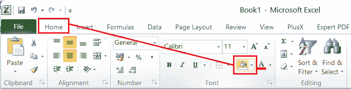
*   Excel 在下一个窗口的**主题颜色**和**标准颜色**下显示各种颜色。
    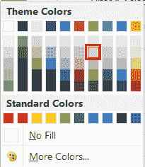
    我们可以点击任何想要的颜色，同样的也会立刻应用到选中的单元格作为背景色。
    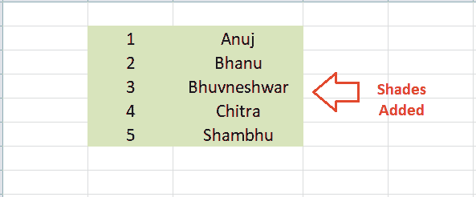
    如果没有找到想要的颜色，可以从窗口点击**【更多颜色】**按钮，相应选择任意自定义颜色。
    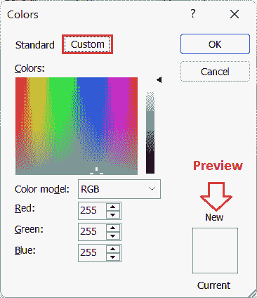

### 应用单元格格式对话框中的阴影

我们可以使用“单元格格式”对话框在 Excel 单元格中应用任何所需的颜色阴影，例如应用边框。我们必须选择单元格，打开**设置单元格格式**对话框(Ctrl + 1)，点击**‘填充’**选项卡，并相应调整首选项。“填充”选项卡包含以下部分或首选项选项:

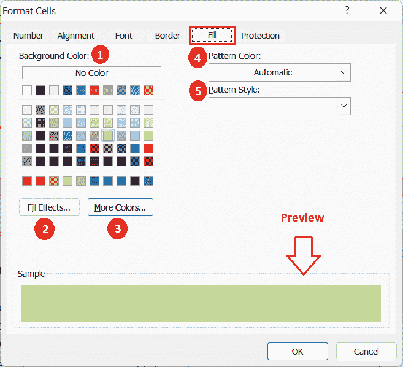

在上面的对话框中，我们可以使用不同的部分以各种方式应用或修改颜色深浅，例如:

1.  此部分显示一组预定义的颜色。我们可以通过单击相应的块来选择所需的颜色。
2.  这个部分允许我们选择渐变风格的阴影。我们可以在单色或多色阴影和渐变方向之间进行选择。
3.  该部分使我们能够选择在显示的块中不可用的颜色。使用这个部分(按钮)，我们可以创建任何我们想要的自定义颜色。
4.  这一部分允许我们为我们想要添加的图案样式以及阴影选择颜色。
5.  此部分包含各种图案样式，可与选定的颜色深浅一起应用。这包括点灰色图案、水平线和垂直线、对角线、对角线剖面线等。

调整阴影设置后，我们需要单击“确定”按钮关闭对话框，并将选定的颜色阴影应用到工作表中所需的单元格。

## 在 Excel 中删除阴影

删除或移除 Excel 单元格的阴影或背景色时，我们可以使用以下任何方法:

*   首先，我们需要选择想要去除阴影的单元格。接下来，我们必须前往**首页>填充>无填充。**这将立即移除所选单元格的颜色阴影。要删除整张表格的颜色，我们可以使用键盘快捷键**‘Ctrl+A’**选择表格中的所有单元格，然后选择‘无填充’。要选择特定的单元格，我们可以按住 **Ctrl** 键，同时单击相应的单元格。
*   如果我们刚刚应用了单元格中的阴影，我们可以单击撤消(Ctrl + Z)来移除它们。
*   我们可以选择单元格并转到**主页>清除>清除格式。**虽然这种方法有助于消除颜色阴影，但它也消除了其他格式，如字体颜色、边框等。因此，这种方法可能不适用于所有情况。

## 需要记住的要点

*   在打印纸张之前应用边框后，我们必须确保使用“打印预览”窗口打印边框。
*   当使用“设置单元格格式”对话框调整颜色阴影的首选项时，我们不能对颜色阴影同时使用“填充效果”和“图案样式”。
*   我们必须确保单元格内的文本在应用颜色渐变时是正确可见的。

* * *