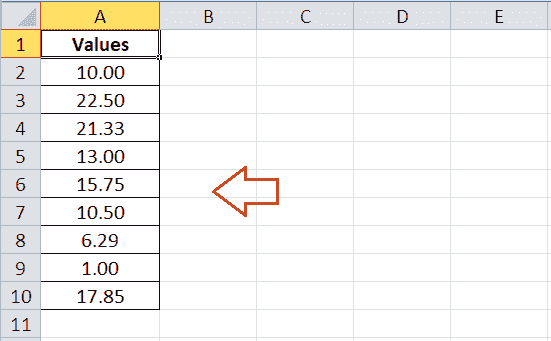
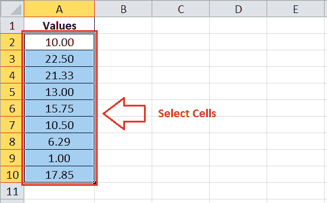
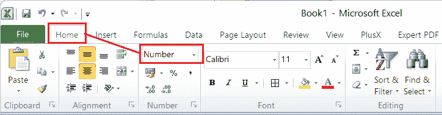
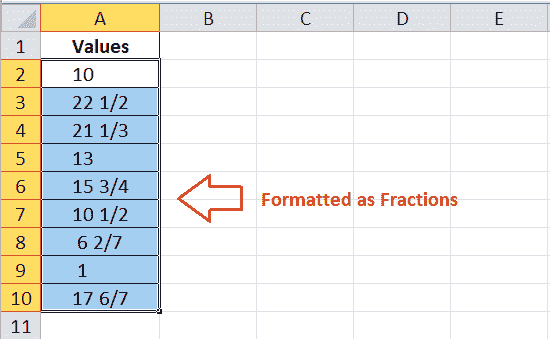
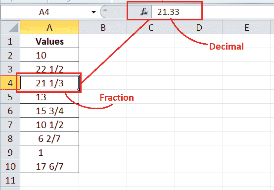
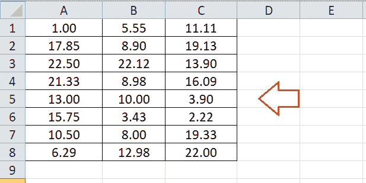
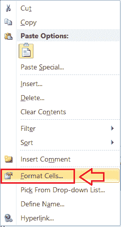
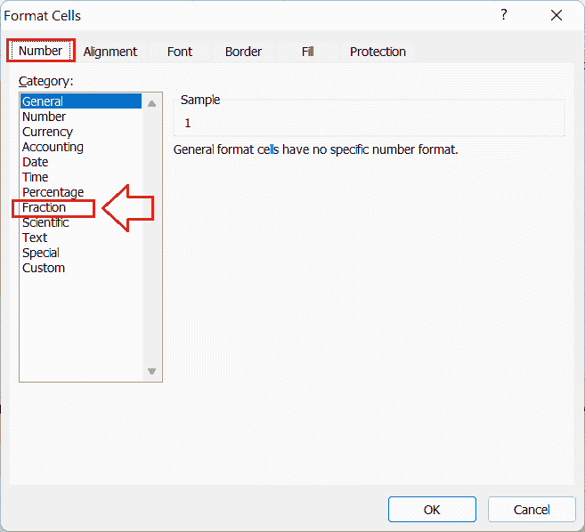
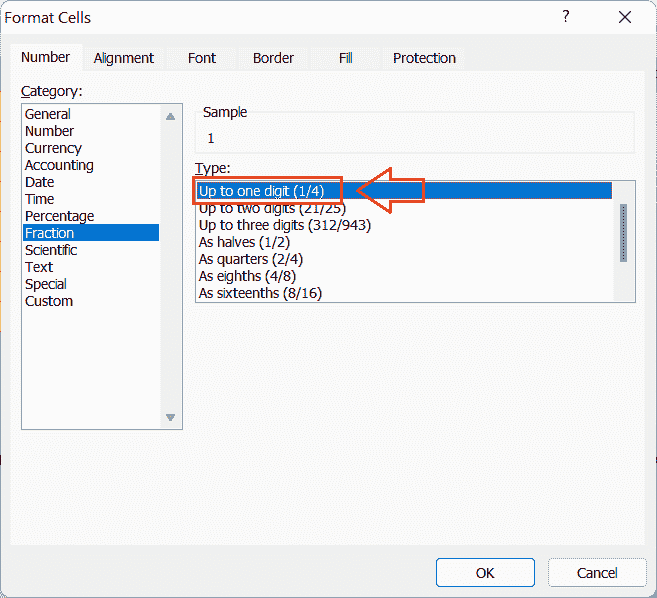
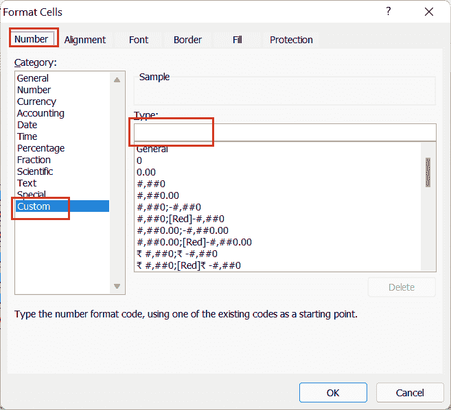

# Excel 中的分数

> 原文:[https://www.javatpoint.com/fractions-in-excel](https://www.javatpoint.com/fractions-in-excel)

MS Excel 或 Microsoft Excel 是功能强大的电子表格软件，可帮助用户在多个工作表的不同单元格中记录数据。在 Excel 中工作时，我们通常会遇到不同的值，如整数、小数、百分比等。Excel 可以处理几乎所有的数据类型或值。分数也是 Excel 中常见的数字格式之一，可能有些时候我们需要在 Excel 中处理分数。

在本文中，我们讨论了 Excel 中分数的简单介绍以及如何在 Excel 工作表中正确使用分数。使用这些方法，我们可以在 Excel 单元格中输入数字，并将其显示为分数。

## Excel 中的分数介绍

Excel 中的分数是指特定的数字格式，它帮助我们将输入的数字显示为精确的分数，而不是日期、十进制数字或任何其他格式。Excel 中的分数有多种格式选项，包括一位数、两位数、三位数等分数。

简而言之，分数有助于将数值(或数字)显示为一个整体的节数。在表示分数时，数字用斜杠(/)分隔。例如，P/Q 表示分数，其中 Q 指的是整个部分，而 P 指的是整个部分 Q 的一部分，在分数中，顶数(即 P)称为**分子，**，底数(即 Q)称为**分母。**

同样，在 Excel 中工作时，我们可能需要写 1/2 而不是 0.5，3/4 而不是 0.75 等。所有这些都是分数的例子。

通常有三种类型的分数，即:

*   **真分数:**任何分数中的分子(顶数)小于分母(底数)，称为真分数。例如，2/4 代表适当的分数，其中“2”小于“4”。这个特殊的分数指的是一个数等于整体的两个部分，而整体被分成四个相等的部分。
*   **不当分数:**任一分数中的分子(顶数)大于等于分母(底数)，称为不当分数。例如，4/2 代表不适当的分数，其中“4”大于“2”。这个特殊分数指的是一个数等于整体的四个部分，而整体被分成两个相等的部分。
*   **混合分数:**如果任何分数由附加在分数前面的附加数字组成，则称为混合分数。例如，1 代表混合分数，其中数字“1”出现在分数“1/2”之前。这个特殊的分数代表一个整体，加上一个整体的一部分，其中一个整体被分成两部分。也可以写成不当函数，即 3/2。

## 如何在 Excel 中将数字格式化为分数？

由于分数在微软 Excel 中是一个特例，默认情况下不会在 Excel 中显示。当我们尝试在 Excel 单元格中输入分数时，Excel 会自动将它们转换为另一种格式，如文本、日期或小数。然而，有时我们可能需要显示分数来帮助用户轻松阅读信息。虽然显示为文本的分数在工作表上看起来不错，但它们不能用于计算。

因此，为了在 Excel 中正确添加分数，我们需要将相应的 Excel 单元格仅格式化为分数，这样 Excel 就不会自行更改分数。以这种方式，分数被适当地显示，并且还可以参与期望的计算。

以下是在 Excel 工作表中将单元格(或数字)格式化为分数的两种有效方法:

*   使用功能区将数字格式化为分数
*   使用单元格格式将数字格式化为分数

让我们详细讨论每种方法:

### 使用功能区将数字格式化为分数

功能区是包含各种选项卡和相关命令或功能的顶部区域。功能区几乎有所有的内置工具或命令来执行 Excel 中的大多数任务。我们也可以直接从功能区选择不同的数字格式，包括分数。

例如，假设我们有下面的 Excel 表，在单元格 A2 到 A10 中有一些小数点数字。

使用 Excel 功能区，我们需要使用 Excel 功能区格式化这些数字或将这些数字转换为分数。为此，我们必须按照以下步骤将给定的数字格式化为分数:

*   首先，我们需要选择/突出显示我们想要应用分数的所有单元格。在我们的示例中，我们选择了从 A2 到 A10 的单元格。
    
*   选择所有有效单元格后，必须进入**首页**选项卡，点击**下拉菜单**图标**编号格式**旁边的类别编号。看起来是这样的:
    
*   在下拉列表中，Excel 显示一些常见的预定义数字格式。我们可以通过单击相应的选项来选择所需的数字格式。在我们的例子中，我们从下拉列表的底部选择**分数**选项。
    T3】
*   当我们单击分数时，选定的小数点值会立即转换为分数。
    
    这只是改变了小数点在数值不变的情况下如何表示为分数。如果我们点击单元格 A2 至 A10 中的特定分数，我们可以从公式栏中看到小数点值。
    

虽然我们可以直接从功能区上的“主页”选项卡将数字格式化为分数，但它提供了对相关首选项的有限访问。相反，我们可以使用“设置单元格格式”对话框，并使用附加或高级功能将数字设置为分数格式。

### 使用单元格格式将数字格式化为分数

将数字格式化为分数的另一种方法是使用“格式化单元格”对话框。“设置单元格格式”对话框包含各种基于格式的数字格式设置。我们可以使用这些设置将所需的 Excel 单元格或数字格式化为分数。

让我们再举一个工作表的例子，其中单元格 A1 到 C8 有十进制数字，如下所示:

我们需要使用“单元格格式”对话框将所有十进制数字格式化为分数。因此，我们必须遵循以下步骤:

*   和前面的方法一样，我们首先需要**选择工作表中的有效单元格**。因此，我们从 A1 到 C8 选择单元格。
    T3】
*   接下来，我们必须在选定的单元格上右键单击，然后从列表中单击**设置单元格格式**选项。
    
    或者，我们可以按键盘快捷键**‘Ctrl+1’**来代替右键菜单选项。这一步帮助我们启动“设置单元格格式”对话框。
*   在单元格格式窗口下，我们需要点击**数字**标签，从列表中选择**分数**选项。
    
*   单击分数选项后，Excel 会显示另一个列表，其中包含分数的附加选项。使用列表，我们可以在选定的单元格上应用分数，最多一位数、两位数、三位数等。在我们的示例中，我们选择第一个选项，即最多一个数字(1/4)。
    
*   最后，我们必须点击**确定**按钮，将选定的数字格式应用于工作表中选定的单元格。之后，我们将在示例表中看到分数，而不是十进制数。
    T3】

这样，我们可以通过使用“设置单元格格式”对话框将数字设置为分数格式。如果我们发现预定义的选项没有帮助，并且需要使用任何特定的分数格式，我们可以定义分数的自定义格式。

## 如何在 Excel 中使用自定义分数？

使用 Excel 中的自定义数字格式，我们可以将任何特定的数字定义为分母。此外，我们可以设置分子大于分母的任何特定函数，即 3/2。

要使用自定义分数格式，我们需要选择有效的单元格，并像前面的方法一样启动“设置单元格格式”对话框。但是，现在我们需要从**号**标签下的列表中选择**自定义**选项。之后，我们需要在**类型**框内指定自定义格式代码。

创建自定义格式代码时，我们可以使用破折号(#)来表示一个整数和一个问号(？)来指定分子和分母的最大位数。

自定义分数格式的一些示例如下所示:

| 格式 | 描述 |
| **#？/?** | 表示最大分母为一位数的混合分数。 |
| **#？？/?？** | 表示最大分母为两位数的混合分数。 |
| **？？？/?？？** | 表示最多三位数的不正确分数。 |
| **#？？/256** | 表示一个具有固定分母的混合分数，即 256。 |

## 需要记住的要点

*   建议将分数设置为三位数，以便使用 Excel 进行更好的调整和有效的计算。
*   在 Excel 单元格中输入任意分数时，可以在公式栏中看到对应的小数/数值。

* * *