# Excel 色阶

> 原文：<https://www.javatpoint.com/excel-color-scales>

想象一下，如果你要在 excel 工作表中浏览和分析 500 个项目，这项工作将会多么单调乏味。毫无疑问，很难抓住关键问题或在大块数据中找到趋势或模式。但是微软 Excel 条件格式工具在这些情况下起到了救星的作用。它帮助用户通过不同的颜色突出显示单元格或强调异常值，并使用数据条、色标和图标集可视化数据，从而产生特定的数据变化。

色标代表所有专业，如温度、速度、年龄、分数等。如果您的 Excel 中有大量数据可以从这种可视化中受益，那么执行起来会比您想象的更容易。

Excel 色标允许用户在几分钟内通过条件格式应用渐变色标。它提供了两种和三种带有原色的色标，用户可以从中选择，也可以选择他们定制的颜色。

## Excel 中什么是色阶？

***“Excel 中的色标是用来突出显示不同颜色单元格的条件格式的一部分。根据指定单元格中的值，色阶选项将应用于各个单元格。即，如果单元格值较高，则应用深色，而如果单元格中的值较小，则应用浅色。”*T3】**

色标非常有用，因为它有助于正确的数据分布，并在您的 Excel 数据中产生变化，不像随着时间的推移不同的投资回报。所选单元格用符合最小、中点和最大阈值的两种色调或三种色调的渐变进行着色。这些条件格式的颜色深浅使同时比较一系列单元格的值变得更快。

Excel 中的“色阶”条件格式功能位于“条件格式”菜单中，通常列在功能区栏上“主页”选项卡的“样式”组中(参见下图)。

Microsoft Excel 提供了一些内置的颜色选项，这些选项带有色阶的条件格式，因此只需单击几下，就可以快速将颜色应用到单元格中。它包含 6 个双色刻度和 6 个三色刻度选项(参见下图)。如果将鼠标光标悬停在每个颜色选项上，您会注意到屏幕提示中的颜色排列。Excel 将自动用每个颜色选项突出显示选定的单元格。这是选择最适合您的 Excel 数据的颜色比例的最快和最合适的方法。

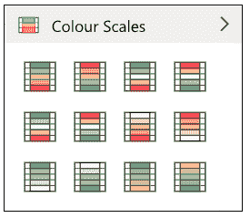

## 需要记住的要点

1.  默认情况下，Excel 提供了一些内置规则，可以在几下点击后快速应用颜色深浅，但您也可以创建更多自定义规则。
2.  条件格式色标根据指定的条件给出结果。如果条件匹配，颜色格式将应用于选定的单元格；如果条件为假，则不会格式化所选单元格。
3.  如果您将鼠标光标悬停在每个色阶选项上，您会注意到屏幕提示中的颜色顺序。Excel 将自动用每个颜色选项突出显示选定的单元格。
4.  如果选定区域包含任何空白单元格或有任何其他错误，Excel 会自动跳到下一个单元格。
5.  用户还可以删除或清除工作表的色标。
6.  色阶功能不区分大小写。

## 例子

**示例 1: Excel 条件格式色标使用默认颜色选项。**

**下图是某部门考试测试中各员工的评分表。应用 Excel 条件格式色标工具，根据获取的分数用不同的颜色突出显示单元格。**

| 学生姓名 | 类型 | 得分 |
| Rahul | 年长的 | Six hundred and fifty-seven |
| 瓦伦 | 初级工程师 | Three hundred and forty-five |
| 喜马偕尔邦 | 次要的 | Five hundred and forty-three |
| 蒂娜（号外乐团成员） | 年长的 | Six hundred and seventy-eight |
| 杰克林 | 初级工程师 | Nine hundred and eighty |
| 出汗了 | 初级工程师 | Three hundred and twenty-three |
| 穆罕默德 | 年长的 | Three hundred and forty-three |

***解决方案:*** 色标允许用户在几分钟内应用带有条件格式的渐变色标。以下是在选定的单元格区域中实现不同颜色深浅的步骤:

**步骤 1 选择单元格**

选择要应用色阶条件格式的整个单元格或单元格区域。在我们的例子中，我们希望根据分数用不同的颜色梯度突出显示所有单元格。所以我们选择了从 E5 到 E11 的单元格。

参考下图:

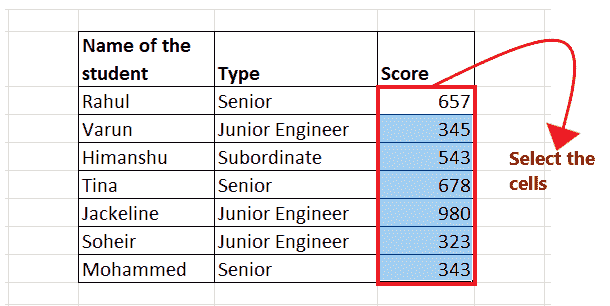

**第二步:点击条件格式色标**

1.  转到 Excel 功能区的“主页”选项卡。点击 Excel 样式组中列出的条件格式
    。
2.  它将打开以下选项窗口；单击“色阶”选项。
    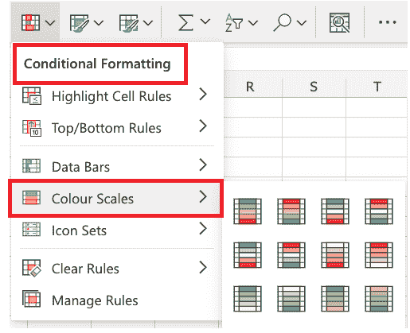

**第 3 步选择任意默认格式颜色**

1.  只要你点击“色阶”选项，Excel 就会打开另一个显示默认颜色深浅的窗口。
2.  它包含 6 个双色刻度和 6 个三色刻度选项(参见下图)。选择任何颜色选项。在我们的案例中，我们选择了格力-黄色-红色色标。

#### 注意:如果将鼠标光标悬停在每个颜色选项上，您会注意到屏幕提示中的颜色排列。Excel 将自动用每个颜色选项突出显示选定的单元格。

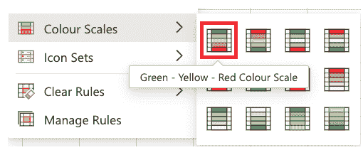

**第 4 步 Excel 会抛出你的结果**

完成上述步骤后，Excel 会将三色标应用到选定的单元格中。单元格值越大，颜色越深，而单元格值越低，颜色越浅。

结果输出请参考下图:

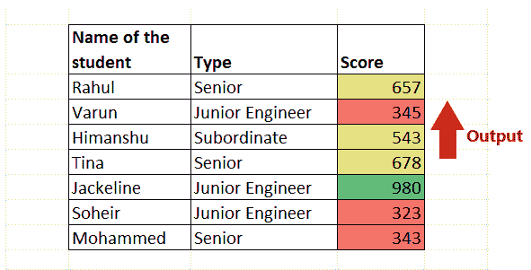

以上输出是根据默认样式获取的。但是，您也可以根据条件进行颜色格式化。让我们在下一个例子中看看如何为给定的条件应用色阶格式。

**示例 2 -使用某些条件对色标进行 Excel 条件格式化**

**使用上面的评分表(参考示例 1 中使用的相同表)，如果单元格值大于 600，则格式化您的评分列的单元格。**

“格式化色阶”条件选项还允许您根据某些条件格式化单元格。在单元格值大于 600 的情况下，按照以下步骤格式化不同颜色的单元格:

**步骤 1 选择单元格**

选择要应用色阶条件格式的整个单元格或单元格区域。在我们的例子中，我们希望根据分数用不同的颜色梯度突出显示所有单元格。所以我们选择了从 E5 到 E11 的单元格。

参考下图:

**第二步:点击条件格式色标**

1.  转到 Excel 功能区的“主页”选项卡。单击 Excel 样式组中列出的条件格式。
2.  它将打开以下选项窗口；单击“色阶”选项。
    

**第三步:选择“更多规则”选项**

1.  单击色标后，会出现另一个辅助窗口，显示颜色选项列表。
2.  因为在问题中，提到要突出显示大于 250 的单元格值。这意味着我们必须指定一个条件；因此我们将点击**更多规则**选项。
    参考下图。
    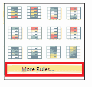

**第 4 步:输入要应用条件的值**

1.  将弹出条件格式“新格式规则”对话框窗口。
2.  在“选择规则类型”选项窗格中，选择带有“仅格式化包含”的单元格的文本
3.  选择此选项后，您会注意到“编辑规则描述”窗口的排列发生了变化。
    *   在第一个选项中，选择单元格值
    *   在第二个选项中，选择大于
    *   在第三个选项中，在文本框中指定 600 值。
4.  选择“格式”选项所需的格式。
5.  完成后，点击**确定。**

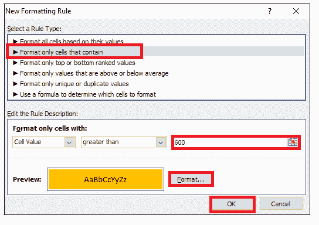

**第五步:Excel 会高亮显示单元格**

您会注意到，在“分数”栏中， ***所有单元格值大于 600 的单元格都用“黄色”突出显示了*** 。

结果输出请参考下图:

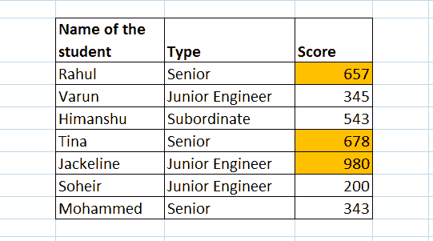

既然我们已经学会了如何根据一些条件应用颜色格式。现在，如果我们想要编辑色标，并想要插入我们定制的颜色，或者，如果需要，我们如何删除它，该怎么办。

## 如何在 Excel 中编辑色标

虽然色阶选项相当酷。但是你也可以用新的颜色选项来定制你的桌子。你只需要从第一种情况开始，就是**编辑色阶。**

按照以下步骤快速编辑桌子的颜色:

**步骤 1 选择单元格**

选择要应用色阶条件格式的整个单元格或单元格区域。在我们的例子中，我们希望根据分数用不同的颜色梯度突出显示所有单元格。所以我们选择了从 E5 到 E11 的单元格。

参考下图:

**第二步:点击条件格式色标**

1.  进入 Excel 功能区的 ***【首页】选项卡*** 。点击 Excel 样式组中列出的 ***条件格式*** 。
2.  它将打开以下选项窗口；点击 ***色阶选项。*T3】**

**第三步:选择“更多规则”选项**

1.  单击色标后，会出现另一个辅助窗口，显示颜色选项列表。
2.  因为在问题中，提到要突出显示大于 600 的单元格值。这意味着我们必须指定一个条件；因此，我们将单击更多规则选项。
    参考下图。
    

**第四步:选择自己的色标**

向下滚动到“编辑规则描述”窗口。在本节中，可以根据单元格的值设置所有单元格的格式:

*   格式样式:可以选择是作为**双色刻度选项**还是随着**三色刻度移动。**
*   接下来，你可以挑选最适合你的 3 种颜色。在我们的例子中，我们将选择这个明亮的红色作为最小刻度，强烈的蓝色作为中点刻度，中等的绿色作为范围的最大刻度。
*   完成后，单击确定。

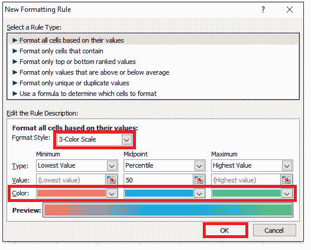

**第五步:定制颜色的色标**

如下图所示，Excel 将根据指定的 3 色选项更改刻度的颜色。

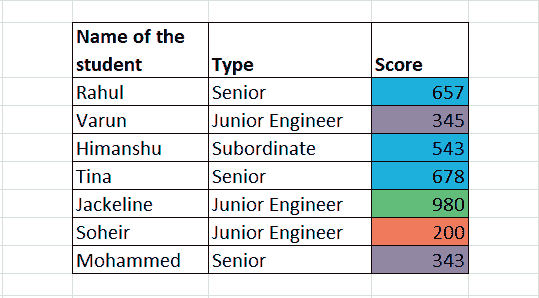

## 如何在 Excel 中去除色阶

有时您应用色标来突出显示单元格，然后您需要**从您的 Excel 工作表中移除色标，以便共享。**

按照以下步骤快速删除表格的颜色:

1.  选择要应用顶端/底端规则条件格式的整个单元格或单元格区域。
2.  转到 Excel 功能区的“主页”选项卡。单击 Excel 样式组中列出的条件格式。它将打开条件格式选项窗口。
3.  从**“条件格式”**部分选择**“清除规则”选项**。
4.  将出现一个对话框窗口；点击**“清除选定单元格中的规则”。**您可以选择另一个选项(清除整张工作表中的规则)来一次删除整张工作表中的格式。

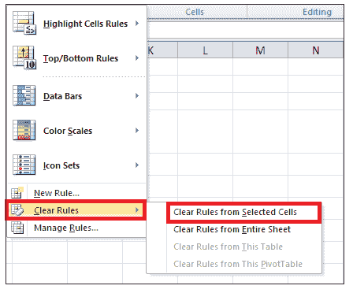

就这样！该色标将从 Excel 表格的选定单元格中成功删除。

* * *