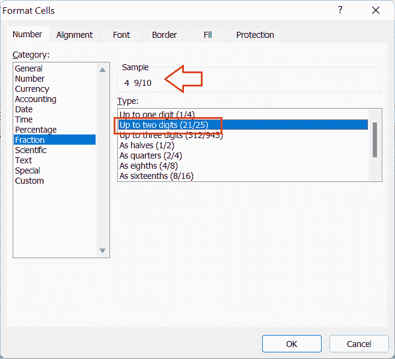

# 在 Excel 中将小数转换为分数

> 原文:[https://www . javatpoint . com/convert-decimal-to-fraction-in-excel](https://www.javatpoint.com/convert-decimal-to-fraction-in-excel)

使用 Excel 时，我们会遇到不同的数据类型，如数字、小数、日期、货币、百分比、分数等。默认情况下，Excel 接受某些数据类型。但是，在我们将某些特定数据类型的值输入到工作表的单元格中后，Excel 会自动转换这些值。默认情况下，Excel 不支持分数这种类型或格式。

Excel 提供了易于使用的方法来将任何特定的单元格设置为任何格式，例如分数。要在 Excel 中使用分数，我们必须手动将特定的单元格类型或格式设置为分数。一旦单元格被格式化为分数，记录在其中的值不会自动更改。这样，我们就可以在 Excel 中将小数转换成分数。

## 为什么我们需要在 Excel 中把小数转换成分数？

与小数相比，分数有助于更好、更清晰地了解数量之间的关系。特别是，分数通过将两个整数组合成一个比率来帮助简化比例。此外，十进制以单个数字的形式表示相同的量。因此，将小数表示为分数对眼睛来说似乎更令人愉快。

比如分数 1/3 看起来比 0.333333…这样的十进制数更讨喜更准确等等。因此，在使用 Excel 时，最好用分数代替小数来表示工作表中的数量。这将有助于我们快速了解相应的数量，并进一步做出相应的决策。

一般来说，当表示诸如天数、配料量、化合物、食品杂货、离散概念等数值时，我们更喜欢使用分数而不是小数。在这种情况下，分数提供了一个更好的代表，如定量关系的形式。

## 如何用 Excel 将小数转换成分数？

如上所述，默认情况下，Excel 不支持单元格内的分数。如果我们输入像 1/2 这样的分数，它会自动转换为日期或小数。但是，有时我们可能严格需要在 Excel 单元格中使用精确分数。在这种情况下，我们必须将特定的单元格格式转换为分数。

在 Excel 中，有几种方法可以将小数转换为分数。我们通常使用 Excel 的分数格式将数字转换、显示或键入为分数。根据给定数字的不同格式或表示，我们可以使用以下方法将小数转换为分数:

### 将单个数字或单元格转换为分数

当我们需要将任何单个数字或单元格转换为分数时，我们需要遵循下面讨论的步骤:

*   我们需要单击并选择工作表中的特定单元格。
    
*   我们必须进入【首页】菜单标签，点击**数字格式**旁边的**下拉**图标，如下图所示:
    
*   从下拉列表中，我们必须点击**分数**
    
    这将把选中的单元格或其小数转换成相应的分数。
    

### 将多个单元格转换为分数

Excel 允许一次将多个小数单元格转换为分数。我们可以将某些单元格(整行或整列)转换或格式化为分数。我们所要做的就是选择工作表中的所有有效单元格，并像前面的方法一样选择分数选项，例如:

*   要选择工作表中多个连续的单元格，我们可以用鼠标点击拖动，或者按住键盘上的 **Shift** 键，点击第一个和最后一个有效单元格。
*   要选择工作表中多个不连续的单元格，我们可以在按住键盘上的 **Ctrl** 键的同时，分别单击每个单元格。
*   要选择整行或一列，我们可以单击列标题的相应行标题。

一旦在工作表中选择了单元格，我们必须转到**主页选项卡>数字格式下拉菜单>分数**。

### 转换为更多的数字分数格式(最多 2 位数、3 位数等。)

默认情况下，Excel 的分数格式在分母中最多只显示一个数字。然而，在某些情况下，一位数分数可能无法达到预期效果。例如，如果我们在 Excel 单元格中键入十进制值 4.9，并使用**主页选项卡>数字格式下拉菜单>分数**将其转换为分数，它不会更改为分数。相反，它变成了 5。

一位数的分母分数是十进制值 4.9 没有变成分数的主要原因。4.9 的精确分数值是 4 9/10，其中分母由 2 位数字组成。由于默认分数格式默认支持一位数分母，Excel 通常会将分数四舍五入为 5。

在这种情况下，要将小数转换成分数，我们必须将分数的分母设置为一个以上的数字。为此，我们必须按照下面讨论的步骤利用“设置单元格格式”对话框:

*   首先，我们必须选择要转换为分数的特定单元格。
*   接下来，我们需要在所选单元格上按下**右键**按钮，并选择“**设置单元格格式**选项。这将启动“设置单元格格式”窗口。
    
    或者，我们可以从“主页”选项卡下的“数字格式”组中单击“更多”图标，打开“设置单元格格式”对话框。
    
*   在格式单元格窗口中，我们需要选择类别列表下的**‘分数**，我们会在右侧部分得到另一个不同分数格式的列表。看样子:
    
*   我们可以选择所需的选项，根据分数的分母决定如何显示分数值。我们可以选择将我们的分数值显示为一位数的分母或一个具有两位数或三位数分母的分数。
    在我们的示例中，分数值有一个两位数的分母。因此，我们从右侧部分选择“**至两位数**选项。
    
*   最后，我们必须点击**确定**只要我们点击确定按钮，我们的十进制值(4.9)就被转换成分数(4 9/10)而不是整数(5)。
    T3】

这样，我们可以将十进制数转换为分数，并在用所需数量的分母表示分数之间进行选择。例如，当在 Excel 单元格中表示 9/15 这样的分数时，我们可以使用“最多两位数”的分数。当表示像 320 这样的分数时，我们可以选择“最多三位数”的分数。

此外，“单元格格式”对话框还使我们能够以二分之一、四分之一、八分之一、十六分之一等形式表示所需的分数。

### 表示为二分之一、四分之一、八分之一、十分之一等。

默认情况下，Excel 会自动调整分数，使分母变小。例如，如果我们将单元格类型设置为“分数”，并输入任何数字，如 2/4，Excel 会自动将其更改为 1/2。分母从 4 减为 2。

因此，如果我们想防止 Excel 改变分母，我们必须使用“设置单元格格式”对话框来定义分母。在我们的示例中，由于我们希望将分母固定为 4，因此我们需要从分数格式列表中选择“**作为四分之一(2/4)** ”选项。

同样，如果我们想将分母设置为 8、16、10 或 100，我们可以从列表中选择其他相应的分数格式。

### 对分数使用自定义数字格式

我们可以使用自定义数字格式为所需的单元格设置任何自定义分数格式。例如，当我们想要将分母固定为 2、4、8、10 和 100 以外的任何值时，我们可以从“设置单元格格式”对话框中选择“自定义”选项，并在“类型”框下指定或输入所需的分数格式代码。

假设我们想要将任何十进制值转换成分母固定为 30 的分数。由于没有“三十年代”的选项，我们必须使用自定义格式。我们需要将格式代码输入为(#？？/30 ),类型框中没有括号。

## 需要记住的要点

*   快捷键“Ctrl + 1”帮助我们瞬间打开单元格格式对话框。
*   当我们需要显示分母中有两位或两位以上数字的分数时，我们必须使用“设置单元格格式”对话框。
*   我们还可以使用自定义数字格式创建自定义分数格式。

* * *