# Excel 规则管理器

> 原文:[https://www.javatpoint.com/excel-rules-manager](https://www.javatpoint.com/excel-rules-manager)

我们经常使用微软 Excel 中的条件格式工具来突出显示工作中的单元格。好的一面是 Excel 使用户能够同时应用两个或多个规则。它甚至扩展了控制这些规则以及编辑、删除或复制的功能。为此，他们在条件格式中引入了另一个名为 ***“规则管理器”的部分。*T3】**

如果要突出显示具有唯一数据值和大于 200 的值的单元格，则需要对 Excel 工作表中的同一组单元格应用两个条件格式规则。使用 Excel 规则管理器，您可以轻松地检查和管理所有条件格式规则。

## 什么是 Excel 规则管理器？

***“Excel 条件格式规则管理器让您可以自由查看工作表中应用的所有条件格式，这与当前选择或为突出显示唯一值而创建的规则不同。然后可以插入新规则、编辑和删除规则，甚至可以重新排列所选单元格或工作表的规则顺序"***

“Excel 管理规则”选项列在“条件格式”菜单中，位于 Excel 功能区的**主页**选项卡的“样式”组中。选择此选项后，将弹出一个辅助窗口，显示应用于当前选择、工作表或同一工作簿的其他各种工作表的各种规则。

## 如何在 Excel 中打开规则管理器？

在打开条件格式规则管理器之前，请确保打开了特定的工作表，并对数值数据应用了一些规则。但是，此选项也允许用户在同一工作簿中包含条件格式规则的工作表之间切换。

下面给出了在 Excel 工作表中快速打开顶级规则管理器的步骤:

1.  转到 Excel 功能区的**主页**选项卡。单击 Excel“样式”组中列出的**条件格式**下拉箭头。
2.  它将打开一个包含条件格式选项列表的窗口；**选择**【管理规则】中的**。**
    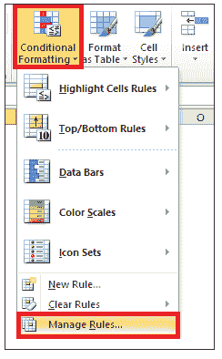
3.  将打开**条件格式规则管理器窗口**(参见下图)。从“显示格式规则:”下拉列表中，选择要查看规则的任何工作表或当前工作表。
    T3】
4.  一旦您选择了任何工作表或当前选择，您将注意到窗口**的**底部面板**将显示您为所选工作表或范围应用的所有规则**。
    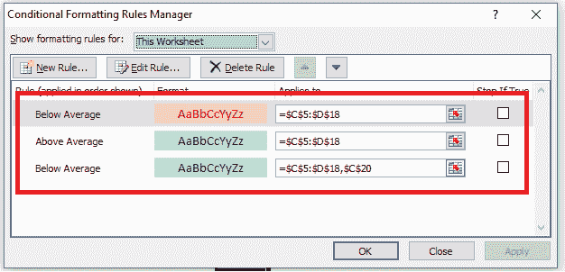

## 管理条件格式规则

下面给出了快速管理 Excel 工作表中应用的规则的步骤:

1.  转到 Excel 功能区的**主页**选项卡。单击 Excel“样式”组中列出的**条件格式**下拉箭头。
2.  它将打开一个包含条件格式选项列表的窗口；**选择**【管理规则】中的**。**
    
3.  将打开**条件格式规则管理器窗口**(参见下图)。从“显示格式规则:”下拉列表中，我们将选择“此工作表”。该工作表上应用的所有规则将显示在底部面板中。
    T3】
4.  在规则管理器的顶部，你会发现你可以采取的各种规则管理器**动作。**选择一个动作，点击**“应用”。**
    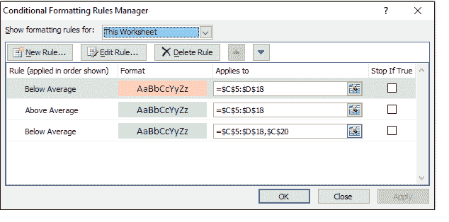
5.  最后点击“确定”按钮，将更改应用到工作表中。

## 创建新规则

虽然预定义的规则非常有用，但在许多情况下，这些规则不能满足您的要求。Excel 允许您创建新规则，以便您可以根据自己的需要自定义工作表。

下面给出了使用条件格式标尺管理器创建新规则的步骤:

1.  转到 Excel 功能区的**主页**选项卡。单击 Excel“样式”组中列出的**条件格式**下拉箭头。
2.  它将打开一个包含条件格式选项列表的窗口；**选择**【管理规则】中的**。**
    
3.  将打开**条件格式规则管理器窗口**(参见下图)。从“显示格式规则:”下拉列表中，我们将选择“此工作表”。该工作表上应用的所有规则将显示在底部面板中。
    T3】
4.  点击**“新规则”**选项下方列出的‘显示格式规则为:
    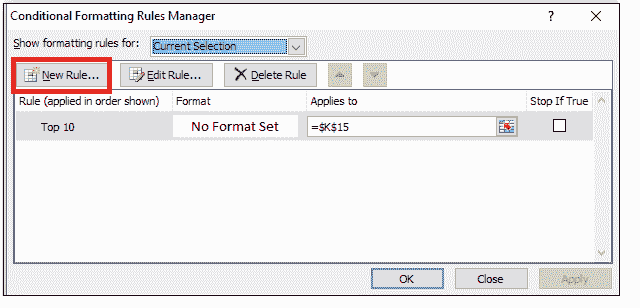
5.  它将打开一个辅助窗口，您可以从中选择任何一组规则或自定义自己的规则。点击确定。
    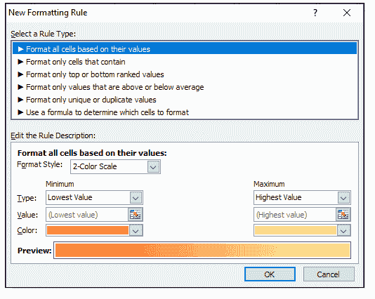

## 更改条件格式规则的优先级

当 excel 数据中有多个规则时，两个或多个规则可能会同时应用于单个单元格。为了避免歧义，您可能需要定义应用于单元格的规则的顺序。具有最高优先权的规则将被赋予优先权。

这里有一个例子:让我们假设你想根据他们的排名突出显示这些值。您已经创建了一些规则来突出显示包含低于平均值且位于底部 30%的单元格。但是低于平均水平的细胞值是你最关心的。在这种情况下，您可以管理规则的优先级，以便如果低于平均值的规则适用于这些单元格，它将停止在那里，并且不会突出显示底部 30%的单元格。

以下是使用规则管理器更改 Excel 工作表中条件格式规则顺序的步骤:

1.  单击具有多个条件格式规则的区域中的单元格。
2.  转到 Excel 功能区的**主页**选项卡。单击 Excel“样式”组中列出的**条件格式**下拉箭头。
3.  它将打开一个包含条件格式选项列表的窗口；**选择**【管理规则】中的**。**
    
4.  将打开**条件格式规则管理器窗口**(参见下图)。从“显示格式规则:”下拉列表中，我们将选择“此工作表”。该工作表上应用的所有规则将显示在底部面板中。
    T3】
5.  在每条规则的前面，您会注意到一个复选框，指示**如果为真则停止**设置。
6.  选择要更改顺序的规则。
7.  要按顺序向上移动规则，点击**向上移动。**要按顺序下移规则，请单击**下移。**
    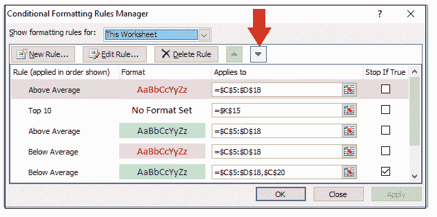
8.  点击**确定。**

就这样！条件格式规则根据指定的优先级应用于工作表中。

## 删除规则

有时你会创建一个不再有用的新规则。在这种情况下，您也可以删除该规则。

以下是使用条件格式规则管理器删除 Excel 工作表中的规则的步骤:

1.  转到 Excel 功能区的**主页**选项卡。单击 Excel“样式”组中列出的**条件格式**下拉箭头。
2.  它将打开一个包含条件格式选项列表的窗口；**选择**【管理规则】中的**。**
    
3.  将打开**条件格式规则管理器窗口**(参见下图)。从“显示格式规则:”下拉列表中，我们将选择“此工作表”。该工作表上应用的所有规则将显示在底部面板中。
    T3】
4.  如果有多个规则，只需选择您想要删除的规则。
5.  点击**“删除规则”**选项下方列出的‘显示格式规则为:
    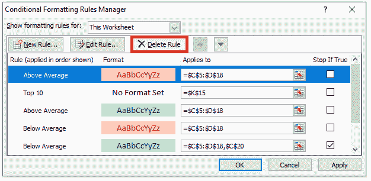
6.  Excel 不确认删除操作。一旦点击删除，条件格式规则将被永久删除。

## 示例 1 -使用 Excel 条件格式规则管理器，用两个不同颜色的非数值突出显示单元格。

**下表有学生姓名、分数和成绩三个字段。用颜色突出显示等级列数据，例如用绿色突出显示“A”级，用红色突出显示“B”级。**

| 学生姓名 | 得分 | 级别 |
| Rahul | Six hundred and fifty-seven | C |
| 瓦伦 | Eight hundred and ninety | B |
| 喜马偕尔邦 | Five hundred and forty-three | C |
| 蒂娜（号外乐团成员） | Six hundred and seventy-eight | C |
| 杰克林 | Nine hundred and eighty | A |
| 出汗了 | eight hundred | B |
| 穆罕默德 | Five hundred | C |

***解决方案:*** 下面给出了用两种不同颜色突出等级的详细步骤:

**STEP-1 选择单元格范围**

选择要突出显示值的整个单元格区域或数组。在我们的例子中，我们选择了从 E5 到 E11 的单元格 ***。*T3】**

参考下图:

**步骤 2:键入新规则**

1.  转到 Excel 功能区的**主页**选项卡。点击**条件格式- >** 新规则。
    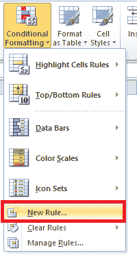
2.  将出现“新格式规则”窗口。从第一个下拉窗口中选择规则类型“仅格式化包含“
    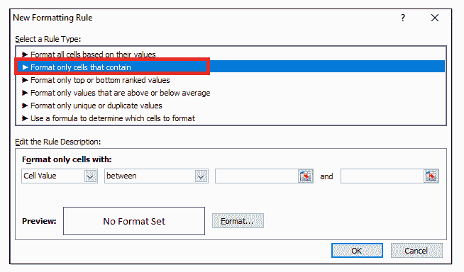的单元格”
3.  您会注意到，只要选择一个规则类型，底部面板的数据就会自动更改。
4.  在第一个下拉列表(单元格值)中，选择“特定文本”。在第二个下拉窗口中，选择“包含”。在第三个文本框中，键入“一”。
    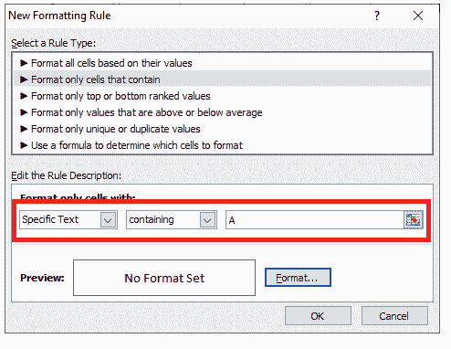
5.  单击底部的格式选项。将出现单元格格式窗口。在“填充”选项卡中选择绿色，然后单击“确定”。
    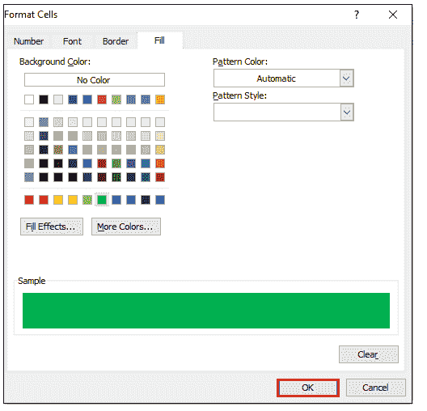
6.  预览框中将显示相同的颜色。点击确定。
    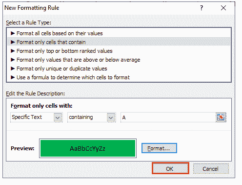

**步骤 3:选择条件格式管理规则**

1.  转到 Excel 功能区的**主页**选项卡。单击 Excel“样式”组中列出的**条件格式**下拉箭头。
2.  它将打开一个包含条件格式选项列表的窗口；**选择**【管理规则】中的**。**
    
3.  将打开**条件格式规则管理器窗口**(参见下图)。从“显示格式规则:”下拉列表中，我们将选择“此工作表”。该工作表上应用的所有规则将显示在底部面板中。
    T3】

**步骤 4:使用规则管理器创建新规则**

1.  将出现“新格式规则”窗口。从第一个下拉窗口中选择规则类型“仅格式化包含“
    的单元格”
2.  您会注意到，只要选择一个规则类型，底部面板的数据就会自动更改。
3.  在第一个下拉列表(单元格值)中，选择“特定文本”。在第二个下拉窗口中，选择“包含”。在第三个文本框中，键入“B”。
    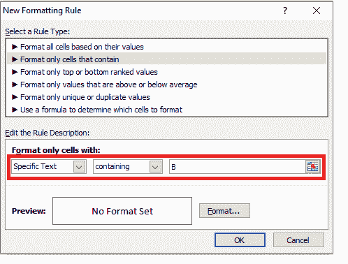
4.  单击底部的格式选项。将出现单元格格式窗口。从那里选择“填充”选项卡中的红色，然后单击“确定”。
    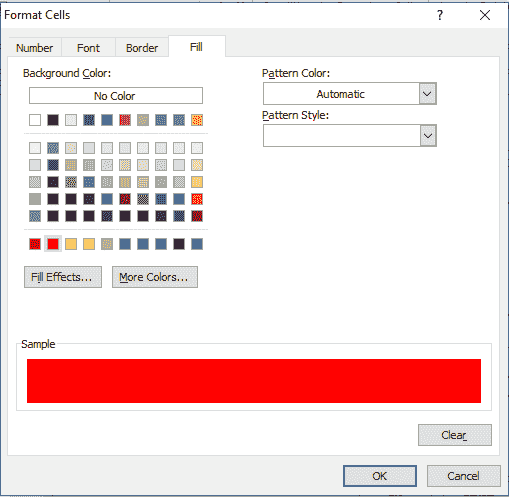
5.  预览框中将显示相同的颜色。点击确定。

**步骤 4 A 级和 B 级单元格高亮显示**

因此，您会注意到所有包含值 A 的单元格都用绿色突出显示，而包含值 B 的单元格用红色突出显示。

查看下图的结果输出。

* * *