# Excel 顶部/底部规则

> 原文:[https://www.javatpoint.com/excel-top-bottom-rules](https://www.javatpoint.com/excel-top-bottom-rules)

你是否厌倦了一遍又一遍地查看大数据工作表(包含数字和文本)？Microsoft Excel 提供了快速帮助，以易于阅读的格式呈现大块数据。你们中的许多人可能已经猜到了，事实上你是真实的；它是强大的条件格式工具，使 Excel 用户能够将自定义格式应用于满足特定条件的单元格。

顶部/底部规则是微软 Excel 中条件格式工具的另一个很酷的特性，它使您能够对满足统计条件的工作表单元格应用特定的格式。此功能通常用作基于颜色的格式，以强调、突出显示或区分大型数据。它允许通过一瞥识别不同的单元格值。

## 什么是 Excel 顶/底规则？

***“Excel 中的条件格式顶端/底端规则允许用户突出显示满足条件的单元格(前 10 项...，倒数 10 项...，前 10%...，底部 10%...，高于平均水平...或低于平均水平...)在选定的范围内。*T3】**

顶部/底部规则是条件格式的一部分，它使您能够将格式应用于满足范围内统计条件的单元格。(例如，低于平均水平，在前 10 项之内，或低于 10%等。).

#### 注意:指定的标准仅适用于包含数字数据的 Excel 单元格。

Excel 顶部/底部规则选项列在“条件格式”菜单中，位于 Excel 功能区的**主页**选项卡的“样式”组中。选择此选项后，将弹出一个二级窗口，显示顶部/底部规则的各种子类别选项。

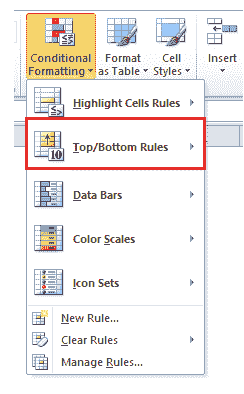

## 顶部/底部规则选项

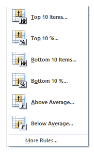

当我们从条件格式菜单中选择**顶部/底部规则**时，出现顶部底部二级窗口(参见下图)。Excel 顶部/底部条件格式还提供了 6 种不同的内置选项，可以轻松地 ***突出显示选定单元格区域中具有最高或最低值的单元格。*** 这使用户能够选择要应用于符合所需标准的单元格的格式。

1.  前 10 项
    根据满足所选范围内最高值标准的单元格值，用一种颜色选项突出显示单元格。
2.  前 10%
    根据满足所选范围内最高百分比值标准的单元格值，用一种颜色选项突出显示单元格。
3.  底部 10 项
    根据满足所选范围底部值标准的单元格值，用颜色选项之一突出显示单元格。
4.  底部 10%
    根据满足所选范围内底部百分比值的单元格值，用一种颜色选项突出显示单元格。
5.  高于平均值
    如果单元格值高于所选范围内的平均值，则高亮显示单元格。
6.  低于平均值
    如果单元格值低于所选范围内的平均值，则高亮显示单元格。

### 顶部/底部外观选项

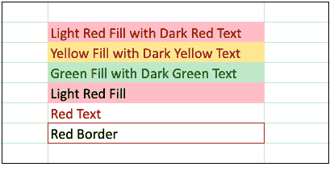

Microsoft Excel 提供了预定义的外观选项，用于有条件地格式化和突出显示单元格。各种选项如下:

1.  浅红色填充深红色文本(默认选项)
2.  用暗黄色文本填充黄色
3.  用深绿色文本填充绿色
4.  浅红色填充
5.  红色文本
6.  红色边框

## 示例 1 -前 10 项的 Excel 条件格式顶部/底部规则。

**下表代表每位员工一年内实现的总销售目标。我们将应用条件格式，用给定的数据对前 10 名最高销售额进行分类。**

| 雇主名称 | 2021 年 |
| 詹娜 | $122,000.00 |
| 埃琳娜 | $345,634.00 |
| 最大 | $145,324.00 |
| 罗伯特 | $213,456.00 |
| 杰维德 | $234,567.00 |
| 子弹 | $675,432.00 |
| 约瑟 | $56,432.00 |
| 恐怖以及辅助 | $23,453.00 |
| 迪伊 | $231,456.00 |
| 吉安 | $10,987,652.00 |
| 马大 | $1,365,473.00 |
| 斯蒂芬 | $12,344.00 |
| 美好的 | $212,345.00 |

***解决方案:*** 下面给出了使用内置的顶部/底部规则选项在 Excel 工作表中查找前 10 个值的详细步骤:

**STEP-1 选择单元格范围**

选择整个单元格区域或数组，您希望在其中使用顶部/底部规则条件格式突出显示前 10 个值。在我们的例子中，我们选择了从 B3 到 C16 的细胞。T3】

参考下图:

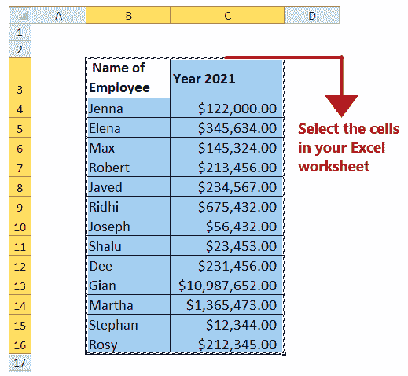

**第二步:点击条件格式顶端/底端规则**

*   转到 Excel 功能区的**主页**选项卡。单击 Excel“样式”组中列出的**条件格式**。
*   它将打开一个包含条件格式选项列表的窗口；点击**顶部/底部规则。**
    

**第 3 步点击前 10 项**

完成上述步骤后，屏幕上会弹出一个二级窗口，显示所有的顶部/底部规则，因为我们被要求只选择问题中的前 10 个销售数字。那么我们就选择**前 10 项？**

参考下图:

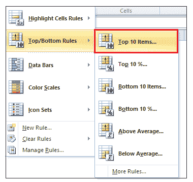

**步骤 4:填写数据条目**

一旦您选择了前 10 项，就会出现另一个窗口(参见下图)，要求您填写条目以格式化排名在前 10 位的单元格:

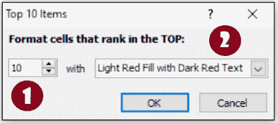

1.在第一个字段中，我们将提到数字，并使用小箭头将 ***项的数量更改为前 10 项。*T3】**

#### 注意:默认的顶部/底部百分比是 10，尽管用户可以指定最多 100 的任何整数。

2.在第二个字段中，我们将选择颜色选项来格式化和突出显示前 10 个单元格。这里 ***选择了浅红色填充暗红色文本外观选项。*T3】**

#### 注意:您可以根据需要自定义格式颜色。只需点击外观下拉菜单中的自定义格式选项。将出现另一个窗口，您可以通过该窗口更改字体样式、边框，并使用自定义颜色突出显示前 10 个单元格。

**步骤-4 前 10 个单元格将高亮显示**

因此，您会注意到前 10 个销售单元格都用粉色填充，文本用红色突出显示。

查看下图的结果输出。

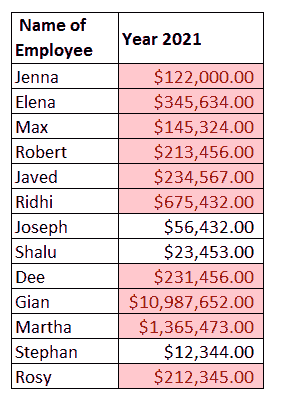

发现了。现在，您已经学习了如何对 excel 工作表中的前 10 项应用条件格式规则。类似地，按照上面的步骤，你可以找到最后 10 个值。

## 示例 2 -带有底部 10 项的 Excel 条件格式顶部/底部规则。

**我们将应用条件格式来突出显示给定数据的倒数 10 个最低销售数字。**

| 雇主名称 | 2021 年 |
| 詹娜 | $122,000.00 |
| 埃琳娜 | $345,634.00 |
| 最大 | $145,324.00 |
| 罗伯特 | $213,456.00 |
| 杰维德 | $234,567.00 |
| 子弹 | $675,432.00 |
| 约瑟 | $56,432.00 |
| 恐怖以及辅助 | $23,453.00 |
| 迪伊 | $231,456.00 |
| 吉安 | $10,987,652.00 |
| 马大 | $1,365,473.00 |
| 斯蒂芬 | $12,344.00 |
| 美好的 | $212,345.00 |

下面给出了使用内置的顶部/底部规则选项在 Excel 工作表中查找底部 10 个值的详细步骤:

**STEP-1 选择单元格范围**

选择整个单元格区域或数组，您希望在其中使用顶部/底部规则条件格式突出显示底部值。在我们的例子中，我们选择了从 B3 到 C16 的细胞。T3】

参考下图:

**第二步:点击条件格式顶端/底端规则**

*   转到 Excel 功能区的**主页**选项卡。单击 Excel“样式”组中列出的**条件格式**。
*   它将打开一个包含条件格式选项列表的窗口；点击**顶部/底部规则。**
*   屏幕上会弹出一个二级窗口，显示所有的最高/最低规则，因为我们被要求只选择问题中最低的 10 个销售数字。那么我们就选择**倒数 10 项？**

参考下图:

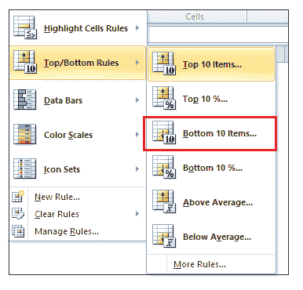

**步骤 4:填写数据条目**

一旦您选择了底部 10 个项目，就会出现另一个窗口(参见下图)，要求您填写条目以格式化排列在底部的单元格:

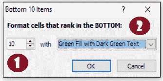

1.在第一个字段中，我们将提到数字，并通过使用小箭头**将项目数量更改为底部 10。**

#### 注意:默认的顶部/底部百分比是 10，尽管用户可以指定最多 100 的任何整数。

2.在第二个字段中，我们将选择颜色选项来格式化和突出显示底部的 10 个单元格。在这里，我们选择了**绿色填充深绿色文本外观选项。**

**步骤-4 底部的 10 个单元格将被突出显示**

因此，您会注意到底部的 10 个销售数字单元格都用绿色填充，文本用深绿色突出显示。

查看下图的结果输出。

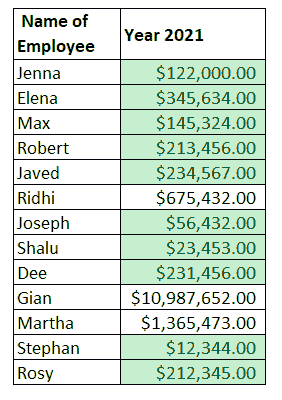

搞定了。底部的 10 个值以不同的颜色突出显示。

## 示例 3 -带有前 10%和后 10%的 Excel 条件格式顶部/底部规则。

**我们将应用条件格式来突出显示给定数据的前 10%值和后 10%值。**

| 雇主名称 | 2021 年 |
| 詹娜 | $122,000.00 |
| 埃琳娜 | $345,634.00 |
| 最大 | $145,324.00 |
| 罗伯特 | $213,456.00 |
| 杰维德 | $234,567.00 |
| 子弹 | $675,432.00 |
| 约瑟 | $56,432.00 |
| 恐怖以及辅助 | $23,453.00 |
| 迪伊 | $231,456.00 |
| 吉安 | $10,987,652.00 |
| 马大 | $1,365,473.00 |
| 斯蒂芬 | $12,344.00 |
| 美好的 | $212,345.00 |

下面给出了使用内置的顶部/底部规则选项在 Excel 工作表中查找顶部 10%值和底部 10%值的详细步骤:

**STEP-1 选择单元格范围**

选择整个单元格区域或数组，您希望在其中使用顶部/底部规则条件格式突出显示前 10%的值。在我们的例子中，我们选择了从 B3 到 C16 的细胞。T3】

参考下图:

**第二步:点击条件格式顶端/底端规则**

*   转到 Excel 功能区的**主页**选项卡。单击 Excel“样式”组中列出的**条件格式**。
*   它将打开一个包含条件格式选项列表的窗口；点击**顶部/底部规则。**
*   屏幕上会弹出一个辅助窗口，显示所有的最高/最低规则，因为我们被要求突出问题中的最高 10%和最低 10%的值。所以首先我们会选择**前 10%...**

参考下图:

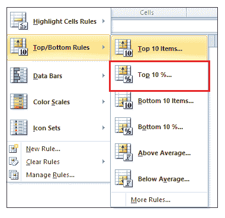

**步骤 4:填写数据条目**

一旦你选择了前 10%...，将出现另一个窗口(参见下图)，要求您填写条目以格式化排名靠前的单元格:

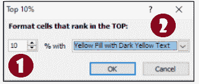

1.在第一个字段中，我们将提到数字，通过使用小箭头，我们将项目的数量更改为前 10 名。

#### 注意:默认的顶部/底部百分比是 10，尽管用户可以指定最多 100 的任何整数。

2.在第二个字段中，我们将选择颜色选项来格式化和突出显示前 10%的单元格。在这里，我们选择了**用深黄色文本填充黄色外观选项。**

**第 4 步-前 10%数值的单元格数值将突出显示**

因此，您会注意到 10%的单元格用黄色填充，文本用深黄色突出显示。

查看下图的结果输出。

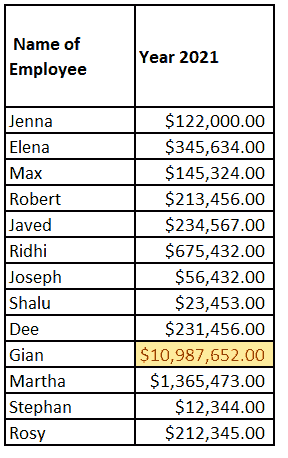

**第五步:对底部 10%** 重复上述步骤

重复同样的步骤，但选择**底部 10%...从条件格式窗口中选择**。

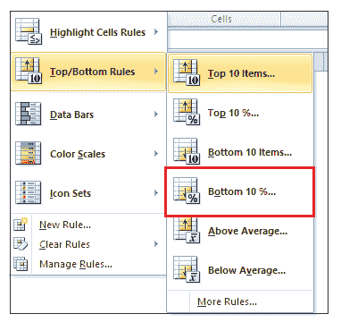

选择“浅红色填充”外观选项。因此，您会注意到，最快的值也用红色突出显示:

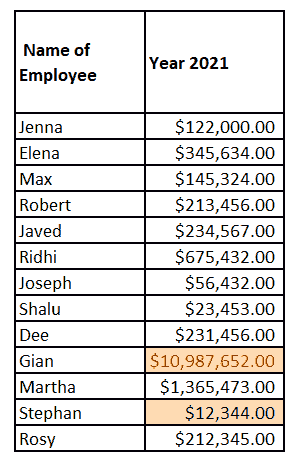

## 示例 4 -高于平均值和低于平均值的 Excel 条件格式顶部/底部规则。

**我们将应用条件格式，用给定的数据突出显示高于平均水平和低于平均水平的销售金额。**

| 雇主名称 | 2021 年 |
| 詹娜 | $122,000.00 |
| 埃琳娜 | $345,634.00 |
| 最大 | $145,324.00 |
| 罗伯特 | $213,456.00 |
| 杰维德 | $234,567.00 |
| 子弹 | $675,432.00 |
| 约瑟 | $56,432.00 |
| 恐怖以及辅助 | $23,453.00 |
| 迪伊 | $231,456.00 |
| 吉安 | $10,987,652.00 |
| 马大 | $1,365,473.00 |
| 斯蒂芬 | $12,344.00 |
| 美好的 | $212,345.00 |

下面给出了使用内置的顶部/底部规则选项在 Excel 工作表中查找高于平均值和低于平均值的详细步骤:

**STEP-1 选择单元格范围**

选择整个单元格区域或数组，您希望在其中使用顶部/底部规则条件格式突出显示低于平均值的值。在我们的例子中，我们选择了从 B3 到 C16 的细胞。T3】

参考下图:

**第二步:点击条件格式顶端/底端规则**

*   转到 Excel 功能区的**主页**选项卡。单击 Excel“样式”组中列出的**条件格式**。
*   它将打开一个包含条件格式选项列表的窗口；点击**顶部/底部规则。**
*   屏幕上会弹出一个辅助窗口，显示所有的顶部/底部规则。因为我们被要求只突出问题中低于平均值的单元格值。所以我们会选择**低于平均值？**选项。

参考下图:

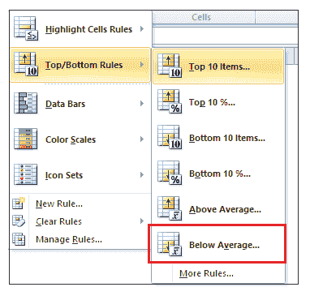

**步骤 4:填写数据条目**

选择“低于平均值”后，将出现另一个窗口(参见下图)，要求您显示下拉框以格式化单元格:

1.  在顶部字段中，我们将选择颜色选项来格式化和突出显示高于平均单元格值的单元格。这里，我们选择了绿色填充深绿色文本外观选项。
2.  点击确定。

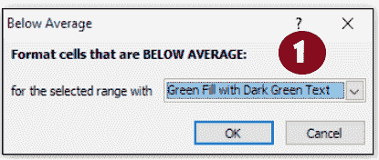

**步骤-4 由高于平均单元格值组成的单元格将突出显示**

因此，您会注意到所有高于平均值的单元格都用绿色填充，文本用深绿色突出显示。

#### 注意:为了确保我们计算了平均值，并且您交叉检查突出显示的值是否高于该平均值。

查看下图的结果输出。

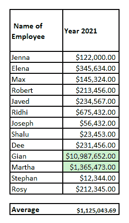

**第五步:以低于平均值**重复上述步骤

重复同样的步骤，但是选择**低于平均值...从条件格式窗口中选择**。

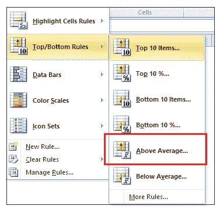

选择“浅红色填充”外观选项。因此，您会注意到，上面的平均单元格值也用红色突出显示:

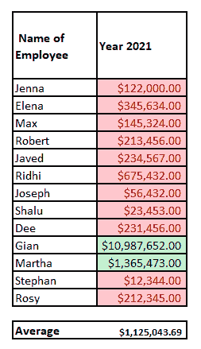

* * *