# 在 Excel 中复制工作表

> 原文：<https://www.javatpoint.com/copy-worksheet-in-excel>

微软 Excel，微软 Excel 的简称，是一个功能强大的电子表格软件，使用它我们可以访问工作表，并在几个单元格中记录大量数据。在经常使用 Excel 的时候，我们经常会遇到需要为了不同的目的使用相同的数据的情况。

例如，出于测试目的或其他原因，我们可能需要备份工作表中的基本数据或创建同一工作表的多个副本。我们可以将数据或工作表复制到另一个工作表中，而不是在新工作表中重新输入整个数据。

本文讨论了几种理解如何在 Excel 中复制工作表的方法。本文还讨论了用户可能需要频繁复制工作表的具体情况。这里讨论的方法几乎适用于所有的 Excel 版本，如 Excel 2010、2013、2016 等。

## 如何在 Excel 中复制工作表？

Microsoft Excel 提供了各种选项来执行大多数内置任务或执行现有命令或工具。同样，在 Excel 中复制工作表或复制工作表也有几种方法。

以下是在 Excel 中将一个工作表复制到另一个工作表时最常用和最有效的方法:

*   使用拖动复制工作表
*   使用右键单击复制工作表
*   使用功能区复制工作表
*   使用键盘快捷键复制工作表

让我们详细讨论每种方法:

### 使用拖动复制工作表

拖放功能通常用于将某些内容从一个位置复制或移动到另一个位置。同样的方法也可以用于复制工作表。拖放是在同一 Excel 工作簿中复制工作表的最快方法之一。我们必须执行以下步骤来使用拖动方法复制工作表:

*   首先，我们需要**选择要将内容复制到另一张纸上的工作表**。要在 Excel 工作簿中选择所需的工作表，我们需要从**工作表标签中点击特定的工作表。**例如选择要复制的单张 1，如下图:
    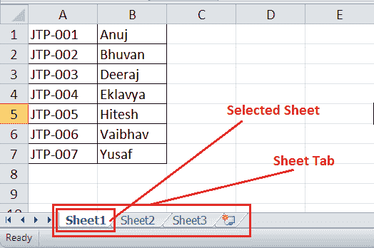
*   接下来，我们必须按住键盘上的 **Ctrl** 键并**拖动**选定的工作表(工作表 1)穿过工作表标签。我们可以将工作表放在两个连续的工作表之间，以放置源工作表的副本。
    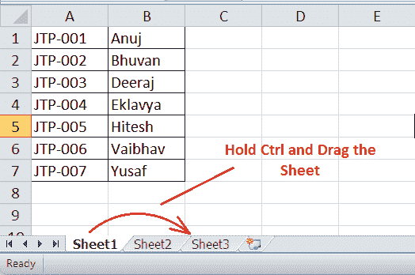
*   在我们拖动选定的工作表后，Excel 会在相应的位置创建选定工作表(工作表 1)的副本，名称为源工作表(2)，即工作表 1 (2)。在我们的示例中，它看起来像这样:
    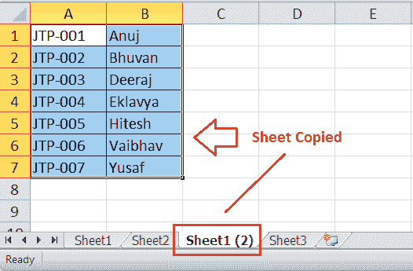

### 使用右键单击复制工作表

使用右键菜单(也称为上下文菜单)是复制工作表或制作重复工作表的另一种简单快捷的方法。这个方法也使用鼠标。我们必须执行以下步骤才能使用右键单击方法复制工作表:

*   首先，我们需要选择要复制的工作表。之后，我们必须在**工作表标签中的特定工作表上用鼠标右键单击**按钮。 Excel 会显示很多选项。这里需要从列表中选择**【移动或复制】**选项，如下图:
    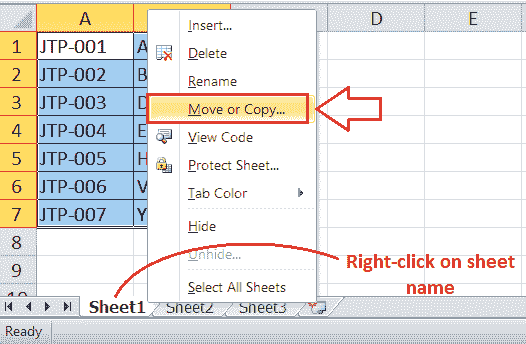
*   在下一个(移动或复制)窗口中，我们必须从**“在工作表之前”**部分下的列表中选择工作表名称。源工作表将被复制到列表中选定的工作表之前。但是，我们也可以选择**“移动到末端”**选项，在工作表标签的末端复制一张工作表。
*   从列表中选择所需选项后，我们必须确保勾选或标记文本**“创建副本”**之前的框。如果我们不勾选“创建副本”框，源工作表将被移动，但不会被复制。最后，我们必须点击**确定**按钮。
    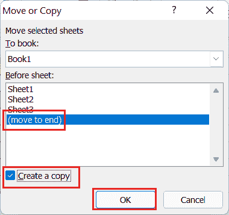
    这将在工作簿中的选定位置创建选定工作表或源工作表的副本。在我们的示例中，我们复制了末尾的工作表，如下所示:
    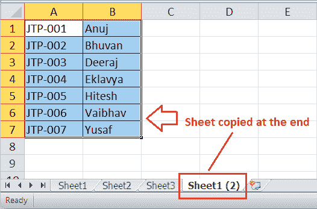

### 使用功能区复制工作表

Excel 的功能区是用户可以访问所有内置功能、工具或命令的主要区域。要使用功能区在 Excel 中复制工作表，我们必须遵循以下步骤:

*   首先，我们必须使用工作表标签选择要复制的工作表。
*   接下来，我们必须导航到功能区上的**主页**选项卡，并从名为**单元格的部分中选择**格式**按钮，**如下所示:
    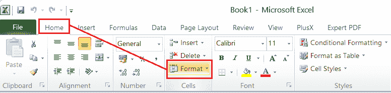
*   选择“格式”按钮后，Excel 会显示一个包含各种选项的下拉列表。在这里，我们必须点击**“移动或复制工作表”**选项。
    T3】
*   完成上一步后，我们将看到一个类似于上一方法的移动或复制对话框。
    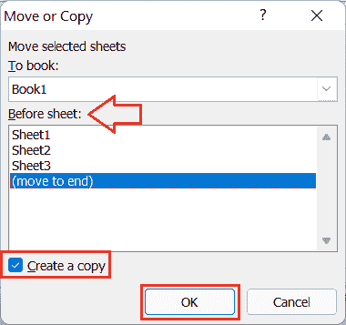
    和前面的方法一样，我们必须选择要复制所选工作表的工作表，勾选**【创建副本】**框，点击**确定**按钮。

### 使用键盘快捷键复制工作表

键盘快捷键是执行大多数 Excel 任务最快捷、最简单的方法。Excel 还提供了各种快捷方式，我们可以按顺序使用这些快捷方式将工作表轻松复制到另一个位置。要使用键盘快捷键复制工作表，我们可以按照以下步骤操作:

*   首先，我们需要打开或选择要复制的工作表。
*   接下来，我们必须使用快捷方式**‘Ctrl+A’**来选择整个工作表或工作表的内容。
*   选择工作表后，我们必须使用快捷方式**‘Ctrl+C’**来复制整个工作表。
*   复制工作表后，我们必须从工作表标签转到另一个工作表(目标工作表)。如果活动工作簿中没有工作表，我们可以使用快捷方式**“Shift+F11”**或**“Alt+Shift+F1”创建新工作表。**我们必须选择目标工作表的第一个单元格，并使用快捷方式**‘Ctrl+V’**粘贴从源工作表复制的内容。

## 在 Excel 中复制工作表的具体案例

在基本情况下，尤其是在相同工作簿中复制工作表时，上述方法对于复制工作表非常有用。但是，当我们可能需要将一个工作表复制到另一个现有的或新的工作簿、复制多个工作表、用公式复制工作表内容等时，可能会有各种特定的用例。在这种特殊情况下，我们需要遵循一些额外的步骤。

以下是我们可能需要在 Excel 中复制工作表的一些最常见情况:

## 将工作表复制到另一个工作簿

将工作表复制到另一个工作簿时，我们可以使用上面讨论的四种方法中的任何一种。让我们相互理解:

### 通过使用拖动

*   首先，我们需要打开两个 Excel 工作簿，一个要复制，另一个要复制到。
*   打开两个 Excel 工作簿后，我们需要导航到**视图**选项卡，并从部分窗口中单击**并排视图**选项。这将在屏幕上并排水平排列两个工作簿。
    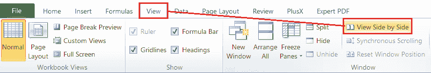
*   接下来，我们必须从第一个工作簿(源工作簿)中选择工作表。我们需要按住 **Ctrl** 键，将选中的工作表拖到另一个工作簿上。
    T3】
*   最后，我们必须将选定的工作表放在第二个工作簿的“工作表”选项卡中工作表之间的所需位置。
    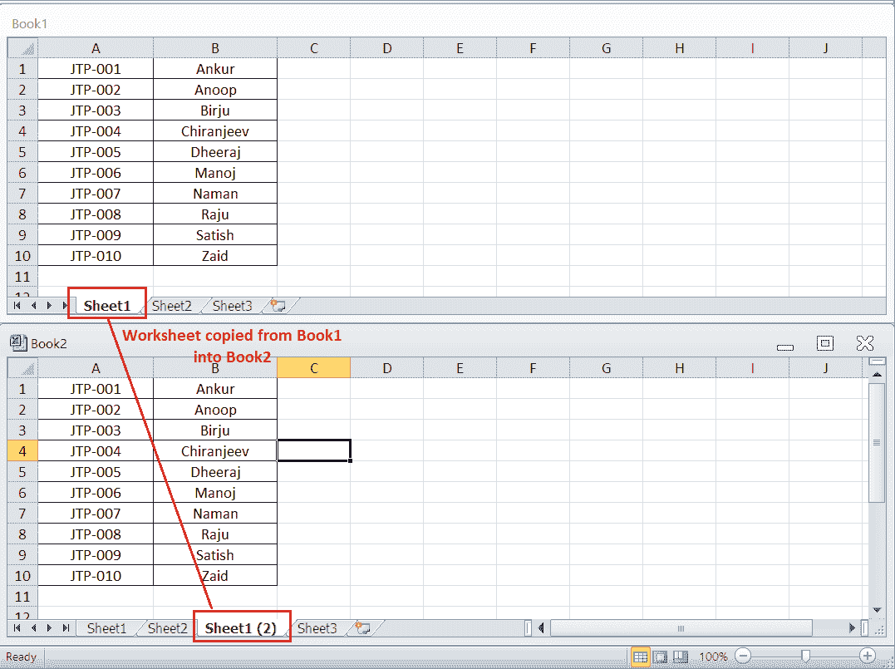

### 通过使用右键单击

*   我们需要右键单击源工作表，选择**‘移动或复制’。**
    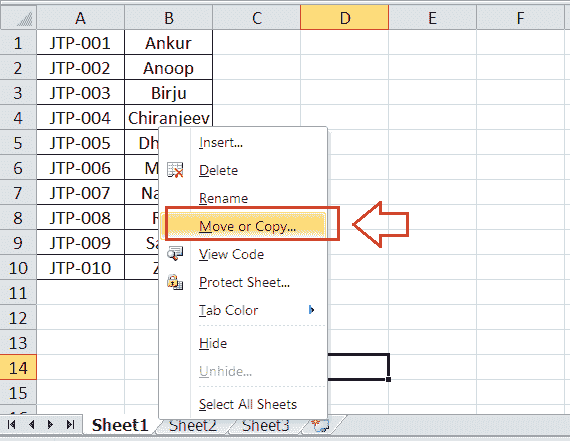
*   接下来，我们必须从**“要预订”下的下拉列表中选择目标或目的工作簿。**但是，目标工作簿必须在后台活动。
    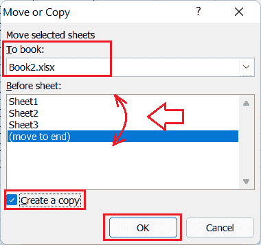
    如果要将工作表复制到新工作簿中，可以从下拉列表中选择**【新书】**选项。
    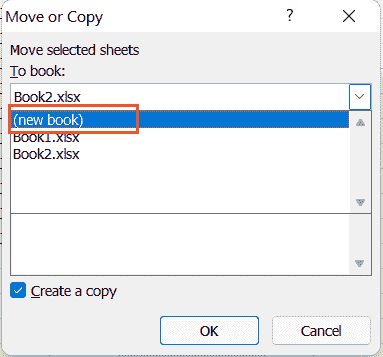
*   选择工作簿后，我们必须选择工作表的复制位置。例如，在任何现有工作表之前或目标工作簿的末尾。最后，我们必须勾选**“创建副本”**框，然后点击**确定**按钮。
    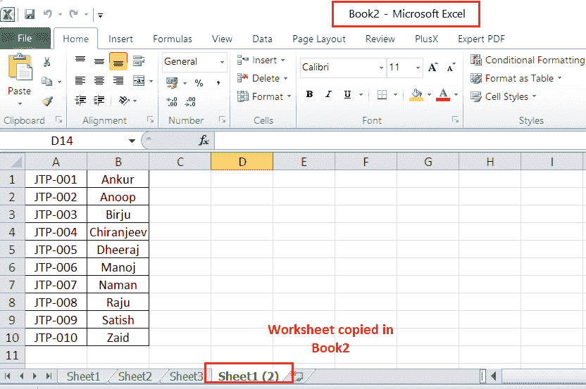

### 通过使用功能区

*   首先，我们需要打开源工作簿和目标工作簿。
*   接下来，我们必须在源工作簿(第一册)中选择要复制的工作表。我们必须导航到**主页**选项卡，并选择**格式**按钮。之后，我们必须点击**“移动或复制工作表”**选项。
    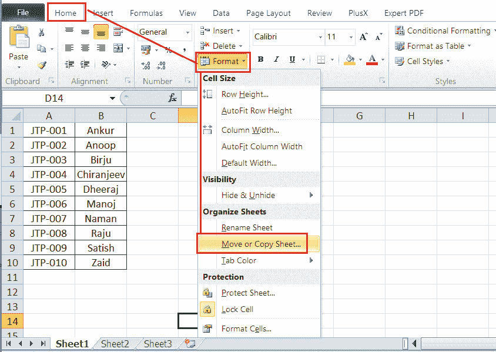
*   Excel 将启动“移动”或“复制”对话框，如前面的方法所示。我们需要选择目标工作簿(第 2 本、第 3 本或新工作簿)，在工作表标签上选择一个位置来复制工作表，勾选**“创建副本”**框，然后点击**确定。**
    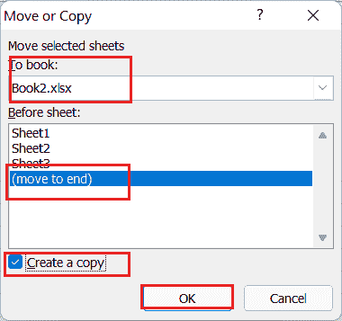

### 通过使用键盘快捷键

*   首先，我们需要打开源工作簿和目标工作簿。
*   接下来，我们必须在源工作簿中打开一个要复制的工作表，使用**‘Ctrl+A’，**选择整个工作表，并使用**‘Ctrl+C’复制它。**
*   复制工作表后，我们需要转到另一个工作簿。在目标工作簿中打开目标工作表，使用**‘Ctrl+V’粘贴工作表。**

## 一次复制多个工作表或选项卡

我们也可以一次复制多个 Excel 工作表，而不是复制一个工作表。但是，在使用上面讨论的任何方法之前，如拖动、右键单击、使用功能区或键盘快捷键，我们必须选择所有需要复制的(源)工作表。

要选择多个工作表，我们可以使用以下任一方法:

*   当我们需要选择相邻的工作表(或连续的工作表)时，我们必须按住 **Shift** 键，并从工作表标签中单击第一个和最后一个工作表。这将选择/突出显示第一个和最后一个选定工作表之间的所有工作表。
*   当我们需要选择**不相邻的**工作表(或非连续的工作表)时，我们必须按住 **Ctrl** 键，并从工作表标签中逐个单击每个工作表。这将只选择/突出显示我们在按住 Ctrl 键时单击的那些工作表。

## 复制包含公式的工作表

通常，我们可以使用上面讨论的任何方法复制带有公式的工作表。此外，在大多数情况下，公式引用会自动调整。例如，假设我们将一个包含公式的工作表 1 复制到同一工作簿中的另一个工作表。在这种情况下，除非我们没有使用指向另一个工作表或 Excel 工作簿的外部单元格引用，否则公式将被更改为引用源工作表。

下图显示了从 Sheet1 复制到新工作表时公式的自动调整:

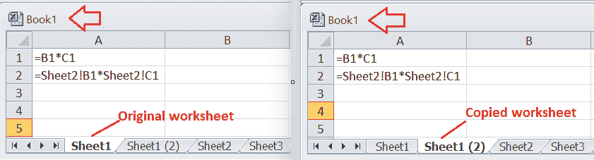

默认情况下，将工作表复制到另一个工作簿时，公式引用会以下列方式更改:

用于另一个工作簿中工作表的引用，无论是绝对的还是相对的，都将引用与原始工作簿或源工作簿相同的工作表。单元格引用或工作表引用不会被更改。但是，另一个(或新的)工作表中的引用也将指向原始工作簿。

例如，我们的示例显示，与原始工作簿相比，另一个工作表中的引用自动发生了微小的变化。尽管单元格引用或工作表名称相同，但在复制的工作表中，工作簿名称会添加到工作表名称之前。

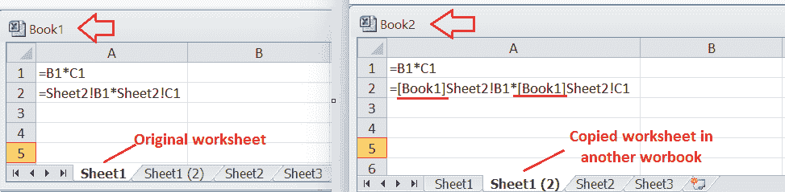

若要解决此问题或更改另一个工作簿中的公式以匹配目标工作簿的引用，我们必须从公式中删除源工作簿名称。这可以使用 Excel 的“查找和替换”工具来完成。将带有公式的工作表复制到另一个工作簿后，我们必须执行以下步骤:

*   首先，我们必须在另一个(或新的或目标)工作簿中选择复制的工作表，并从功能区导航到**公式>显示公式**以使所有公式可见。
    T3】
*   接下来，我们必须选择所有包含要进行更改的公式的单元格(删除原始工作簿名称)。
*   选择公式单元格后，需要使用快捷方式**【Ctrl+H】**打开**【查找替换】**对话框。
*   我们必须在对话框的“查找内容”框旁边键入**原始工作簿名称**。在我们的示例中，我们键入“[Book1]”，因为它是原始工作簿的名称。此外，我们必须将“替换为”框留空，如下图所示:
    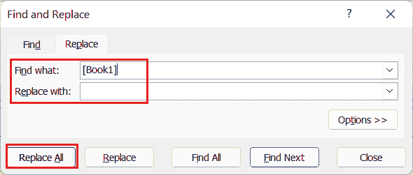
*   最后，我们必须单击全部替换按钮。这将从公式中删除原始工作簿(即 Book1)的名称，并使其适合目标工作簿。如我们的示例所示，目标工作簿中的公式已从**=【Book1】sheet 2 更改！B1*[Book1]Sheet2！C1 to =Sheet2！B1*Sheet2！C1。**
    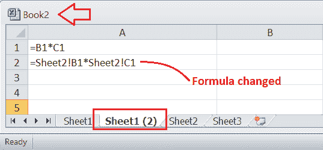

## 需要记住的要点

*   使用拖动功能在 Excel 中复制工作表时，我们只能在同一工作簿中复制，不能在其他工作簿中复制。
*   当使用 Excel 的移动或复制功能将工作表复制到另一个工作簿时，Excel 会限制我们从下拉列表中选择目标工作簿。下拉列表仅显示活动工作簿。因此，在使用移动和复制功能之前，我们需要打开源工作表和目标工作簿(或工作表)。

* * *