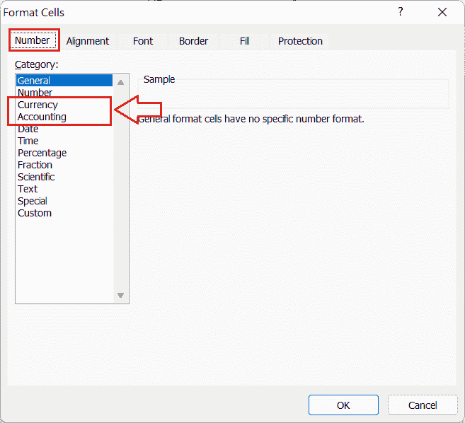

# Excel 中的货币与会计格式

> 原文：<https://www.javatpoint.com/currency-vs-accounting-format-in-excel>

微软 Excel 或微软 Excel 是目前最流行和功能最强大的电子表格软件，用于跨多个工作表记录单元格内的数据。它使用户能够在每个工作表中存储大量数据。此外，它支持各种数字格式，如数值、文本、百分比、分数、日期等。在 Excel 中，货币和会计是两种不同的数字格式，用于更改单元格中数字的视图。虽然它们在 Excel 单元格中看起来很相似，但它们之间有显著的差异。

本文讨论了货币和会计格式之间的一些本质区别。文章还包括一些实用的例子，这些例子将帮助我们理解或识别单元格中输入的数字是否被格式化为货币或会计。

## Excel 中的货币和会计格式是什么？

**货币**格式是指 MS Excel 的内置数字格式，特别用于价格等货币。它在格式化单元格内的输入值前添加货币符号。货币格式最常用于表示 Excel 单元格中的一般货币值。我们可以选择相应地添加小数位。

**会计**格式是指另一种特殊的内置数字格式，看起来甚至与货币格式的工作方式相同；但是，与货币格式不同，会计格式会对齐(或排列)工作表中各个单元格或列中的货币符号和值。使用会计格式很容易阅读或理解单元格内的价格。

#### 注意:货币和会计格式的货币符号是根据在相应设备中选择的地理位置添加的。但是，可以根据需要进行更改。同样，我们可以选择包含在单元格值中的小数位数。

## 货币和会计格式的区别

Excel 的货币和会计格式之间的主要差异如下表所示:

| Excel 货币格式 | Excel 会计格式 |
| 货币格式将货币符号与单元格中值的左边缘对齐。 | 会计格式将货币符号对齐在最靠近边框的单元格左边缘。 |
| 我们可以选择左对齐、右对齐或居中对齐。 | 我们不能选择统一价值观。它严格保持价值观的正确性。 |
| 货币符号和以货币格式在单元格中输入的值之间没有多余的空格。 | 在会计格式中，货币符号和值之间会出现额外的空格。 |
| 货币格式显示零值。 | 会计格式显示破折号(-)表示零值。 |
| 货币格式允许用减号、红色、括号或红色括号显示负值。 | 会计格式只允许在括号中显示负值。 |
| 货币格式对于格式化目的来说是灵活的，但是对于可见性来说不太可取。 | 会计格式不允许在格式上有很大的灵活性，但是它有很好的可视性，使得在具有大数据集的工作表中很容易找到金额或货币。 |

## 如何在 Excel 中实现货币或会计格式？

当我们需要在所需的 Excel 单元格中应用货币或会计格式时，我们必须执行以下步骤:

*   首先，我们需要选择/突出显示表单中需要格式化的所有单元格。我们可以按住 **Ctrl** 或 **Shift** 键，同时分别为非连续或连续的 Excel 单元格选择单元格。
*   选择有效的 Excel 单元格后，我们需要启动“设置单元格格式”对话框。我们必须按下**右键单击单元格**，并从列表中选择**设置单元格格式**选项来打开它。或者，我们可以使用键盘快捷键**‘Ctrl+1’。**
    
*   显示格式单元格对话框后，我们必须从**编号**选项卡的**类别**部分下选择所需的格式(货币或会计)。
    
*   选择所需格式后，我们必须选择货币符号和小数位数，检查样本/预览，点击**确定**按钮。
    T3】

## 举例说明货币与会计格式

虽然我们已经讨论了 Excel 的货币和会计格式之间的差异，但用一个例子来理解一个概念总是更好。让我们举一个 Excel 表格的例子，在列中包含一些金额或价格，并分别以货币和会计格式格式化相同的数据。这将有助于我们清楚地了解这两种格式，解释它们的不同之处。

让我们以下面的工作表为例:

### 货币格式示例

首先，我们将金额更改为货币格式。为此，我们需要执行以下步骤:

*   首先，我们选择有效单元格或范围 B2:D13。
    
*   接下来，我们使用快捷键“Ctrl + 1”启动“设置单元格格式”对话框。
*   在对话框中，我们从“类别”下的列表中选择货币格式，选择一美元作为货币符号，并将小数位数设置为两位数。会是这样的:
    
*   对货币格式进行所有更改后，我们单击确定按钮。之后，我们看到美元符号被添加到选定范围 B2:D13 的所有单元格中。货币格式在数字金额前加货币符号($)，如下图:
    

### 会计格式示例

现在，我们将金额更改为会计格式。为此，我们需要执行以下步骤:

*   与前面的方法一样，我们首先选择有效单元格或范围 B2:D13。
*   之后，我们使用快捷键“Ctrl + 1”打开“设置单元格格式”对话框。
*   我们从“单元格格式”对话框中“类别”下的列表中选择会计格式。此外，我们选择美元作为货币符号，并将小数保留到两位数，类似于货币格式排列。看起来是这样的:
    
*   对会计格式进行所有更改后，我们单击“确定”按钮。虽然美元符号被添加到选定范围 B2:D13 的所有单元格中，但是与货币格式不同，它严格与相应单元格的左边缘对齐。这样，金额和货币符号更清晰可见，如下所示:
    

并排看这两种格式的例子，我们很容易看出货币符号的不同。虽然货币格式添加货币符号时没有任何对齐，但会计格式将货币符号对齐到相应单元格的左侧，如下所示:

* * *