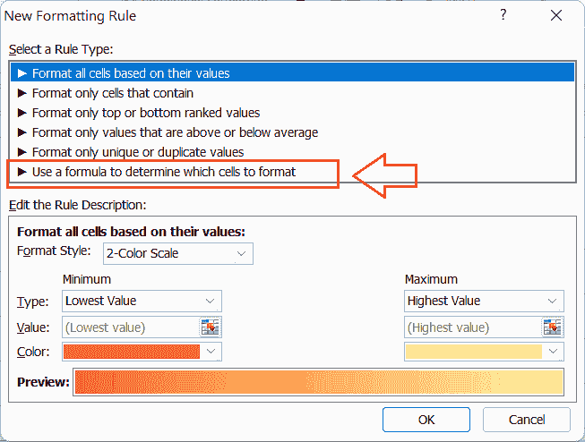

# 突出显示 Excel 中的重复项

> 原文:[https://www.javatpoint.com/highlight-duplicates-in-excel](https://www.javatpoint.com/highlight-duplicates-in-excel)

MS Excel，缩写为 Microsoft Excel，是一款功能极其强大的电子表格软件，用于在多个工作表的不同单元格内记录财务和会计数据。它可以处理每个工作表中的大量数据。通常，出错是人类的一种倾向，可能会有我们在 Excel 单元格中错误输入重复值的情况。

在工作表中出现多次的数据或值称为重复数据。Excel 使我们能够突出显示重复的值，以决定它们是否需要。我们可以查看每个副本，并通过突出显示这些值来相应地进一步保留或删除。但是，在对 Excel 文件进行更改之前，始终建议保留原始 Excel 文件的备份。


本教程讨论了在 Excel 工作表中突出显示重复值的各种方法。本教程解释了我们可能需要突出显示重复记录的具体情况。

## Excel 中如何突出重复项？

在 Excel 中搜索重复值或突出显示重复项时，最有用和最快的方法是使用条件格式工具。条件格式工具帮助我们用定义的颜色和特定的规则或条件突出显示重复的值。使用条件格式工具的优势在于，它可以查找并突出显示现有的重复项和将来要输入的新重复项。

在 Excel 中有多种查找或突出显示重复值的方法。以下是最常见和最有效的方法:

*   使用条件格式规则
*   使用条件格式公式

让我们详细了解每种方法:

### 使用条件格式规则

使用条件格式规则，我们可以根据某些预定义的规则，在工作表中格式化数据的各种现有选项之间进行选择。该工具还提供了突出显示重复项的途径。

下面列出了在 Excel 中查找和突出显示重复值的步骤:

*   首先，我们需要**选择工作表中单元格的范围**。我们可以用鼠标点击并拖动该区域进行相应的选择。但是，在选择整个工作表时，我们必须使用快捷键“Ctrl + A”。
    T3】
*   选择数据范围后，我们必须导航到**主页**选项卡，并选择样式部分下的**条件格式**选项，如下所示:
    
*   在下一个窗口(条件格式下拉列表)中，我们必须单击**“突出显示单元格规则”**选项。该选项将进一步列出更多规则，我们必须选择**“重复值”**选项。
    
*   之后，Excel 会给我们显示一个重复值的对话框。在这里，我们必须从第二个下拉列表中选择所需的颜色格式选项，在“values with”文本之后给出。在我们的例子中，我们选择**‘红色文本’**选项。
    
    如果我们不喜欢预定义的格式规则，我们可以从第二个下拉菜单中单击**【自定义格式】**选项。这将启动**格式单元格**对话框，我们可以在其中调整文本单元格背景的颜色，添加/移除边框，调整边框颜色等。
*   最后，我们必须从重复值对话框中点击**确定**按钮，文本中的重复值将立即以红色突出显示。
    T3】

此方法主要用于突出显示选定区域或整个工作表中重复的单个值。

## 使用条件格式公式

Excel 的条件格式工具允许用户应用所需的公式或函数。使用特定的公式或函数，用户可以定位任何特定范围的单元格，并相应地应用所需的格式首选项。公式和函数帮助我们轻松地突出显示各种特定情况下的副本。

在 Excel 中使用公式或函数突出显示重复项时，我们通常使用 COUNTIF 函数。当任何指定值在提供的范围内出现多次时，此函数返回真。为了突出显示重复项，我们以下列方式应用 COUNTIF 函数:

```

=COUNTIF(Cell range, Starting cell address)>1

```

下面列出了使用常规格式公式在 Excel 中查找和突出显示重复值的步骤:

*   让我们再次考虑同一个例子。首先，我们需要在工作表中选择有效的 Excel 单元格或区域。在我们的示例中，我们选择范围 A2:A13。
    
*   选择范围后，我们需要进入**首页**标签，点击**条件格式**选项，和前面的方法一样。
    
*   在下一个窗口(或下拉菜单)中，我们必须选择**‘新规则’**选项，如下图所示:
    
*   Excel 显示各种选项，以便在下一个窗口中为选定的单元格区域设置自定义格式规则。在“选择规则类型”框下，我们需要选择最后一个选项**“使用公式确定要格式化的单元格”。**
    
*   完成上一步后，Excel 会显示一个公式窗口，我们可以在其中用特定的规则键入所需的公式。我们必须使用如下的 COUTIF 公式:
    **=COUNTIF($A$2:$A$13，A2) > 1**
    其中' $A$2:$A$13 '代表我们示例中所选范围的绝对参考。
    
*   之后，我们必须点击**格式**按钮，启动“单元格格式”对话框，在这里我们可以选择各种格式选项，如字体颜色、背景颜色、边框等。在“设置单元格格式”对话框中完成所有首选项后，我们必须单击**确定**按钮关闭对话框。
    
*   最后，我们必须在“新格式规则”窗口中选中所选格式首选项的预览框，然后单击**确定**按钮。
    
    这将立即突出显示选定范围内具有指定格式的重复项。在我们的示例中，副本如下所示:
    

这样，我们可以通过条件格式工具使用 Excel 公式轻松突出显示选定区域或整个工作表中重复的单个值或重复项。这个方法还可以帮助我们突出显示具有特定规则的重复项，例如突出显示没有第 1 次出现的重复项、突出显示第 3、第 4 和其他实例的重复项、突出显示行的重复项等。

## 重复的特定案例

使用条件格式工具中的独特公式，我们可以根据某些用例突出显示重复项。下面讨论一些这样的常见情况:

### 突出显示没有第一次出现的重复项

假设我们的工作表中有多个副本，我们需要突出显示工作表中的第 2 个<sup>和第 1 个</sup>以及所有其他后续副本。在这种情况下，我们必须使用类似如下的公式:

**= COUNTIF ($ A2:$ A2，$A2) > 1**

这里，A2 指的是所选范围的最上面的单元格。


### 突出显示 3 <sup>rd</sup> 和其他重复实例

假设我们的工作表中有多个副本，我们需要突出显示工作表中的 3 <sup>rd</sup> 和所有其他后续副本。特别是，我们希望突出显示从第 n 次出现开始的重复。在这种情况下，我们必须使用与前一种情况类似的公式，唯一的区别是我们将> 1 替换为所需的数字。在我们的例子中，我们需要应用如下公式:

**=COUNTIF(澳元 2 美元:A2 美元)> =3**


### 突出显示第 4 个<sup>和其他重复实例</sup>

和前面的方法一样，在突出显示第 4 <sup>个</sup>和所有后续重复项时，我们需要应用如下公式:

**=COUNTIF(澳元 2 美元:A2 美元)> =4**


### 突出显示特定的出现次数

假设我们的工作表中有多个副本，我们只需要突出显示工作表中任何特定的出现次数。在这种情况下，我们需要使用等号后跟所需的数字。例如，当只突出显示 3 <sup>rd</sup> 重复出现时，我们需要应用如下公式:

**=COUNTIF($A$2:$A2，$A2)=3**

这不会突出显示所有重复值，但会突出显示每次出现的第 3 个<sup>。</sup>


### 基于一列中的重复项突出显示整行

假设我们有一个包含多列的 Excel 工作表。我们需要突出显示任何特定列中包含重复值的整行。

由于 Excel 内置的条件格式工具规则只允许我们在单元格级别查找和突出显示重复项，因此我们必须使用自定义公式。使用基于公式的规则，我们可以覆盖多个行和列，并突出显示整行。

要使用该公式，我们必须选择所有行，并在 Excel 的条件格式工具中键入以下公式之一:

*   突出显示重复行时，包括第 1 个 <sup>st</sup> 出现:
    **=COUNTIF($A$2:$A$15，$A2) > 1**
    这里，A2 指的是第一个单元格，而 A15 指的是我们需要检查重复的特定列的最后一个单元格。
    
*   突出显示重复行时，不包括第 1 个 <sup>st</sup> 事件:
    **=COUNTIF($A$2:$A2，$ T7)1**
    

上述公式显示了绝对单元格引用和混合单元格引用的不同应用，这两种引用在突出显示不同值方面有很大区别。

### 同样突出显示重复的行

在前面的案例中，我们根据任何特定列中的重复项突出显示了整行。但是，可能存在不同行可能有重复的情况，这意味着特定行的所有单元格在工作表中可能包含相同的值。在这种情况下，我们必须使用 COUNTIFS 函数而不是 COUNTIF 函数。

COUNTIF 函数允许我们根据各种标准或偏好来比较单元格。例如，假设我们有一个 Excel 表，其中两列(A 和 B)在某些行中有精确的值(重复的)。

突出显示 Excel 工作表中的重复行时，我们必须在 Excel 的条件格式工具中使用以下公式之一:

*   突出显示重复行时，出现 1<sup>ST</sup>:
    **= COUNTIFS($ A $ 2:$ A $ 15，$A2，$B$2:$B$15，$B2) > 1**
    
    上图显示第一列中的术语“Speakers”存在重复，但特定行的相应单元格中的值不同。该函数不会突出显示这些行，因为它只是用来突出显示两列中具有相同值的重复行。然而，前面的方法也帮助我们突出显示了那些重复的行。
*   突出显示重复行时，除了 1 <sup>st</sup> 事件:
    **=COUNTIFS($A$2:$A2，$B$2:$B2，$B2) > 1**
    

在上例中，只有两列。但是，工作表可以有更多具有重复行值的列，并且将应用相同的方法。COUNTIFS 函数可以帮助我们处理或突出显示最多 127 个范围/标准对。

## 需要记住的要点

*   在维护考勤表、地址目录、学生成绩单和其他类似文档中的记录时，在 Excel 中突出显示重复项通常会很方便。
*   删除工作表中的重复项时，我们必须谨慎，因为它们会影响其他工作表记录。
*   “设置单元格格式”对话框帮助我们用所需的颜色组合或格式突出显示数据。

* * *