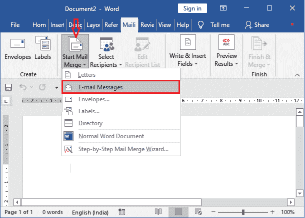
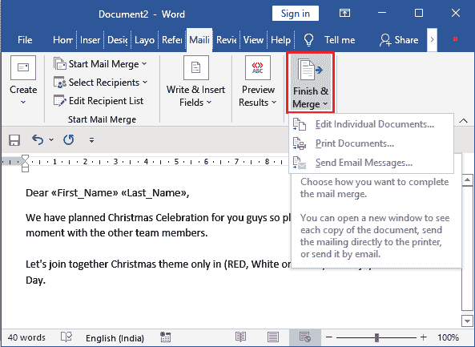
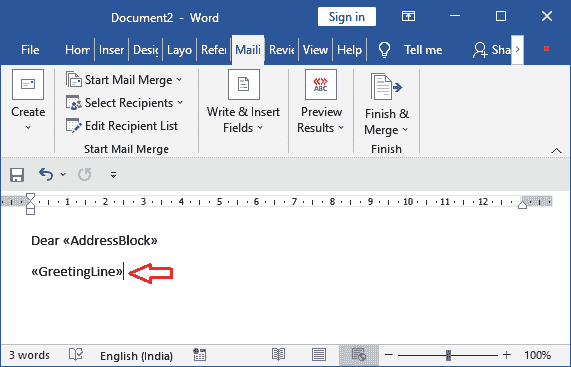

# 从 Excel 到 Word 的邮件合并

> 原文:[https://www.javatpoint.com/mail-merge-from-excel-to-word](https://www.javatpoint.com/mail-merge-from-excel-to-word)

在开始邮件合并之前，用户应该知道什么是邮件合并以及为什么需要它。这一章是关于邮件合并以及如何在 Excel 中进行邮件合并。在这一章中，我们将尝试阐述从 Excel 到 Word 的邮件合并过程。

邮件合并过程基本上包括这个过程中的三个文档，即模板、源和最终文档。如果你甚至不知道邮件合并，你也会学的。

Excel 用户应该知道邮件合并操作不是从 Microsoft Excel 执行的。MS Excel 工作表仅用作源文件，但合并实际上是从 Microsoft Word 执行的。

**本章涵盖的主题**

1.  [什么是邮件合并？](#Whatis)
2.  [邮件合并基础知识](#Basics)
3.  [邮件合并组件](#Components)
    1.  [模板文件](#Template)
    2.  [数据文件](#Data)
4.  [在哪里使用邮件合并？](#Where)
5.  [邮件合并是如何工作的？](#How)
6.  [创建邮件合并的步骤](#Steps)
    1.  [准备 Excel 电子表格](#PrepareExcel)
    2.  [在 Word 中准备模板文件](#Preparetemplate)
    3.  创建邮件合并文档
    4.  [预览邮件合并](#Previewmail)
    5.  [完成并保存邮件合并](#Finishsave)
7.  [准备邮件合并时要知道的事情](#Things)

## 什么是邮件合并？

邮件合并是一种快速创建和发送大量个性化电子邮件或信件的方法。您不需要从电子邮件应用程序创建电子邮件。它会自动工作，并将数据从工作表带到模板文件中。模板文件可以是信件或电子邮件。

基本上，邮件合并允许用户创建因收件人而异的个性化文档。用户不需要为每个用户编写单独的电子邮件模板/信件。邮件合并无需为每个收件人单独创建邮件就可以轻松完成。

您可以同时为数百个收件人创建电子邮件/信件。本章将指导您创建从 Excel 到 Word 的邮件合并。

## 邮件合并基础

邮件合并是创建并向不同用户发送批量定制电子邮件或信件的简单过程。在学习邮件合并过程之前，这看起来是一项非常艰巨的任务。如果你从三个文档的角度来考虑邮件合并，你会很容易理解。

1.  包含带有个性化邮件/信件自定义字段的数据的 Word 文档。
2.  Excel 文件是一个源文件，其中包含要与 Word 文档合并的列中收件人的信息。每个收件人一行。这些源文件数据将从 Word 文档代码中的字段中替换。
3.  第三个也是最后一个是另一个 Word 文档，它是由上述两个文件准备的最终文档。基本上就是要发送的个性化文档。

从 Excel 到 Word 邮件合并的主要目的是使用文件 1 (Word 文件)和文件 2 (Excel 文档)创建第三个文件。

## 邮件合并的组件

邮件合并有两个用户应该知道的基本组件-

1.  数据文件
2.  模板文件

### 数据文件

数据文件是包含电子表格中的数据(如姓名、地址、电话号码)的源文件。该数据文件可以是 Excel 电子表格或谷歌工作表。数据文件的数据在模板文件中用于创建个性化的电子邮件或信件。

**“通过定义邮件或信件的格式，邮件合并自动从数据文件中获取数据，并放入模板文件中进行邮件的个性化模板。”**

这是我们将在本章中创建的示例数据文件:

### 模板文件

模板文件是保存要发送出去的消息的文档。它可以是电子邮件或信件模板。在本文档中，我们必须指定个性化数据的放置位置。姓名、地址和电话号码等个性化数据是从表单中获取的，也可以说是数据文件。

这是我们将在本章下面创建的示例模板文件:

## 在哪里使用邮件合并？

邮件合并可用于创建以下个性化消息，即，

1.  制作电子邮件，
2.  时事通讯，
3.  自定义目录，以及
4.  套用信函等等。

## 邮件合并是如何工作的？

当邮件合并运行时，Excel 工作表(源)会连接到 Word 文档(模板文件)。连接两个文件后，Word 文档从 Excel 工作表中提取数据，并将其放在插入字段的位置。

因此，在开始邮件合并过程之前，请确保 Excel 文件包含您在 Word 文档中创建个性化电子邮件/信件所需的所有信息。

## 创建邮件合并的步骤

邮件合并过程有三个最重要的步骤来准备从 Excel 到 Word 的邮件合并，即:

1.  [准备 Excel 电子表格](#PrepareExcel)
2.  [在 Word 中准备模板文件](#Preparetemplate)
3.  创建邮件合并文档
4.  [预览邮件合并](#Previewmail)
5.  [完成并保存邮件合并](#Finishsave)

### 准备 Excel 电子表格

首先，我们将在 Excel 电子表格中准备源数据，自定义邮件/信件模板将从该电子表格中创建。在本例中，我们将创建三个名为“名字”、“姓氏”和“电子邮件”的列。

**第一步:**在 Excel 工作表的第一行创建标题，并将数据插入下面的单元格。

在这个 Excel 工作表中，我们存储了以下数据。这些数据将在模板文件中使用。数据文件必须包含标题，该标题将在模板文件中用作从该文件获取数据的字段。

### 在 Word 中准备模板文件

创建源数据文件并准备数据后，下一步是在 Word 文档中准备模板文件。要在 Word 文档中创建模板文件，请按照下列步骤操作:

**步骤 1:** 创建一个新的 Word 文档，在该文档上导航至**邮件**选项卡。

**第二步:**点击**开始邮件合并**按钮，选择**邮件**创建个性化邮件的邮件合并。

您也可以选择信函来设计个性化信函。我们已经为电子邮件选择了电子邮件消息。

**用 Word 连接 Excel 表格**

用于编写自定义电子邮件的新 Word 文档将从前面的步骤中打开。接下来是将准备好的 Excel 工作表与 Word 文档连接起来。

**步骤 3:** 在此新文档上，单击**选择收件人**，然后选择**使用现有列表。**

**第四步:**你将导航到本地存储选择 Excel 文件。从系统中选择 Excel 表格，点击**打开**按钮。

**步骤 5:** 我们在 Excel 文件中创建的数据存储在 Sheet3 中。因此，这里我们将选择**表 3** 并点击**确定。**

完成这些步骤后，我们的 Excel 工作表现在链接到 Word 文档。

**将字段插入 Word 文档**

在发送邮件时，开始写你想放在邮件正文中的邮件。为此，您需要个性化邮件的字段，如名字、姓氏或电子邮件地址。您必须在 Word 文档的正确位置插入正确的字段。

**第六步:**我们开始写邮件内容。现在。这里我们要插入收件人的名字和姓氏。

将光标放在要插入字段的位置，并重复执行步骤 7。

**第 7 步:**在同一个邮件标签中，点击**插入邮件合并**并选择你想在 Word 文件中插入的任何字段。

**第 8 步:**插入名字字段。现在，再次点击**插入合并字段**下拉按钮，这次选择姓氏字段名称。

**第 9 步:**模板 Word 文件中已经插入了另一个字段。继续编写邮件内容，并在您想要插入的地方插入其他或相同的字段。

### 预览邮件合并

设置邮件合并后，您可以预览已创建的邮件合并，这样一切都可以按照您的需要进行设置。

**步骤 10:** 在邮寄标签上，点击**预览结果。**

**第 11 步:**一旦点击*预览结果，*第一条记录会自动显示给你。名字和姓氏将替换为第一个员工详细信息。

请参见以下文档:

**步骤 12:** 要查看另一个文档，请单击下一个和上一个图标来更改文档。

我们的模板文件已经准备好，可以发送了。现在，您可以将此文档保存在您的存储中。

### 完成并保存邮件合并

是时候完成邮件合并并保存创建的模板文档了。

**步骤 13:** 在邮寄标签内，点击**完成&合并**按钮。你会看到不同的选择。

选择您想要的最佳选项，即打印、保存或发送完全个性化的准备好的文档。

**第 14 步:**选择**编辑单个文档。**

您也可以选择*发送电子邮件*发送创建的文档。

**步骤 15:** 将打开一个小窗口面板，在该面板上继续选择**全部**单选按钮，并点击**确定。**

**步骤 16:** 为所有收件人创建一个新的 Word 文档。现在，您为各个收件人准备了单独的邮件模板。您可以使用**Ctrl+s**打印或保存文档

完成所有步骤后，您可以保存文档并关闭文件。

### 排除收件人

记录列表可能很大，但您不想将创建的个性化邮件发送给所有收件人。用户可以直接从 Word 文件中排除收件人，而无需从 Excel 工作表中删除记录。

要从您添加的数据文件的列表中排除一条或多条记录，您可以按照以下步骤操作:

**第一步:**在同一个*邮件*标签上，点击**编辑收件人列表。**

#### 注意:只有当 Excel 工作表连接到 Word 文档时，此“编辑收件人列表”选项才会启用。否则，此选项将被禁用。

**步骤 2:** 将打开邮件合并收件人窗口面板，您可以通过取消对应于收件人记录的复选框来删除收件人。

**第三步:**做完所有事情后，点击该面板上的**确定**按钮。

即使没有从 Excel 工作表中删除记录，收件人列表也会更新。这意味着您准备的个性化邮件/信件不会针对排除的记录进行定制。

## 准备邮件合并时需要了解的事项

创建邮件合并时，您应该了解以下事项。

1.  Word 文档的所有字段都应该在 Excel 工作表中可用。这意味着列名应该与 Word 文件中的字段相匹配。**例如**名，姓。
2.  您必须在 Excel 工作表中创建标题行，这将在以后的模板文件中使用。
3.  如果源 Excel 工作表包含以 0 开头或结尾的日期、时间、货币或邮政编码，请在合并前正确格式化它们。因此，MS Word 可以正确读取这些值。
4.  您将使用邮件合并的所有数据都应该在 Excel 工作簿的第一个电子表格中。
5.  如果要对电子表格数据进行更改，应在将其连接到 Word 文档进行邮件合并之前进行。

## 插入个性化消息

Excel 提供了三个变量，可以用来插入到 Word 文档中。这三个变量是**地址块、问候语、**和**合并字段。**在上面的邮件合并示例中，我们已经在准备好的个性化电子邮件中插入了合并字段。

### 地址块

在创建邮件合并时，此地址块用于指定收件人的地址。比如，先生、先生&太太，或者想用缩写形式的名字等。

### 问候语

问候行变量在模板文件中用于获取不同收件人的个性化问候行或称呼。问候语基本上就是你想要开始对话的方式，比如“到”或“亲爱的”。

### 合并字段

当您使用其他文档数据(如微软 Excel 工作表)作为数据文件时，合并字段非常有用。您正在使用它从该文件中获取作为字段值的数据。Excel 列标题被视为合并字段，其相应的单元格数据是从工作表中提取的。

### 插入地址块

假设在编写邮件合并之前，您已经执行了创建邮件合并的步骤。只有在此之后，您才能插入地址块、问候语和合并域。

当您想要给收件人任何特定的地址方式时，可以使用 Excel 工作表中的地址块变量。

要插入地址块，请在新创建的邮件合并文档上单击*书写&插入字段*内的**地址块**选项。

将打开一个面板，通过选择其中一种格式指定地址元素，然后单击**确定。**

地址块已成功插入模板文件。

同样，您可以插入问候语。也看看它的步骤。

### 插入问候语

我们只是做个演示。你可以根据自己的方便使用这些变量。

要在模板文件中插入问候语，请单击*书写&插入字段下的**问候语**选项。*

将打开一个面板，您可以在其中选择问候语格式，然后单击**确定。**

请注意问候行变量已经插入到模板文件中。

## 使用向导创建邮件合并

创建邮件合并所需的所有步骤，我们已经在上面描述过了。您可以使用以下步骤轻松创建从 Excel 到 Word 的邮件合并。希望你不会陷在任何一步。

除此之外，MS Word 还提供了分步指南。你也可以跟着学。你也可以用那个。当您开始邮件合并过程时，您会发现该选项。

在 Word 文件中，点击**开始邮件合并**，在*邮件*标签中选择**分步邮件合并向导**。

Word 文档的右侧将启用一个面板，向您显示准备邮件合并的分步指导。请看下面的截图:

* * *