# 计算机键盘快捷键

> 原文：<https://www.javatpoint.com/computer-shortcut-keys>

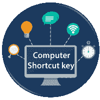

在现代，说计算机已经成为日常生活中非常有用的一部分并没有什么混乱。如果你经常使用电脑，你必须了解电脑快捷键。

计算机快捷键为在计算机软件中导航和执行命令提供了一种更简单的方式。快捷键的使用对计算机用户来说是有益的，因为它允许他们在更短的时间内准确地完成任务。此外，通过使用快捷键，您可以提高工作效率，减少重复运动造成的压力。

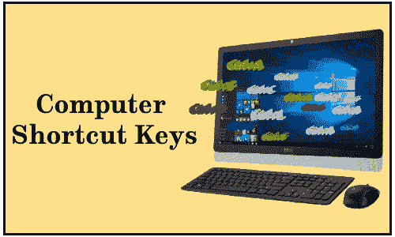

计算机快捷键是一组生成要执行的特定命令的一个或多个键。快捷键一般通过使用 **Alt** 或 **Ctrl** 键和其他一些键来执行。

*   [基本电脑快捷键](#Basic)
*   [微软 Word 快捷键](#MSWord)
*   [微软 Excel 快捷键](#MSExcel)
*   [微软 PowerPoint 快捷键](#MSPowerPoint)
*   [窗口快捷键](#WindowKey)
*   [F1 - F12 功能键快捷键](#Function)
*   [YouTube 快捷键](#YouTube)
*   [谷歌 Chrome 快捷键](#Chrome)

* * *

## 带说明的基本计算机快捷键

该表包含一些常用的基本快捷键列表，这些快捷键与 [IBM](https://www.javatpoint.com/ibm-full-form) 兼容的计算机和软件配合使用。强烈建议所有用户都应该使用这些密钥，并尝试记住它们。

| 快捷键 | 说明 |
| alt+tab | 它允许你在电脑上打开的程序之间切换。您需要按住 Alt 键并一直按 Tab 键，以便从一个程序移动到另一个程序，并且当 Tab 键在您要打开的程序上时，请释放它。 |
| **Alt+E** | 最常用于访问当前程序中的**编辑选项**。ALT+E 还有一些更多的用法，下面给出:

*   **In Google Chrome,** it allows you to open the **file menu** option.
*   In **winamp** and **kmplayer** , call up **to switch the playlist editor.**
*   In **mixer** , you can open **extrusion menu.**

 |
| **Alt+F** | 它使您能够访问当前程序中的**文件菜单选项**。 |
| **F1** | 

*   **F1** is the first **function key,** , which is used to display **help** **information** on each Windows program.
*   For example, in Microsoft Windows, it allows you to open the help and support screen of Microsoft Windows by pressing **F1** **window key+F1** .
*   In addition, it is also used to access the Microsoft office task pane by pressing **Ctrl+F1** .

 |
| **F2** | 它为用户提供了将重命名为**图标**或用户选择的**文件**的选项。
在 MS word 中，如果按下 **Ctrl+F2** ，则**打印预览**选项打开。 |
| **F5** | 主要用于**刷新**当前窗口或文件或文件夹的内容。
此外，如果您在网页浏览器中按下 **Ctrl + F5** 或 **Shift + F5** ，它会重新加载该网页，而不考虑缓存的内容，并重新下载网页的全部内容。 |
| **Ctrl+A** | 它允许你**选择**一个页面的全部内容，包括图像和其他对象。 |
| **Ctrl+B** | 它为用户提供了在页面的选定文本上加粗**的选项。它在不同的互联网浏览器中也有不同的用途，比如在**火狐**和**网景**中，它用于查看书签，在**互联网浏览器中，**用于显示**收藏夹**。** |
| **Ctrl+C** | 用于**复制**选中的内容，包括一页的其他对象。 |
| **Ctrl+V** | 它为用户提供了**粘贴**复制数据的选项。您需要复制数据一次，然后可以粘贴任意多次。 |
| **Ctrl+D** | 主要用于**互联网浏览器**将当前网站添加到**书签**或**收藏夹**中。 |
| **Ctrl+F** | 它为用户提供了在当前文档或窗口中**查找**或**搜索**文本的选项。 |
| **Ctrl+I** | 它允许用户对所选的**文本**进行斜体和非斜体处理。 |
| **Ctrl+N** | 它允许用户在微软应用程序和其他软件中创建一个新的或空白的文档。它也用于互联网浏览器打开一个**新标签**。 |
| **Ctrl+O** | 在当前软件中，它被广泛用于打开文件。 |
| **Ctrl+K** | 根据不同的程序，它有不同的用途。例如，在某些应用程序中，它用于插入**超链接，**，而在**互联网浏览器中，**则侧重于**搜索栏。**如 **:**

*   In **Chrome,** Open Omnibox (search bar)
*   In **Firefox,** opens the search bar.
*   In **Internet Explorer,** copied a current label.
*   In **Opera,** check email.

 |
| **Ctrl+P** | 用于打开当前页面或文档的**打印**预览窗口。例如，当浏览器或任何其他文档窗口打开时，如果您按下 **Ctrl+P** ，您将看到该页面的打印预览窗口。 |
| **Ctrl+S** | 用于**保存**文档或文件。也可以使用 **Shift+F12** 在微软 Word 中保存文件。 |
| **Ctrl+Y** | 它的用途是**重做**任何撤销的文本和其他对象，也用于重复上次执行的动作。 |
| **Ctrl+Z** 的缩写形式 | 用于**撤销**内容和其他对象。例如，如果您错误地删除了数据，您可以立即按 Ctrl+Z 来检索这些数据。 |
| **换挡+插入** | 用于**粘贴**复制的项目。 |
| **移位+删除** | 主要用于**删除**所选文本，也提供**永久删除**任何文件夹或文件**的选项**。 |
| **家** | 它主要用于将打字光标带到当前正在打字的行首。如果您按下 **Ctrl+home，**它会将光标返回到文档、网页或单元格的开头。 |
| **结束** | 用于在行的**端**移动打字光标，也可以通过按 **Ctrl+End** 将光标移动到文档的末尾。 |
| **Alt+Enter** | 广泛用于访问所选项目的**属性**，如**文件、** **文件夹**或任何其他**对象**。 |
| **Alt+F4** | 用于关闭当前打开的**窗口**。例如，如果您在浏览器窗口打开时按 Alt+F4，它将关闭浏览器窗口和其他打开的选项卡。另外，您可以使用此键**关闭**系统，为此您需要在**桌面屏幕**上按 **Alt+F4** ，您将看到一个对话框，然后单击**确定按钮**，系统将**关闭**。 |
| **Ctrl+Esc** | 它将打开**开始菜单**。您也可以使用**窗口键**打开开始菜单。 |
| **Ctrl+Shift+Esc** | 它为用户提供了从 Windows 95 开始在所有版本的 Windows 中快速打开 **Windows 任务管理器**的好处。 |
| **轮班+回家** | 通过同时按下 Shift 和 Home 键，您可以**选择从光标当前位置到一行开始的所有文本**。 |

* * *

## Microsoft Word 快捷键

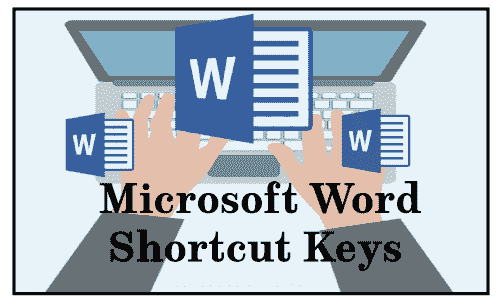

**下面给出了一个简单的微软 Word 快捷键列表，并附有说明。**

*   **Ctrl+A:** 用于**选择**一个页面的所有内容，包括图片等对象。
*   **Ctrl+B:** 为用户提供了**加粗**页面选中项的选项。
*   **Ctrl+C:** 它的作用是**复制**选中的文本，包括文件或页面的其他对象。
*   **Ctrl+D:** 用于访问**字体**偏好设置窗口，提供字体大小、字体样式、字体颜色等多个选项。
*   **Ctrl+E:** 用于**将**选中的项目对准屏幕的**中心**。
*   **Ctrl+F:** 帮助用户在当前文档或窗口中**查找**或**搜索**数据。
*   **Ctrl+G:** 用于**转到**或跳转到任意页面。当您按下 Ctrl+G 时，会出现一个对话框，为您提供各种选项，如查找、替换和**转到**。例如，您的文件中有 15 页，您想访问第 4 页，然后在给定的框中输入第 4 页，并按**转到**按钮，它会将您带到所需的页面。如下图所示:
    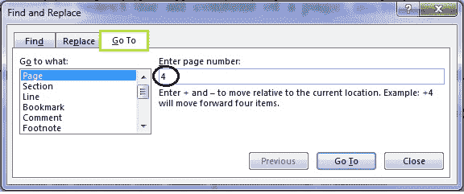
*   **Ctrl+H:** 用于**替换**文件中的单词或句子。例如，如果您在文件的许多地方误写了 spple 而不是 apple，您可以一次用 apple 替换它。
*   **Ctrl+I:** 它提供了一个选项，可以对突出显示的文本进行***非斜体**。*
**   **Ctrl+J:** 用于**对齐**(将文本均匀分布在页边距之间)所选文本。*   **Ctrl+K:** 可以插入**超链接**。例如[http://www.javatpoint.com](https://www.javatpoint.com)*   **Ctrl+L:** 用于将**(对齐)**选中的内容调整到屏幕左侧。*   **Ctrl+M:** 为用户提供**缩进**的选项如下图:
    *   **Ctrl+N:** 用于在微软应用和一些其他软件中打开一个**新**或**空白** **文档**。*   **Ctrl+O:** 用于**打开**对话框，可以选择想要打开的文件。*   **Ctrl+P:** 用于打开文档或文件的**打印**预览窗口。也可以通过按**Ctrl+F2****Ctrl+Shift+F12**来完成。*   **Ctrl+Q:** 它的作用是将**选中的段落与**对齐*   **Ctrl+R:** 它为用户提供了将**线或所选内容对齐到屏幕右侧**的选项。*****   **Ctrl+S:** 它的作用是**保存**的文档或者一个文件。*   **Ctrl+T:** 它给用户的好处是为一个段落创建一个**悬挂缩进**。为了更好的理解，请看下图:
    *   **Ctrl+U:** 用于对选中的文本进行**下划线**。*   **Ctrl+V:** 用于**粘贴**复制的数据。它允许您复制数据一次，然后可以粘贴任意次。也可以使用**Shift+插入**来粘贴数据。*   **Ctrl+W:** 它的作用是**快速关闭**当前打开的**文档**或者一个文件。*   **Ctrl+X:** 如果想剪切一些文字，可以用此键**剪切**选中的内容。也可以使用 **Ctrl+V** 粘贴。*   **Ctrl+Y:** 它允许用户**重做**文件中执行的最后一个动作。比如你写过一个词芒果；按 **Ctrl+Y** 可以多次重复这个单词。*   **Ctrl+Z:** 用于**取回**删除的项目。例如，如果误删了数据，可以按 Ctrl+Z 检索(**撤销**)删除的数据。也可以通过按**Alt+退格**来完成。*   **Alt+F，A:** 它允许用户使用**另存为**选项，这意味着保存一个不同名称的文件。为此，您需要按 **Alt+F，**显示一个对话框或一个页面，然后按 A 保存为选项。也可以简单地通过按压来完成*   **Ctrl+Shift+L:** 此键用于快速在文件中创建一个项目符号点。*   **Ctrl+Shift+ > :** 它将**字号**的增加+1 磅至 12 磅，之后增加+2 磅。*   **Ctrl+Shift+ < :** 用于**减少**字体**如果字体大小为 12pt 或以下；它将字体减少-1 磅，如果字体大小超过 12 磅，它将字体减少+2 磅。***   **Ctrl+】:**它的作用是**将**字体**的大小增加**+1 磅。*****   **Ctrl+[:** 用于**将**字体**缩小**-1 磅。*****   **Ctrl+/+C:** 它为用户提供了在**中插入**一个**分符号( )的选项。***   **Ctrl +(左箭头↓):**I t 允许用户将**的利益移动**一个字到该行或某个段落的**左侧**。*   **Ctrl +(右箭头→):** 用于将**移动**一个字到*   **Ctrl+Shift+*:** 用于显示或隐藏非打印字符。*   **Ctrl +(向上箭头↓):**此键用于**将**打字**光标**移动到行或段的开头。*   **Ctrl +(向下箭头↓):** 它使您能够**将**打字**光标**移动到段落末尾。*   **Ctrl+Delete:** 允许用户**删除光标右侧**的**一个字。*****   **Ctrl+退格:**允许用户**删除光标左侧**的**一个字。*****   **Ctrl+End:** 它的作用是将**光标**移动到文档的最后一个**。*****   **Ctrl+1:** 用来给一个**单线空间**。例如，在段落的行间留出 1.0 的空间。*   **Ctrl+2:** 用于给**双线空格**。例如，在段落的行间留出 2.0 的空间。*   **Ctrl+5:** 用于在一段文字的行间留出 **5 的空间**。*   **Ctrl+空格键:**它使您能够**将**所选文本重置为**默认字体。***   **Ctrl+Home:** 可以将**光标**移动到文档的**开头**。*   **Ctrl+Alt+1:** 将文本格式改为**标题 1。***   **Ctrl+Alt+2:** 将文本格式改为**标题 2。***   **Ctrl+Alt+3:** 将文本格式改为**标题 3。***   **Alt+Ctrl+F2:** 用于打开**新文件**或文档。*   **Ctrl+F1:** I ts 使用的是打开**任务窗格**在某些 Microsoft office 版本中，在 word 2016 中，它用于隐藏和显示**功能区**，如下图所示:
    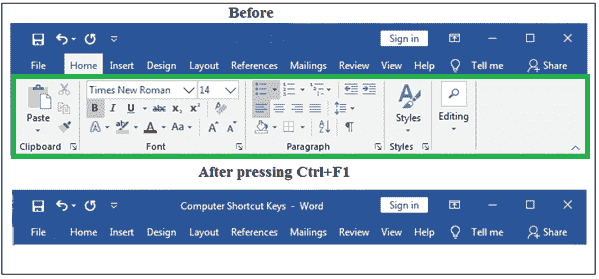*   **Ctrl+Shift+F6:** 它允许用户在微软 Word 中打开的文档之间**切换**。*   **F1:** 功能键 **F1** 用于打开**帮助和支持***   **F4:** 它能让你重复上次执行的动作。例如，当您想要多次重新键入最后键入的单词时，可以使用此键。*   **F5:** 用于进入**查找替换**对话框，包括**转***   **F7:** 它为用户提供了检查所选文本或文档的**拼写**和**语法**的优势。*   **Shift+F3:** 用于使用改变大小写选项，可以将文字从大写改为小写，或者在每个单词的开头加一个大写字母。*   **Shift+F7:** 它为用户提供了检查所选单词的**词库**的选项。你需要选择单词并按下这个键。如下图所示:
    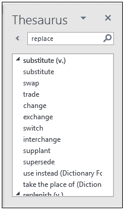*   **Shift+Alt+D:** 用于插入**当前日期**。*   **Shift+Alt+T:** 其作用是插入**当前时间**。*******

 ****** * *

## Microsoft Excel 快捷键

如果在[微软 Excel](https://www.javatpoint.com/excel-tutorial) 上工作，可以利用键盘快捷键的数量来加快工作速度，让工作更加方便。我们试图提供一个简单的快捷键列表。

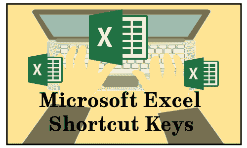

**下表包含了微软 Excel 常用的快捷键，并附有说明。**

| 快捷键 | 描述 |
| **Ctrl+Shift+；** | 用于插入**当前时间**。 |
| **Ctrl+;** | 用于输入**当前日期**。 |
| **换挡+ F3** | 其用途是打开 **Excel 公式的**窗口。' |
| **Shift + F5** | 它为用户提供了显示**查找和替换**对话框的选项。 |
| **Ctrl + A** | 其用途是**选择**或高亮显示**工作表的所有内容**。 |
| **Ctrl + B** | 它允许您将 Excel 表格中的所有选定项目**加粗为**。也可以通过按 **Ctrl+2** 来完成。 |
| **Ctrl + C** | 用于**复制**工作表的选定内容。 |
| **Ctrl + D** | 它使您能够用所选单元格的内容填充**单元格**。如下图所示:
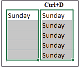 |
| **Ctrl + F** | 它提供了快速打开**查找**和**替换**对话框的选项。也可以用 **Shift + F5** 来实现。 |
| **Ctrl + G** | 用于打开**转到**选项对话框，可以转到具体单元格。也可以使用 **F5** 完成。 |
| **Ctrl + H** | 它允许你在一个文件中**找到并替换**这个单词或句子。例如，如果你误写了一个 som computer，而不是你工作表中很多地方的计算机，你可以一次用计算机替换它。 |
| **Ctrl + I** | 用于将 ***【斜体】*** 放在所选部分的所有单元格上。也可以通过按 **Ctrl+3** 来完成。 |
| **Ctrl + K** | 它提供了在文件中插入**超链接**的选项。 |
| **Ctrl + L** | 它使您能够访问**创建表格**对话框。 |
| **Ctrl + N** | 其用途是打开**新文档**或工作簿。 |
| **Ctrl + O** | 它为用户提供了**打开**对话框的选项，用户可以在该对话框中选择要打开的文件。也可以使用 **Ctrl+F12** 打开文件。 |
| **Ctrl + P** | 它允许您快速打印当前工作表或文档。 |
| **Ctrl + Q** | 用于显示所选带数据单元格的**快速分析选项**。如下图所示:
 |
| **Ctrl + R** | 它允许您用所选单元格的内容将**单元格**填充到**右侧的**。如下图截图所示:
 |
| **Ctrl + S** | 其用途是**保存**文档。也可以使用 **Alt+Shift+F2** 完成。 |
| **Ctrl + T** | 它为用户提供了显示**创建表格**对话框的选项。 |
| **Ctrl + U** | 用于**给所有选中的单元格加下划线**。也可以使用快捷键 **Ctrl+4** 给 Excel 表格中的单元格加下划线。 |
| **Ctrl + V** | 它为用户提供了将复制的数据粘贴到 Excel 表格中的选项。您需要复制数据一次，然后可以粘贴任意次。 |
| **Ctrl + W** 的缩写形式 | 用于**快速关闭当前**打开的文档**或文件。也可以通过按 **Ctrl+F4** 快捷键来完成。** |
| **Ctrl + X** | 它允许用户选择**剪切**Excel 表格中选定单元格的全部数据。 |
| **Ctrl + Y** | 它为用户提供了恢复任何撤销内容的选项。 |
| **Ctrl + Z** 的缩写形式 | 用于**撤销**(取回)删除的项目。例如，如果您误删除了数据，可以按 Ctrl+Z 键检索删除的数据。也可以通过按**Alt+退格**来完成。 |
| **Ctrl +向上翻页&向下翻页** | 它允许您在同一 Excel 文件中从一个工作表移动到另一个工作表。 |
| **Ctrl + F6** | 它使用户能够在微软 Excel 中将**从一个**文档**移动到另一个文档。也可以通过按 **Ctrl+Tab** 来完成。** |
| **Ctrl + F9** | 它允许用户选择**最小化**当前窗口。 |
| **Ctrl + F10** | 它用于**最大化**当前选择的窗口。 |
| **F1** | 用于打开**帮助**屏幕窗口。 |
| **F2** | 它允许您在 Excel 工作表中**编辑**选定的单元格。 |
| **F4** | 它为用户提供了重复**最后一个动作**的选项。例如，如果您更改单元格中文本的红色，通过按 F4，您可以在另一个单元格中应用相同的文本颜色。 |
| **F7** | 用于**检查所选文本的**拼写**。** |
| **F10** | 功能键 F10 用于**激活**菜单栏**。比如要打开文件菜单，需要按下 **F10、**然后 **F** 。** |
| **F11** | 它的用途是在 Excel 中**创建**一个**图表**。 |
| **F12** | 它使您能够使用**另存为**选项，该选项允许您以不同的名称保存文件。也可以使用 **Alt+F2** 完成。 |
| **Alt + =** | 它允许您使用**公式**添加上述所有单元格的数据。 |
| **Ctrl+Shift+"** | 它允许您复制单元格的内容，并将其粘贴到其正下方的单元格中。也可以使用**Ctrl+“**键完成。例如，如果您在单元格 B1 中写了“Excel”，并且其下面的单元格是 B2，则按下 **Ctrl+Shift+或 Ctrl+'** 将在单元格 B2 中复制“Excel”一词。 |
| **Ctrl + Shift +！** | 用于在数字中应用**逗号**格式。例如，如下图所示:
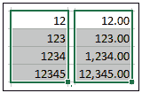 |
| **Ctrl + Shift + $** | 它的用途是将**货币**格式应用于数字。如下图截图所示:
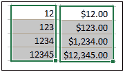 |
| **Ctrl + Shift +%** | 它为用户提供了将**百分比符号**应用于数字的选项。例如，见下图:
 |
| **Ctrl + Space** | 它使您能够**选择**整个活动的**列**。 |
| **Shift + Space** | 它使您能够**选择**整个激活的**行**。 |
| **Ctrl +(右箭头→)** | 它允许用户将光标移动到包含文本的下一个单元格。 |
| **Ctrl + 1** | 用于打开**格式单元格**对话框，在此可以更改文本颜色、字体大小、字体样式、文本对齐方式等文本格式。也可以通过按 **Ctrl+Shift+F** 或 **Ctrl+Shift+P** 来完成。 |
| **Ctrl + 5** | 它的作用是将**删除线**放到所有选中的单元格中。如下图所示:
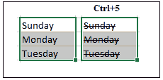 |
| **Ctrl + 9** | 它的用途是在工作表中**隐藏**选中的**行**。 |
| **Ctrl + Shift + (** | 它的作用是显示**(取消隐藏)**隐藏的行。 |
| **Ctrl + 0** | 用于**隐藏**选中的**列**。 |
| **Ctrl+---** | 它将打开**删除**对话框，您可以在其中删除选定的行或列。 |
| **Ctrl + Shift + =** | 它将打开**插入**对话框，您可以在其中插入新的行或列。 |
| **Ctrl + Shift + ^** | 它是用来做任意数字的**指数**形式的。例如，您在工作表中写了一个数字 12345，如果您按下 Ctrl+shift+^，该数字将以指数形式变为 1.23E+05。 |
| **Ctrl + Shift + &** | 它为用户提供了在所选单元格周围制作**边框**的选项。 |
| **Ctrl + Shift+ _** | 它为用户提供了删除工作表中选定单元格周围边框的选项。 |
| **Ctrl+Shift+空格键** | 用于**选择**整个工作表**中的**。 |
| **Ctrl + Home** | 它允许用户**将**光标移动到工作表的开始**(单元格 A1)** 。 |
| **Ctrl + End** | 用于**将**光标移动到工作表上最后一个带文字的**单元格**。 |
| **上移+翻页** | 它允许您**选择位于所选**单元格上方**的所有**单元格。**** |
| **轮班+回家** | 它使您能够**选择当前激活的**单元格**的**左侧**的所有**单元格。 |
| **Shift +(向上箭头↑)** | 它使您能够将选定区域向上扩展一个单元格。 |
| **Shift +(向下箭头↑)** | 它使您能够将选定区域向下扩展一个单元格。 |
| **Alt + Enter** | 它允许用户在一个单元格中多行书写。例如，如果您在一个单元格中键入，它使您能够通过按下**Alt+回车键**在一个单元格中的**下一行**上移动**。** |
| **【alt+’** | 用于进入**样式**对话框。 |
| **Ctrl + F3** | 用于打开微软 excel 中的**名称管理器**。 |
| **Ctrl + F5** | 其用途是**恢复**窗口大小。 |
| **Ctrl + F11** | 用于在微软 excel 中插入**宏** **表**。 |
| **Alt + F8** | 用于显示**宏**对话框。 |
| alt+F11 | 它为用户提供了打开 **Visual Basic 编辑器**的选项。 |
| **Alt + Shift + F1** | 它使您能够在微软 Excel 中**创建****新工作表**。 |

## Microsoft PowerPoint 快捷键

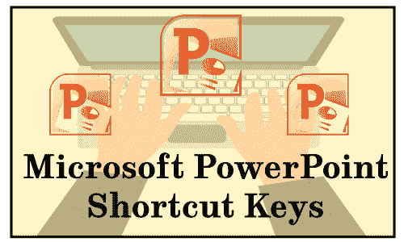

| 快捷键 | 说明 |
| **(幻灯片编号)+输入** | 它用于在幻灯片放映期间**跳转**到**想要的幻灯片**。例如，在幻灯片放映过程中，如果正在观看第 5 张号幻灯片，并且您想跳到第 8 张号幻灯片，请按 8 号键，然后按回车键。 |
| **Shift+Alt+T 或 D** | 它允许你打开**日期**和**时间**窗口插入当前日期和时间。 |
| **Ctrl+A** | 它为用户提供了选择所有**项目的选项，如文本框中的文本和幻灯片中的对象。在**幻灯片浏览视图**中，用于**选择所有幻灯片**。此外，在**幻灯片**中，其用途是显示**各种选项**，如下图所示:
** |
| **Ctrl+B** | 它使您能够在所选内容中添加或删除**粗体**。 |
| **Ctrl+C** | 其用途是**复制**选中的文本，包括幻灯片中的其他对象。也可以通过按**Ctrl+插入**来完成。 |
| **Ctrl+D** | 用于**创建**选中幻灯片**的**副本**。例如，如果您想添加任何幻灯片的副本，您需要选择它，并按下 **Ctrl+D** 快捷键。** |
| **Ctrl+E** | 它使您能够**将线条或选定的**文本**与幻灯片的**中心**对齐。** |
| **Ctrl+F** | 它为用户提供了在文件中**查找**或搜索内容的选项。 |
| **Ctrl+H** | 多用于**替换文件中的**一个单词或句子，在幻灯片中，也用于隐藏光标或任何激活的工具，如钢笔或荧光笔工具。 |
| **Ctrl+I** | 它允许您添加或删除所选文本的*斜体。此外，在幻灯片视图中，它还用于将光标更改为**荧光笔工具**。您需要按住鼠标按钮才能在屏幕上使用荧光笔。* |
| **Ctrl+J** | 它使您能够**对齐**(使您的文本在幻灯片上均匀对齐)选定的文本。 |
| **Ctrl+K** | 它提供了一个选项来**插入**一个**超链接**。 |
| **Ctrl+L** | 它的用途是将内容或选定的行与幻灯片的左侧对齐。 |
| **Ctrl+M** | 用于将**新**或空白**幻灯片**插入到所选幻灯片的正下方。 |
| **Ctrl+N** | 它使您能够在另一个 PowerPoint 窗口中**创建****新的**或空白的**文件**。 |
| **Ctrl+O** | 用于**打开**对话框或页面，在这里可以选择一个想要打开的文件。也可以使用 **Alt+Ctrl+F2** 打开文件。 |
| **Ctrl+P** | It provides users with the option to open the **Print** Preview page to print the file. It can also be done by using **Ctrl+Shift+F12** or **Ctrl+F2** shortcut keys.此外，在幻灯片放映视图中，它还用于将光标更改为钢笔工具。 |
| **Ctrl+R** | 它**将文本或所选段落移动到幻灯片的**右侧**处。** |
| **Ctrl+S** | 它允许你**保存**打开的文件。也可以使用 **Shift+F12** 保存文件。 |
| **Ctrl+T** | 用于打开**字体**窗口，可以调整字体大小、样式、类型等。也可以通过按 **Ctrl+Shift+F** 快捷键来完成。 |
| **Ctrl+U** | 它使用户能够从所选内容中添加或删除**下划线**。 |
| **Ctrl+V** | 用于将复制的文本、幻灯片和其他对象粘贴到文件中。您需要复制一次数据，然后可以粘贴多次。也可以使用**Shift+插入**粘贴数据。 |
| **Ctrl+W** 的缩写形式 | 它使您能够**关闭**当前打开的文档。 |
| **Ctrl+X** | 它允许您**剪切**所选项目。 |
| **Ctrl+Y** | 其用途是**重复**上一次执行的动作。也可以通过按功能键 **F4** 来完成。 |
| **Ctrl+Z** 的缩写形式 | 用于**撤销**(取回)删除的文字、幻灯片等对象。假设，错了；您已经删除了任何幻灯片，您可以使用此快捷键取回它。 |
| **换挡+F3** | 它允许用户**将所选文本**更改为**大写**或**小写**，并可用于将单词的首字母更改为大写字母。如果未选择文本，则仅光标后的第一个单词会被更改。 |
| **Shift+F5** | 从**选择的幻灯片**开始**幻灯片**有助于**开始**。例如，如果您的文件中有 20 张幻灯片，并且您想从第 5 张幻灯片开始放映幻灯片，您需要选择第 5 张幻灯片，然后按 **Shift+F5** 。 |
| **换挡+F7** | 用于查看所选单词的**词库**。如下图所示:
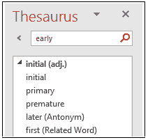 |
| **Shift+F9** | 它的用途是在微软 PowerPoint 的幻灯片上**显示**或**隐藏**的**网格**。 |
| **B** | 用于幻灯片放映时将**显示**变为**黑色**，再次按下 B 返回幻灯片放映。 |
| **F1** | 用于打开**帮助**菜单，在幻灯片放映视图中，用于显示幻灯片放映帮助窗口，该窗口提供了幻灯片放映中使用的快捷方式列表。 |
| **F5** | 它允许用户查看所有幻灯片的**幻灯片放映**。 |
| **F7** | 它为用户提供了检查所选单词的语法和拼写的好处。 |
| **F12** | 它允许您使用**另存为**选项，在该选项中，您可以使用新名称保存文件。 |
| **Ctrl+F1** | 用于显示或隐藏**色带**。 |
| **Ctrl+Shift+ >** | 用于**增加所选文本的**字号**。也可以通过按**Ctrl+】**来完成。** |
| **Ctrl+Shift+ <** | 用于**减小所选文本的**字号**。也可以通过按**Ctrl+[**]来完成。** |
| **Ctrl + Shift + =(等号)** | 帮助用户**将**选中的文字**改为** a **下标**。比如纯文本 **下标文本** ，X2 → **X 2** |
| **Ctrl+空格键** | 它允许您将选定的**文本**更改为**默认字体大小**并键入。 |
| **Ctrl+Home** | 其用途是将**光标**移动到**第一个**滑块上。例如，如果您的文件中有 50 张幻灯片，并且光标在第 45 张幻灯片上，通过按 Ctrl+Home，您可以将光标移动到第一张幻灯片。 |
| **Ctrl+End** | 用于将**光标**移动到**最后一个**滑块。比如你的 PowerPoint 文件有 100 张幻灯片，你想把光标移到最后一张幻灯片，可以按 **Ctrl+End** 。 |
| **Ctrl+退格** | 将**删除光标左侧**的**字**。**** |
| **Ctrl+删除** | 将**删除光标右侧**的**字****** |
| **Alt+N，P** | 它使您能够在文件中**插入**一张**图片**。你需要同时按 Alt 和 N 键，然后按 p 键 |

* * *

## 窗口键快捷方式

下表包含几个窗口( **Winkey** )快捷键:

| 快捷键 | 说明 |
| **窗口键** | 它为用户提供了打开和关闭开始菜单的选项。 |
| **Winkey + D** | 它用于最小化所有打开的窗口并恢复最小化的窗口。例如，如果您已经打开了不同的程序，如谷歌 Chrome、微软 Word，那么您可以同时按窗口键和 D 键来最小化所有打开的窗口。 |
| **Winkey + E** | 它帮助用户打开计算机窗口或硬盘驱动器。 |
| **Winkey + M** | 它允许用户**最小化**所有打开的程序窗口。 |
| **Winkey + Shift + M** | 用于**恢复所有**窗口**，使用 **Winkey+M** 和 **Winkey+D** 最小化。** |
| **Winkey + Tab** 的缩写形式 | 它为用户提供了通过在电脑上使用 Aero Flip 3-D 在**打开程序**之间切换**的选项。您需要按住窗口键并一直按 Tab 键从一个程序移动到另一个程序，当 Tab 键在您要打开的程序上时，请释放它。** |
| **Winkey + F** | 它将显示一个窗口，您可以在其中**搜索**或在您的计算机中找到可用的数据。 |
| **Winkey + L** | 用于**锁定**电脑或切换用户。 |
| **威基+ R** | 它的用途是打开**运行**对话框，用户可以在其中打开各种程序。例如，如果您想打开微软 Word，您需要按下 **Winkey + R、**并在打开的运行窗口中键入 **winword** ，然后按回车键。 |
| **Winkey + U** | 它允许您打开**易用性访问中心**窗口，该窗口使您能够访问各种选项，如开始放大镜、屏幕键盘、开始旁白等。 |
| **Winkey +暂停/中断** | 其用途是打开**系统属性**对话框。 |
| **温基+号** | 它为用户提供了根据他们在任务栏上的位置打开固定在任务栏上的**程序**的选项。例如，如下图所示，Internet Explorer 位于任务栏上的 1 st 位置；按下 **Winkey+1，**将打开**互联网浏览器**。因此，如果您按下 **Winkey+6，****Excel**将被打开，因为它位于任务栏上的第 6 个位置。
 |
| **Shift + Winkey + Number** | 它允许你根据程序在任务栏上的位置打开固定在任务栏上的程序的新窗口。例如，如下图所示，Internet Explorer 位于任务栏上的第 1 个位置；通过按 **Shift+Winkey+1，**将打开 Internet Explorer。如果您在打开 Internet Explorer 时再次按下此快捷键，它将再次打开 Internet Explorer 的新窗口。
T3】 |
| **Alt + Winkey + Number** | 它用于根据程序在任务栏上的位置打开固定在任务栏上的程序的跳转列表。比如下图所示:按 **Alt + Winkey + 1** 完成。
T3】 |
| **威基+ V** | 其用途是打开**剪贴板 app** 。 |
| **温基+上箭头(↑)** | 该键用于**最大化**窗口。 |
| **温基+向下箭头(↓)** | 用于**最小化**窗口。 |
| **温基+左骨髓 （←）** | 它帮助用户将**最大化**窗口到**屏幕左侧**。 |
| **温基+右箭头(→)** | 它的用途是最大化屏幕右侧的窗口。 |
| **Winkey + P** | 它允许用户选择演示**显示模式**。如下图所示:
 |
| **Winkey + X** | 它为用户提供了打开**窗口移动中心**的选项，您可以在其中调整音量、亮度等。 |

* * *

## F1 - F12 功能键快捷键

在电脑键盘上，功能键的范围从 **F1** 到 **F12** 不等。这些键执行由操作系统或当前运行的程序定义的特殊功能。这些键可以与 Alt 或 Ctrl 键一起使用，以执行不同的功能。

功能键可以在不同的键盘上执行不同的任务。由于一些笔记本电脑和小键盘的功能键用于改变屏幕亮度、音量和执行其他特定功能。Windows 和 macOS 的常用快捷键如下:

### 子一代

*   它几乎在每个程序中都用来打开帮助窗口。
*   也用于进入 **BIOS** 或 **CMOS** 有些电脑允许你使用不同的键进入 BIOS 设置，如 F2、F10、删除、Esc。
*   如果按 **Window + F1** ，会打开微软 Windows 帮助和支持中心。

### 第二子代

*   在微软视窗中，用于重命名用户选择的**图标、文件、**或**文件夹**。
*   在 Microsoft Excel 中，F2 键允许您编辑 Excel 工作表中的选定单元格。
*   在 Microsoft word 中，如果按下 **Ctrl+F2、**打印预览窗口将打开， **Alt+Ctrl+F2** 将打开新文件或文档。
*   此外，它还用于进入 CMOS 设置。

### 第三子代

*   它主要用于为许多程序打开一个**搜索**功能。
*   在 MS-DOS 或 Windows 命令行中，它为用户提供了重复输入的最后一个命令的选项。
*   在微软 Word 中，如果你按下 **Shift + F3，**它允许你将选中的文本从大写改为小写或者在每个单词的开头加一个大写字母。
*   在微软 Outlook 中，如果按下 **Windows 键+ F3** ，会打开高级查找窗口。
*   此外，它还用于在苹果电脑上打开**任务控制**。

### 法乐四联症

*   它的用途是在 Windows 95 中打开查找窗口到 XP。
*   它用于打开浏览器和浏览器中的地址栏。
*   在 Microsoft Word 中，它允许您重复上次执行的操作。例如，如果要多次重新键入最后键入的单词或句子，可以使用此键。
*   如果按下 **Alt+F4** ，将会**关闭**微软 Windows 中当前**打开的窗口**。此外，它还用于**关闭**系统，为此您需要在桌面屏幕上按 Alt+F4，您将看到一个对话框，然后单击确定按钮，系统将关闭。

### F5

*   主要用于**刷新**或重新加载页面或文档窗口。
*   如果在网页浏览器中按下 **Ctrl + F5** 或 **Shift + F5** ，则完全刷新网页，清除缓存，重新下载网页的全部内容。
*   它为用户提供了在微软 Word 中访问**查找**、**替换**、**转到**对话框的选项。
*   此外，它还用于在 PowerPoint 中启动**幻灯片显示**。

### F6

*   它帮助用户在 Internet Explorer、Mozilla Firefox、Google Chrome 等 Internet 浏览器中将光标移动到地址栏。
*   在微软 Word 中，如果您按下 Ctrl+Shift+F6，它允许您在其他打开的 Word 文档之间切换。
*   此外，它降低了笔记本电脑扬声器的音量(在某些笔记本电脑上)。

### F7

*   它通常用于在微软程序(如微软 Word、Outlook 等)中检查文档的拼写和语法。
*   如果您按下 **Shift+F7，**它允许您在微软 word、PowerPoint 中查看所选单词的同义词库。
*   它为用户提供了在 Mozilla Firefox 中打开插入符号浏览的选项。
*   它还用于增加笔记本电脑扬声器的音量(在某些笔记本电脑上)。

### F8

*   **F8** 功能键允许用户进入 Windows 启动菜单，一般用于进入 Windows 安全模式。
*   它也用于某些计算机访问 Windows 恢复系统，但可能需要 Windows 安装光盘。
*   此外，它还显示了 macOS 中所有工作空间的缩略图。

### F9

*   它用于在微软 Outlook 中发送和接收电子邮件。
*   它也用于刷新微软 Word 中的文档。
*   它的用途是访问夸克 5.0 中的测量工具栏。
*   它有助于降低某些笔记本电脑的屏幕亮度。
*   它为用户提供了在 macOS 10.3 或更高版本的单个工作空间中显示每个窗口缩略图的选项。
*   在苹果电脑上，如果你同时按下 **Fn** 和 **F9** 键，任务控制就会打开。

### F10

*   它允许您激活微软视窗中打开的应用程序的菜单栏。
*   **Shift+F10** 用于打开所选单词、图标、文件或互联网链接上的**右键选项**。如下图截图所示:
    
*   它允许用户访问康柏、惠普和索尼电脑上的隐藏恢复分区。
*   它为用户提供了在某些计算机上进入 CMOS 设置的选项。
*   它也用于提高某些笔记本电脑的屏幕亮度。
*   在 macOS 10.3 或更高版本上，它显示活动程序的所有打开的窗口。

### F11

*   它用于在所有现代互联网浏览器中启用和禁用全屏模式。
*   它允许用户选择访问电子机器、网关和联想电脑上的隐藏恢复分区。
*   在 macOS 10.4 或更高版本上，它用于隐藏所有打开的窗口并显示桌面。

### F12

*   用于打开**另存为**选项，可以在 Microsoft Word、Excel 等中保存不同名称的文件。
*   按 **Ctrl+F12、**可以在 Word、Excel 等中打开文件或文档。
*   **Shift+F12** 用于**在微软 Word 中保存**文件，就像我们使用**Ctrl+s**一样
*   如果在 Microsoft Word 中按下 **Ctrl+Shift+F12** ，会像我们使用**Ctrl+p**一样打开文档或文件的打印预览窗口
*   F12 也用于打开浏览器的 firebug 或调试工具。
*   在苹果电脑 10.4 或更高版本上，F12 用于显示或隐藏仪表板。
*   此外，它还提供了计算机启动时可引导设备的列表。您可以从已连接到电脑的列表中选择要启动的设备，例如硬盘、DVD 驱动器或光盘、软盘驱动器、USB 驱动器和网络。

* * *

## YouTube 快捷键

| 快捷键 | 描述 |
| **空格键**或 **K** | 它用于在 YouTube 上播放和暂停视频。 |
| **零点**或**家** | 如果您在 YouTube 上观看视频时按下零(0)键，它将从头开始播放该视频。 |
| **结束** | 它为用户提供了跳到视频结尾的选项。如果您正在观看播放列表，它将播放播放列表中的下一个视频。 |
| **右箭头(→)** | 它用于在您每次按键时将视频快进五秒。 |
| **左箭头(ↈ)** | 它的用途是当你按键时，将视频快速向后倒 5 秒。 |
| **J** 和 **L** | 用 **J** 键倒带 10 秒，用 **L** 转带 10 秒。 |
| **数字(1 至 9)** | 从 1 到 9 的任意数量的键用于以百分比的形式跳转视频。例如，如果您在观看视频时按 1，视频将会前进 10%。如果您按 2，视频将转发 20%。因此，如果您按 8，视频将前进 80%。 |
| **F** | 它允许您将视频切换到全屏模式或影院模式。 |
| **T** | 它的用途是在影院模式和普通模式之间切换。 |
| **向上箭头(↑)** | 用于在全屏模式下观看视频时**增加**音量。而在正常模式下，您必须在按下此键之前点击视频。 |
| **向下箭头(ↈ)** | 用于在全屏模式下观看视频时**降低**音量。在正常模式下，您必须在使用此键之前点击视频。 |
| **M** | 它可以让你**静音**YouTube 上的视频。 |

* * *

## 谷歌 Chrome 快捷键

下面的列表包含了谷歌浏览器上所有广泛使用的快捷键。

| 键组合解释 |
| **Alt + Man** | **用于在 Chrome 浏览器中打开主页。** |
| **F11** | 它为用户提供了全屏显示当前网站的选项，再次按 F11 退出该模式。 |
| **Alt +左箭头** | 其用途是返回**前一页**。 |
| **Alt+右箭头** | 用于转到**下一页。** |
| **Ctrl + Plus (+)** | 它为用户提供了放大页面的选项。 |
| **Ctrl + Plus (-)** | 它为用户提供了缩小页面的选项。 |
| **Ctrl + 0** | 用于将浏览器**缩放**至**默认**大小。 |
| **Ctrl+1 至 8** | 它为用户提供了切换到选项卡栏上打开的选项卡之一的选项。例如，如果您按 Ctrl+3，将出现第三个选项卡。 |
| **Ctrl + 9** | 它允许您切换到标签栏上打开的最后一个标签。 |
| **Ctrl + A** | 它用于选择页面上的所有内容。 |
| **Ctrl + D** | 用于为当前打开的页面添加**书签**。 |
| **Ctrl + F** | 它使您能够打开查找栏来搜索当前页面上的文本。 |
| **Ctrl+回车** | 它帮助用户快速找到 add.Com 分机的网址。比如在地址栏输入‘javatpoint’，按 Ctrl+Enter，会自动完成，比如**javatpoint.com**。 |
| **Ctrl+Shift+Del** | 它为用户提供了访问清除浏览数据窗口的选项，以清除浏览历史记录、cookies 和其他私有数据。 |
| **Ctrl + O** | 它允许你在浏览器中**打开**一个**文件**。 |
| **Ctrl + Shift + O** | 用于在 Chrome 浏览器中打开**书签管理器**。 |
| **Ctrl + H** | 它的用途是打开**历史**窗口，您可以根据需要管理您的浏览器历史。 |
| **Ctrl + J** | 它使用户能够在新的选项卡中打开**下载**窗口。 |
| **Ctrl+K 或 E** | 它为用户提供了将文本**光标**移动到**搜索栏**的好处，在这里你可以搜索任何查询。 |
| **Ctrl + L** | 它将光标移至**浏览器地址**栏，并选择地址栏中所有可用的文本 |
| **Ctrl + N** | 其用途是打开**新的**浏览器窗口。 |
| **Ctrl + P** | 用于打开**打印**窗口，可以打印页面。 |
| **Ctrl + Shift + N** | 它为用户提供了在**隐姓埋名模式**下访问新窗口的选项。隐姓埋名模式或私人模式允许您在一个独特的沙盒网络会话中搜索查询。它为您提供了临时控制浏览器历史的选项，因为当您关闭浏览器窗口时，它会忘记存储您的历史。 |
| **Ctrl + R 或 F5** | 用于在浏览器上**刷新**当前页面。 |
| **Ctrl + S** | 它允许您打开**另存为**窗口，您可以在其中保存当前打开的网页。 |
| **Ctrl + T** | 它为用户提供了在浏览器上快速打开一个**新标签**的选项。 |
| **Ctrl + U** | 它可以让你显示网页的**源代码**。 |
| **Ctrl + W** 的缩写形式 | 用于**关闭**当前**标签。** |
| **Ctrl+Tab** | 它允许您将**从一个选项卡移动到另一个选项卡的浏览器右侧。** |
| **Ctrl+ Shift + Tab** | 它允许你将**从一个标签移动到另一个标签**到浏览器的左侧**。** |
| **Ctrl+Shift+W** | 它为用户提供了关闭当前选择的**窗口**的选项。 |
| **Ctrl +左键点击** | 它允许用户在新选项卡中打开搜索结果链接，而无需离开当前页面。 |
| **Ctrl + Shift 左键点击** | 它使您能够在新选项卡中打开搜索结果链接，并切换到新选项卡。 |
| **空格键** | 用于将**下移**页面。 |
| **Shift +空格键** | 用于将**上移**页面。 |
| **结束** | 它的用途是在页面底部移动。 |
| **家** | 它的用途是在页面的开始或顶部移动。 |
| **Ctrl+Shift+T** | 它为用户提供了重新打开您关闭的最后一个选项卡的好处。如果您已经关闭了多个选项卡，也可以通过多次按下此快捷键来重新打开这些选项卡。 |

* * ******