# SQL 面试问答

> 原文：<https://www.javatpoint.com/sql-interview-questions>

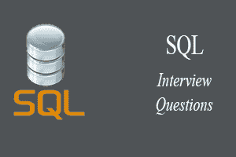

以下是最受应届生和有经验的考生欢迎和最有用的 SQL 面试问题和答案。这些问题是专门为让您熟悉在 SQL 面试中可能会遇到的问题类型而设计的。根据我们的经验，优秀的面试官很少计划在面试中问任何具体的话题。相反，提问通常从对主题的基本理解开始，根据你的回答，进一步的讨论发生了。

### 1)什么是 SQL？

SQL 代表结构化查询语言。它是用于维护关系数据库和对数据执行许多不同的数据操作的标准语言。SQL 最初是在 1970 年发明的。它是一种数据库语言，用于数据库的创建、删除、获取和修改行等。有时，它被发音为“续集”我们还可以使用它来处理由实体(变量)组成的有组织的数据，以及数据的不同实体之间的关系。

* * *

### SQL 什么时候出现的？

SQL 最早出现在 1974 年。它是维护关系数据库最常用的语言之一。1986 年，SQL 成为美国国家标准协会(ANSI)的标准，1987 年成为 ISO(国际标准化组织)的标准。

* * *

### SQL 有哪些用法？

SQL 负责维护数据库中的关系数据和数据结构。下面给出了一些常见用法:

*   对数据库执行查询
*   从数据库中检索数据
*   在数据库中插入记录
*   更新数据库中的记录
*   从数据库中删除记录
*   创建新数据库
*   在数据库中创建新表
*   在数据库中创建视图
*   对数据库执行复杂的操作。

* * *

### SQL 是否支持编程语言特性？

SQL 指的是标准查询语言。因此，SQL 确实是一种语言，但实际上并不支持编程语言。这是一种没有循环、条件语句和逻辑操作的通用语言。除了数据操作，它不能用于任何其他用途。它是一种执行数据库操作的命令语言。SQL 的主要目的是对数据库中的数据进行检索、操作、更新、删除和执行复杂的操作，如连接。

* * *

### SQL 有哪些子集？

以下是 SQL 的四个重要子集:

*   **数据定义语言(DDL):** 它定义了由 CREATE、ALTER、DROP 等命令组成的数据结构。
*   **数据操作语言(DML):** 用于操作数据库中已有的数据。此类别中的命令有选择、更新、插入等。
*   **数据控制语言(DCL):** 它控制对存储在数据库中的数据的访问。该类别中的命令包括 GRANT 和 REVOKE。
*   **事务控制语言(TCL):** 用于处理数据库中的事务操作。该类别中的命令有提交、回滚、设置事务、保存点等。

* * *

### DDL 语言的目的是什么？

DDL 代表数据定义语言。它是数据库的子集，在创建数据库时定义数据库的数据结构。**例如，**我们可以使用 DDL 命令来添加、删除或修改表。它由以下命令组成:CREATE、ALTER 和 DELETE 数据库对象，如模式、表、索引、视图、序列等。

**例**

```

CREATE TABLE Students
(
Roll_no INT,
Name VARCHAR(45),
Branch VARCHAR(30),
);

```

* * *

### DML 语言的目的是什么？

数据操作语言使用户能够检索和操作关系数据库中的数据。DML 命令只能对数据执行只读操作。我们可以使用 DDL 语言执行以下操作:

*   通过 Insert 命令将数据插入数据库。
*   通过 SELECT 命令从数据库中检索数据。
*   通过 Update 命令更新数据库中的数据。
*   通过 Delete 命令从数据库中删除数据。

**例**

```

INSERT INTO Student VALUES (111, 'George', 'Computer Science')

```

* * *

### DCL 语言的目的是什么？

数据控制语言允许用户控制对数据库的访问和权限管理。它是数据库的子集，决定了哪个用户应该在什么时间点访问数据库的什么部分。它包括两个命令，GRANT 和 REVOKE。

**GRANT:** 它使系统管理员能够为特定用户帐户分配权限和角色，以便在数据库上执行特定任务。

**REVOKE:** 它使系统管理员能够从用户帐户中撤销权限和角色，以便他们不能使用以前分配的数据库权限。

**例**

```

GRANT * ON mydb.Student TO javatpoint@localhsot;

```

* * *

### 9)数据库中有哪些表和字段？

表是以行和列的形式组织的一组数据。它使用户能够以结构格式存储和显示记录。它类似于电子表格应用程序中的工作表。这里，行指的是元组，表示简单的数据项，而列是特定行中数据项的属性。列可以分类为垂直，行可以分类为水平。

字段是为表提供结构的组件。它以相同的数据类型存储相同类别的数据。表包含固定数量的列，但可以有任意数量的行，称为记录。它也称为数据库表中的一列。它表示记录中实体的属性或特征。

**例**

**表:**学生

**字段:**梭哈 _ 罗拉诺、梭哈 _ 姓名、出生日期、分支等。

* * *

### 10)什么是主键？

主键是唯一标识表中每条记录的字段或字段组合。它是一种特殊的独特的钥匙。如果列包含主键，它不能为空。一个表可以有重复的列，但不能有多个主键。它总是将唯一的值存储到一列中。**例如**ROLL Number 可以被视为大学或学院中学生的主键。

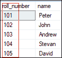

我们可以将主键定义到学生表中，如下所示:

```

CREATE TABLE Student (  
    roll_number INT PRIMARY KEY,  
    name VARCHAR(45),   
);  

```

要阅读更多信息，[点击此处](https://www.javatpoint.com/mysql-primary-key)。

* * *

### 11)什么是外键？

外键用于将一个或多个表链接在一起。它也被称为参考键。外键被指定为与另一个表的主键相关的键。这意味着一个表中的外键字段引用另一个表的主键字段。它唯一地标识了另一个表中维护引用完整性的每一行。主键-外键关系是一种非常重要的关系，因为它有时会维护数据库的 ACID 属性。它还可以防止破坏子表和父表之间链接的操作。

我们可以将外键定义到表中，如下所示:

```

CONSTRAINT constraint_name]  
    FOREIGN KEY [foreign_key_name] (col_name, ...)  
    REFERENCES parent_tbl_name (col_name,...)  

```

* * *

要阅读更多信息，[点击此处](https://www.javatpoint.com/mysql-foreign-key)。

* * *

### 12)什么是唯一键？

唯一键是一个或多个字段的组合，确保列中存储的所有值都是唯一的。这意味着列不能存储重复的值。该键为一列或一组列提供唯一性。**例如**学生表格的电子邮件地址和卷号应该是唯一的。它可以接受空值，但每列只能接受一个空值。它确保了将不同值存储到表中的列或列组的完整性。

我们可以将外键定义到表中，如下所示:

```

CREATE TABLE table_name(  
    col1 datatype,  
    col2 datatype UNIQUE,  
    ...  
);

```

要阅读更多信息，[点击此处](https://www.javatpoint.com/mysql-unique-key)。

* * *

### 13)主键和唯一键有什么区别？

主键和唯一键都是 SQL 的基本约束。它们之间的主要区别在于主键标识了表中的每条记录。相比之下，唯一键可防止列中出现重复条目，空值除外。下面的对比图解释得更清楚:

| 主关键字 | 唯一密钥 |
| 主键充当表中每个记录的唯一标识符。 | 当主键不在表中时，唯一键也是记录的唯一标识符。 |
| 我们不能在主键列中存储空值。 | 我们可以在唯一键列中存储空值，但只允许一个空值。 |
| 我们无法更改或删除主键列值。 | 我们可以修改唯一键列值。 |

要阅读更多信息，[点击此处](https://www.javatpoint.com/primary-key-vs-unique-key)。

* * *

### 14)什么是数据库？

数据库是结构化为表、行、列和索引的有组织的数据集合。它帮助用户频繁地找到相关信息。它是一个电子系统，使数据访问、数据操作、数据检索、数据存储和数据管理变得非常容易。几乎每个组织都使用数据库来存储数据，因为它易于访问且易于操作。数据库提供了对数据的完美访问，并允许我们执行所需的任务。

以下是数据库的常见功能:

*   管理大量数据
*   精确的
*   易于更新
*   安全
*   数据完整性
*   易于研究的数据

* * *

### 15)什么是数据库管理系统？

数据库管理系统代表数据库管理系统。它是一个软件程序，主要作为数据库和最终用户之间的接口。它为我们提供了管理数据、数据库引擎和数据库模式等功能，以便于使用简单的查询在几乎没有时间的情况下组织和操作数据。它就像一个文件管理器，管理数据库中的数据，而不是将其保存在文件系统中。如果没有数据库管理系统，用户访问数据库数据将会困难得多。

以下是数据库管理系统的组件:

*   软件
*   数据
*   程序
*   数据库语言
*   询问处理程序
*   数据库管理器
*   数据库引擎
*   报告

* * *

### 16)有哪些不同类型的数据库管理系统？

数据库管理系统可以分为几种类型。下面列出了一些重要的清单:

*   分层数据库
*   网络数据库(IDMS)
*   关系数据库
*   面向对象数据库
*   文档数据库(文档数据库)
*   图形数据库
*   ER 模型数据库
*   NoSQL 数据库

* * *

### 17)什么是关系数据库管理系统？

关系数据库管理系统代表关系数据库管理系统。它是一个基于关系模型的数据库管理系统。它便于您通过使用关系运算符来操作存储在表中的数据。关系数据库管理系统将数据存储到表的集合中，并在需要时使用关系运算符轻松链接这些表。关系数据库管理系统的例子有微软 Access、MySQL、SQL Server、Oracle 数据库等。

* * *

### 18)什么是数据库中的规范化？

规范化用于通过组织数据库的字段和表来最小化冗余和依赖性。

数据库规范化有一些规则，通常称为“正常自”，它们是:

*   第一范式(1NF)
*   第二范式(2NF)
*   第三范式(3NF)
*   Boyce-Codd 范式(BCNF)

使用这些步骤，可以消除数据库中数据的冗余、异常和不一致性。

* * *

### 19)规范化的主要用途是什么？

规范化主要用于添加、删除或修改可以在单个表中进行的字段。规范化的主要用途是消除冗余，消除插入、删除和更新干扰。规范化将表分成小的分区，然后使用不同的关系将它们链接起来，以避免冗余。

* * *

### 20)不执行数据库规范化有什么缺点？

主要缺点是:

数据库中冗余项的出现会导致磁盘空间的浪费。

由于冗余的术语，也可能出现不一致。如果一个表的数据发生了变化，而另一个表的相同数据没有发生变化，那么就会出现不一致。这种不一致将导致维护问题，并影响酸的性质。

* * *

### 21)什么是不一致依赖？

不一致依赖是指由于数据路径缺失或中断而难以获得相关数据。它会导致用户在错误的表中搜索数据，从而导致输出错误。

* * *

### 22)什么是数据库中的反规范化？

反规范化是数据库管理员用来优化其数据库基础结构效率的一种技术。反规范化概念基于规范化，规范化被定义为为了特定目的将数据库正确地排列成表。这种方法允许我们将冗余数据添加到规范化数据库中，以缓解数据库查询将多个表中的数据合并到一个表中的问题。它向表中添加冗余项，以避免复杂的连接和许多其他复杂的操作。

反规格化并不意味着不做规格化。这是一种优化策略，发生在规范化过程之后。

* * *

### 23)SQL 运算符有哪些不同类型？

运算符是为执行特定操作而保留的特殊关键字或特殊字符。它们也用于 SQL 查询。我们可以主要在 SQL 命令的 WHERE 子句中使用这些运算符。这是根据指定条件过滤数据的命令的一部分。SQL 运算符可以分为以下几种类型:

*   **算术运算符:**这些运算符用于对数值数据进行数学运算。该运算符的类别有加法(+)、减法(-)、乘法(*)、除法(/)、余数/模(%)等。
*   **逻辑运算符:**这些运算符对表达式求值，并以 True 或 False 返回结果。该运算符包括“所有”、“与”、“任何”、“为空”、“存在”、“介于”、“在”、“类似”、“非”或“唯一”。
*   **比较运算符:**这些运算符用于对两个值进行比较，检查它们是否相同。它包括等于(=)，不等于(！=或< >)，小于()，小于或等于(< =)，大于或等于(> =)，不小于(！)，等等。
*   **按位运算符:**用于在两个整数类型的表达式之间进行位操作。它首先执行整数到二进制位的转换，然后应用诸如 AND ( &符号)或(|，^)，NOT (~)等运算符。
*   **复合运算符:**这些运算符在将变量的结果设置为运算结果之前对变量执行运算。它包括加等于(+=)、减等于(-=)、乘等于(*=)、除等于(/=)、模等于(%)=)等。
*   **字符串运算符:**这些运算符主要用于执行字符串的串联和模式匹配。它包括+(字符串连接)、+=(字符串连接赋值)、%(通配符)、[](字符匹配)、[^](字符不匹配)、_(通配符匹配一个字符)等。

* * *

### 24)什么是 SQL 中的视图？

视图是没有值的数据库对象。它是一个包含表中数据子集的虚拟表。它看起来像一个包含行和列的实际表，但是占用的空间较少，因为它在物理上不存在。它的操作类似于基表，但不包含任何自己的数据。它的名字总是独一无二的。一个视图可以包含一个或多个表中的数据。如果基础表中发生任何更改，视图中也会反映相同的更改。

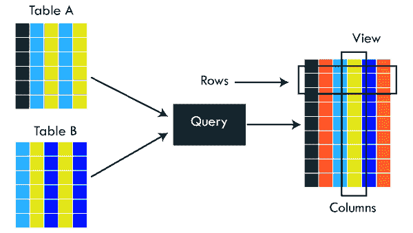

视图的主要用途是实现安全机制。它是一个可搜索的对象，我们可以使用查询来搜索视图，就像搜索表一样。它只显示创建视图时声明的查询返回的数据。

我们可以使用以下语法创建视图:

```

CREATE VIEW view_name AS
SELECT column_lists FROM table_name
WHERE condition;

```

* * *

### 25)什么是 SQL 中的索引？

索引是与加快行检索的表或视图相关联的盘结构。它降低了查询的成本，因为查询的高成本会导致其性能下降。它用于提高性能，并允许更快地从表中检索记录。索引减少了我们查找特定数据页所需访问的数据页数量。它还有一个唯一的值，意味着索引不能重复。索引为每个值创建一个条目，这使得检索数据更快。

**例如:**假设我们有一本书，里面记载了各个国家的细节。如果你想找到关于印度的信息，为什么要翻那本书的每一页？你可以直接去索引。然后从索引中，你可以进入那个特定的页面，那里给出了所有关于印度的信息。

* * *

### 26)SQL 中有哪些不同类型的索引？

SQL 索引只不过是一种最小化查询成本的技术。查询成本越高，查询性能越差。以下是 SQL 中支持的不同类型的索引:

*   唯一索引
*   聚集索引
*   非聚集索引
*   位图索引
*   正常指数
*   复合指标
*   b 树索引
*   基于函数的索引

* * *

### 27)什么是唯一指数？

唯一索引用于强制单列或多列中值的唯一性。我们可以在单个表中创建多个唯一索引。为了创建唯一索引，用户必须检查列中的数据，因为当表中的任何列具有唯一值时，都会使用唯一索引。如果列是唯一索引的，此索引不允许字段具有重复值。定义主键时，可以自动应用唯一索引。

我们可以使用以下语法创建它:

```

CREATE UNIQUE INDEX index_name  
ON table_name (index_column1, index_column2,...);

```

**例**

```

CREATE TABLE Employee(    
    ID int AUTO_INCREMENT PRIMARY KEY,     
    Name varchar(45),   
    Phone varchar(15),  
    City varchar(25), 
);

```

假设我们想要创建一个 Phone 列作为唯一索引。我们可以这样做:

```

CREATE UNIQUE INDEX index_name_phone ON Employee (Phone);  

```

要阅读更多信息，[点击此处](https://www.javatpoint.com/mysql-unique-index)。

* * *

### 28)什么是 SQL 中的聚集索引？

聚集索引实际上是存储行数据的表。它根据只能在一个方向上排序的键值来确定表数据的顺序。每个表只能有一个聚集索引。这是生成主键时自动创建的唯一索引。如果表中需要进行许多数据修改，那么最好使用聚集索引。

要阅读更多信息，[点击此处](https://www.javatpoint.com/mysql-clustered-index)。

* * *

### 29)什么是 SQL 中的非聚集索引？

主索引(聚集索引)以外的索引称为非聚集索引。我们知道，聚集索引是在生成主键时自动创建的，而非聚集索引是在查询中使用多个联接条件和各种筛选器时创建的。非聚集索引和表数据都存储在不同的位置。它不能改变表的物理顺序，也不能保持数据的逻辑顺序。

创建非聚集索引的目的是为了搜索数据。它最好的例子是一本书，内容写在一个地方，索引在不同的地方。我们可以在每个表中创建 0 到 249 个非聚集索引。非聚集索引提高了使用键而不分配主键的查询的性能。

* * *

### 30)SQL、MySQL 和 SQL Server 有什么区别？

下面的对比图解释了它们的主要区别:

| 结构化查询语言 | 关系型数据库 | 数据库 |
| SQL 或结构化查询语言对于管理我们的关系数据库非常有用。它用于查询和操作数据库。 | MySQL 是用于管理关系数据库的流行数据库管理系统。这是一个快速、可扩展且易于使用的数据库。 | SQL Server 是一个 RDBMS 数据库系统，主要为 Windows 系统开发，用于存储、检索和访问开发人员请求的数据。 |
| SQL 最早出现在 1974 年。 | MySQL 最早出现在 1995 年 5 月 23 日。 | SQL Server 最早出现在 1989 年 4 月 24 日。 |
| SQL 是由 IBM 公司开发的。 | MySQL 是由甲骨文公司开发的。 | SQL Server 由微软公司开发。 |
| SQL 是一种用于管理数据库的查询语言。 | MySQL 是使用 SQL 语言与数据库进行交互的数据库软件。 | SQL Server 也是一个使用 SQL 语言来处理数据库的软件。 |
| SQL 没有变量。 | MySQL 可以使用变量、约束和数据类型。 | SQL Server 可以使用变量、约束和数据类型。 |
| SQL 是一种编程语言，所以它不会得到任何更新。它的命令总是固定不变的。 | MySQL 是软件，所以经常更新。 | SQL Server 也是软件，所以更新频繁。 |

* * *

### 31)SQL 和 PL/SQL 有什么区别？

下面的对比图解释了它们的主要区别:

| 结构化查询语言 | PL/SQL |
| SQL 是一种用于与关系数据库通信的数据库结构化查询语言。它是由 IBM 公司开发的，最早出现在 1974 年。 | PL/SQL 或过程语言/结构化查询语言是 SQL 的一种方言，用于增强 SQL 的功能。甲骨文公司在 90 年代早期开发了它，它使用 SQL 作为它的数据库语言。 |
| SQL 是一种声明性和面向数据的语言。 | PL/SQL 是一种面向过程和应用的语言。 |
| SQL 没有变量。 | PL/SQL 可以使用变量、约束和数据类型。 |
| SQL 一次只能执行一个查询。 | PL/SQL 可以一次执行整个代码块。 |
| SQL 查询可以嵌入到 PL/SQL 中。 | PL/SQL 不能嵌入到 SQL 中，因为 SQL 不支持任何编程语言和关键字。 |
| SQL 可以直接与数据库服务器交互。 | PL/SQL 不能直接与数据库服务器交互。 |
| SQL 就像我们需要显示的数据源。 | PL/SQL 提供了一个展示 SQL 数据的平台。 |

* * *

### 32)是否可以使用列别名对列进行排序？

是的。我们可以在 ORDER BY 中使用别名方法，而不是 WHERE 子句来对列进行排序。

* * *

### 33)SQL 中的聚集索引和非聚集索引有什么区别？

索引是一种快速获取请求数据的方法。SQL 中的索引主要有两种，聚集索引和非聚集索引。从 SQL 性能的角度来看，这两个索引之间的差异非常重要。下面的对比图解释了它们的主要区别:

| 聚集索引 | 非聚集索引 |
| 聚集索引是存储行数据的表或视图。在关系数据库中，如果表列包含主键，MySQL 会自动创建一个名为 primary 的聚集索引。 | 主索引(聚集索引)以外的索引称为非聚集索引。它具有独立于数据行的结构。非聚集索引也称为辅助索引。 |
| 聚集索引存储数据信息和数据本身。 | 非聚集索引只存储信息，然后它会向您引用聚集数据中存储的数据。 |
| 每个表只能有一个聚集索引。 | 一个表中可以有一个或多个非聚集索引。 |
| 聚集索引决定了数据在表中的物理存储方式。因此，从聚集索引中读取会更快。 | 它创建数据行的逻辑顺序，并使用指针来访问物理数据文件。因此，从聚集索引中读取比较慢。 |
| 聚集索引总是包含索引 id 0。 | 非聚集索引总是包含 id>0 的索引。 |

要阅读更多信息，[点击此处](https://www.javatpoint.com/mysql-clustered-vs-non-clustered-index)。

* * *

### 34)显示当前日期的 SQL 查询是什么？

SQL 中有一个内置函数，叫做 GetDate()，用来返回当前时间戳。

* * *

### 35)SQL 中哪些是联接？说出最常用的 SQL 联接？

SQL 联接用于将多个表中的数据检索到一个有意义的结果集中。每当需要从两个或多个表中获取记录时，都会执行该操作。它们与 SELECT 语句和连接条件一起使用。

以下是 SQL 中最常用的连接:

*   内部连接
*   左外连接
*   右外连接

* * *

### 36)SQL 中有哪些不同类型的连接？

联接用于合并两个表或从表中检索数据。这取决于表之间的关系。根据 ANSI 标准，以下是 SQL 中使用的不同类型的连接:

*   内部连接
*   自连接
*   左外连接
*   右外连接
*   完全外部连接
*   交叉连接

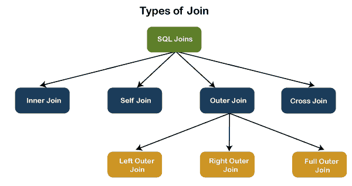

要阅读更多信息，[点击此处](https://www.javatpoint.com/sql-server-joins)。

* * *

### 37)什么是 SQL 中的 INNER JOIN？

内部联接只返回表中符合指定条件的记录，并隐藏其他行和列。简而言之，当发现表之间至少有一行匹配时，它会提取行。INNER JOIN 关键字连接两个表中匹配的记录。它被假定为默认连接，因此可以选择在查询中使用 INNER 关键字。

下图更清楚地解释了这种连接:

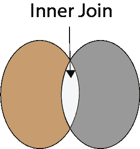

以下语法说明了 INNER JOIN:

```

SELECT column_lists
FROM table1  
INNER JOIN table2 ON join_condition1  
INNER JOIN table3 ON join_condition2  
...;  

```

要阅读更多信息，[点击此处](https://www.javatpoint.com/mysql-inner-join)。

* * *

### 38)什么是 SQL 中的正确连接？

右联接用于检索右表中的所有行，并且只检索满足联接条件的其他表中的那些行。它返回右侧表中的所有行，即使左侧表中没有匹配项。如果它从左侧表中找到不匹配的记录，它将返回一个空值。这种连接也称为右外连接。

下图更清楚地解释了这种连接:

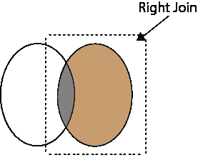

以下语法说明了右连接:

```

SELECT colum_lists  
FROM table1   
RIGHT JOIN table2  
ON join_condition;

```

要阅读更多信息，[点击此处](https://www.javatpoint.com/sql-right-join)。

* * *

### 39)什么是 SQL 中的左连接？

左连接用于从左表中获取所有行以及指定表之间的公共记录。它返回左侧表中的所有行，即使右侧表中没有匹配项。如果在右侧表中找不到任何匹配的记录，则返回 null。这种连接也可以称为左外连接。

下面的视觉表现更清楚地解释了这一点:

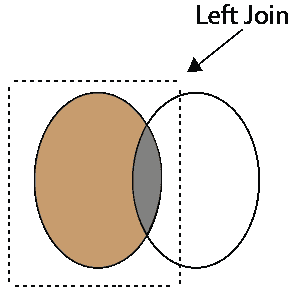

以下语法说明了右连接:

```

SELECT colum_lists  
FROM table1   
LEFT JOIN table2  
ON join_condition;

```

要阅读更多信息，[点击此处](https://www.javatpoint.com/sql-left-join)。

* * *

### 40)什么是 SQL 中的完全连接？

完全联接由包含两个表中所有记录的左联接和右联接组合而成。当任何一个表中有匹配的行时，它就提取行。这意味着它返回左侧表中的所有行和右侧表中的所有行。如果没有找到匹配项，它将放入空值。它也被称为完全外部连接。

下面的视觉表现更清楚地解释了这一点:

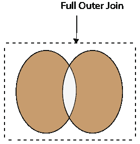

以下语法说明了完全连接:

```

SELECT * FROM table1   
FULL OUTER JOIN table2  
ON join_condition;

```

要阅读更多信息，[点击此处](https://www.javatpoint.com/sql-full-join)。

* * *

### 41)什么是 SQL 中的“触发器”？

触发器是驻留在系统目录中的一组 SQL 语句。它是一种特殊类型的存储过程，在响应事件时自动调用。它允许我们在针对特定表运行插入、更新或删除命令时执行一批代码，因为每当向系统发出 DML 命令时，触发器都是一组激活的操作。

SQL 触发器有两个主要组成部分一个是动作，另一个是事件。当采取某些操作时，这些操作会导致事件发生。

我们使用 CREATE TRIGGER 语句在 SQL 中创建一个触发器。以下是语法:

```

CREATE TRIGGER trigger_name    
    (AFTER | BEFORE) (INSERT | UPDATE | DELETE)  
         ON table_name FOR EACH ROW    
         BEGIN    
        --variable declarations    
        --trigger code    
        END;

```

要阅读更多信息，[点击此处](https://www.javatpoint.com/mysql-trigger)。

* * *

### 42)什么是自加入，自加入的要求是什么？

SELF JOIN 用于将表与其自身连接起来。这种连接可以使用表别名来执行，这允许我们避免在一个句子中重复相同的表名。如果我们在单个查询中多次使用同一个表名而不使用表别名，将会引发错误。

当我们想要将数据与同一个表本身中的其他数据组合在一起时，需要 SELF JOIN。将层次结构转换为平面结构通常非常有用。

以下语法说明了自连接:

```

SELECT column_lists  
FROM table1 AS T1, table1 AS T2  
WHERE join_conditions;  

```

**例**

假设我们有一个包含以下数据的“学生”表:

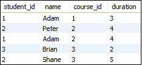

如果我们想从 student_id 相等，而 course_id 不相等的表中检索 student_id 和名称，可以通过使用自连接来实现:

```

SELECT  s1.student_id, s1.name  
FROM student AS s1, student s2  
WHERE s1.student_id=s2.student_id  
AND s1.course_id<>s2.course_id;  

```

结果如下:

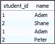

要阅读更多信息，[点击此处](https://www.javatpoint.com/mysql-self-join)。

* * *

### 43)SQL 中有哪些集合运算符？

我们使用 set 运算符来合并一个或多个同类表中的数据。虽然集合运算符类似于 SQL 联接，但有一个显著的区别。SQL 联接组合了来自不同表的列，而 SQL 集合运算符组合了来自不同查询的行。包含集合操作的 SQL 查询称为复合查询。SQL 中的集合运算符分为四种不同的类型:

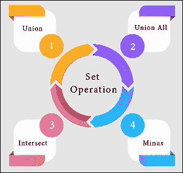

**A. UNION:** 它将来自多个 SELECT 查询的两个或多个结果组合成一个结果集。它有一个默认功能，可以从表中删除重复的行。以下语法说明了联合运算符:

```

SELECT columns FROM table1  
UNION  
SELECT columns FROM table2;  

```

**B. UNION ALL:** 该运算符类似于 UNION 运算符，但它不会从 SELECT 语句的输出中删除重复的行。以下语法说明了联合所有运算符:

```

SELECT columns FROM table1  
UNION  ALL
SELECT columns FROM table2;  

```

**C. INTERSECT:** 该运算符从两个或多个 SELECT 语句中返回公共记录。默认情况下，它总是检索唯一的记录并按升序排列它们。这里，列数和数据类型应该相同。以下语法说明了 INTERSECT 运算符:

```

SELECT columns FROM table1  
INTERSECT
SELECT columns FROM table2;  

```

**D .减:**该运算符返回第一次查询的记录，在第二次查询中找不到。它不返回重复的值。以下语法说明了减运算符:

```

SELECT columns FROM table1  
MINUS
SELECT columns FROM table2;  

```

要阅读更多信息，[点击此处](https://www.javatpoint.com/dbms-sql-set-operation)。

* * *

### 44)IN 和 between 运算符有什么区别？

下面的对比图解释了它们的主要区别:

| 运算符之间 | 输入运算符 |
| 该运算符用于选择两个值之间的数据范围。这些值也可以是数字、文本和日期。 | 它是一个逻辑运算符，用于确定一组值中是否存在特定的值。该运算符减少了查询中多个或条件的使用。 |
| 它返回列值在定义范围内的记录。 | 它比较指定列的值，并在值集中存在匹配项时返回记录。 |
| 以下语法说明了该运算符:
选择* FROM 表名
WHERE 列名介于“值 1”和“值 2”之间； | 下面的语法说明了这个运算符:
SELECT * FROM table _ name
WHERE 列 _name IN ('value1 '，' value 2 ')； |

* * *

### 45)什么是约束？说说它的各个层次。

约束用于指定允许或限制表中存储哪些值/数据的规则和规定。它确保表内数据的准确性和完整性。它强制我们存储有效数据，并阻止我们存储不相关的数据。如果约束和数据操作之间发生任何中断，则操作失败。一些最常用的约束是不为空、主键、外键、自动增量、唯一键等。

以下语法说明了如何为表创建约束:

```

CREATE TABLE table_name (  
    column1 datatype constraint,  
    column2 datatype constraint, 
    .........  
);  

```

SQL 将约束分为两个级别:

**列级约束:**这些约束仅适用于单个列，并限制该列中可以存储的数据类型。

**表级约束:**这些约束应用于整个表，并限制可以输入的数据类型。

要阅读更多信息，[点击此处](https://www.javatpoint.com/mysql-constraints)。

* * *

### 46)如何写一个 SQL 查询找到以‘A’开头的学生名字？

我们可以编写以下查询来获取姓名以 A 开头的学生详细信息:

```

SELECT * FROM student WHERE stud_name like 'A%';

```

这里是一个演示示例，我们有一个名为 student 的表，其中包含两个以“A”字符开头的名称。

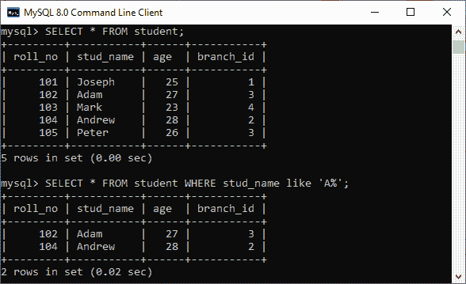

* * *

### 47)编写 SQL 查询，从名为 employees 的表中获取员工的第三个最高工资。

以下查询是获取员工第三个最高工资的最简单方法:

```

SELECT * FROM `employees` ORDER BY `salary` DESC LIMIT 1 OFFSET 2

```

下面是演示示例，展示了如何获得员工的第三个最高工资。

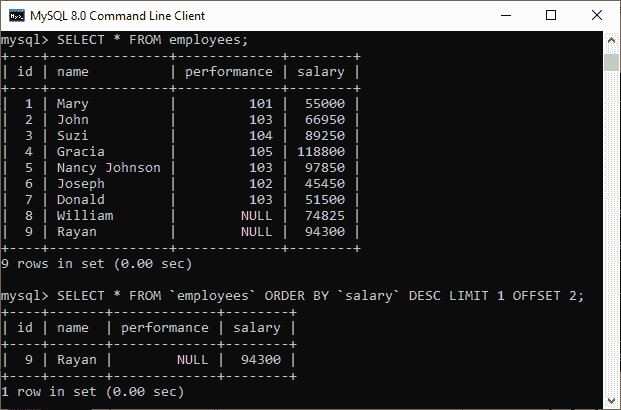

以下是获得员工第三高工资的替代方法:

**A .使用 LIMIT 关键字**

```

SELECT salary FROM employees 
ORDER BY salary DESC 
LIMIT 2, 1;

```

**B .使用子查询**

```

SELECT salary  
FROM 
    (SELECT salary 
     FROM employees 
     ORDER BY salary DESC 
     LIMIT 3) AS Temp 
ORDER BY salary LIMIT 1;

```

**C .使用 TOP 关键字**

```

SELECT TOP 1 salary 
FROM 
    (SELECT DISTINCT TOP 3 salary 
     FROM employees 
     ORDER BY salary DESC) AS Temp 
ORDER BY salary ASC;

```

* * *

### 48)SQL 中的 DELETE 和 TRUNCATE 语句有什么区别？

它们之间的主要区别在于 delete 语句删除数据而不重置表的标识，而 truncate 命令重置特定表的标识。下面的对比图解释得更清楚:

| 号码 | 删除 | 缩短 |
| 1) | delete 语句根据指定的条件从现有表中删除一行或多行。 | truncate 命令删除现有表的全部内容，而不删除表本身。它保留了表结构或模式。 |
| 2) | 删除是 **DML 命令。** | TRUNCATE 是一个 **DML 命令。** |
| 3) | 我们**可以在 DELETE 命令中使用 WHERE** 子句。 | 我们**不能将 WHERE** 子句与 TRUNCATE 一起使用。 |
| 4) | DELETE 语句用于**从表格中删除一行**。 | TRUNCATE 语句用于**从表中删除所有行**。 |
| 5) | DELETE 是**比较慢的**，因为它维护了日志。 | TRUNCATE 语句比 DELETE 语句更快**，因为它一次删除整个数据，而不维护事务日志。** |
| 6) | 使用 DELETE 语句后**可以回滚**数据。 | 使用 TRUNCATE 语句后不可能回滚。 |
| 7) | 删除查询**占用更多空间。** | TRUNCATE 查询**占用空间较少。** |

要阅读更多信息，[点击此处](https://www.javatpoint.com/delete-vs-truncate-command)。

* * *

### 49)数据库中的 ACID 属性是什么？

ACID 属性是指通过不同任务组的事务。事务是数据的单一逻辑顺序。它提供属性来维护数据库中事务前后的一致性。它还确保在数据库系统中可靠地处理数据事务。

ACID 属性是原子性、一致性、隔离性和持久性的缩写。

**原子性:**它确保事务单元内的所有语句或操作都必须成功执行。如果事务的一部分失败，整个事务都会失败，数据库状态保持不变。它的主要特性是提交、回滚和自动提交。

**一致性:**该属性确保数据必须满足所有验证规则。简单地说，我们可以说，只有当事务成功提交时，数据库才会改变状态。它还保护数据免受崩溃。

**隔离:**该属性保证事务单元中执行的并发属性必须独立运行。它还确保语句对彼此透明。提供隔离的主要目标是控制数据库中的并发性。

**持久性:**该属性保证一旦事务被提交，即使系统崩溃、断电或失败，事务也会永久存在。

要阅读更多信息，[点击此处](https://www.javatpoint.com/acid-properties-in-dbms)。

* * *

### 50)空格或零是否与空值相同？

否。空值不等于零或空格。以下几点解释了它们的主要区别:

*   空值是“不可用、未分配、未知或不适用”的值它将在没有任何值的情况下使用。我们可以对它进行算术运算。另一方面，零是一个数字，空格被视为一个字符。
*   空值可以被视为未知和缺失的值，但是零和空格与空值不同。
*   我们可以将一个空格或零与另一个空格或零进行比较。另一方面，一个空值可能与另一个空值不同。空表示没有提供数据或不存在数据。

* * *

### 51)SQL 中有哪些函数及其用法？

SQL 函数是简单的代码片段，在数据库系统中经常使用和重复使用，用于数据处理和操作。函数是测量值。它总是执行特定的任务。创建函数时应记住以下规则:

*   函数应该有名称，并且名称不能以特殊字符开头，如@、$、#，或其他类似字符。
*   函数只能使用 SELECT 语句。
*   每次调用一个函数，它都会编译。
*   函数必须返回值或结果。
*   函数总是与输入参数一起使用。

SQL 将函数分为两种类型:

*   **用户自定义功能:**用户根据自己的需求创建的功能称为用户自定义功能。
*   **系统定义函数:**由系统定义的函数称为系统定义函数。它们是内置的数据库函数。

SQL 函数用于以下目的:

*   对数据执行计算
*   要修改单个数据项
*   操纵输出
*   格式化日期和数字
*   转换数据类型

* * *

### 52)什么是案例操作功能？解释它在 SQL 中的不同类型。

案例处理功能是角色功能的一部分。它将数据从已经存储在表中的状态转换为大写、小写或混合大小写。该函数执行的转换可用于格式化输出。我们几乎可以在 SQL 语句的每个部分使用它。案例操作函数大多是在需要搜索数据的时候使用的，你根本不知道你要找的数据是小写还是大写。

SQL 中有三个案例操作函数:

**low:**该函数用于将给定字符转换为小写。以下示例将“stephen”作为“STEPHEN”返回:

```

SELECT LOWER ('STEPHEN') AS Case_Reault FROM dual;

```

#### 注:这里，“dual”是一个虚拟表。

**UPPER:** 此函数用于将给定字符转换为大写。以下示例将“stephen”作为“STEPHEN”返回:

```

SELECT UPPER ('stephen') AS Case_Reault FROM dual;

```

**INITCAP:** 该函数用于将每个单词首字母的给定字符值转换为大写。意思是单词的第一个字母都转换成大写，剩下的都是小写。以下示例将“你好斯蒂芬”返回为“你好斯蒂芬”:

```

SELECT INITCAP ('hello stephen') AS Case_Reault FROM dual;

```

* * *

### 53)解释字符操作功能？解释它在 SQL 中的不同类型。

字符操作功能用于改变、提取和改变字符串。当一个或多个字符和单词被传递到函数中时，函数将对这些输入字符串执行操作并返回结果。

以下是 SQL 中的字符操作函数:

**A) CONCAT:** 此函数用于将两个或多个值连接在一起。它总是将第二个字符串追加到第一个字符串的末尾。例如:

**输入:**从 DUAL 选择 CONCAT(‘信息-’、‘技术’)；

**产出:**信息技术

**B) SUBSTR:** 用于返回字符串中从指定起点到终点的部分。例如:

**输入:**从 DUAL 选择 SUBSTR('数据库管理系统'，9，11)；

**输出:**管理

**C) LENGTH:** 该函数返回字符串的数值长度，包括空格。例如:

**输入:**从 DUAL 中选择 LENGTH(‘Hello Javatpoint’)；

**输出:** 16

**D) INSTR:** 该函数查找给定字符串中指定字符或单词的确切数字位置。例如:

**输入:**选择 INSTR ('Hello Javatpoint '，' Javatpoint ')；

**输出:** 7

**E) LPAD:** 返回右对齐值左侧字符值的填充。例如:

**输入:**选择 LPAD ('200 '，6 ' *)；

**输出:** ***200

**F) RPAD:** 返回左对齐值的右侧字符值的填充。例如:

**输入:**选择 RPAD ('200 '，6 ' *)；

**输出:** 200***

**G) TRIM:** 此功能用于从开头、结尾或两者删除所有定义的字符。它还修剪了额外的空间。例如:

**输入:**选择 TRIM(‘A’FROM‘abdcba’)；

**输出:** BCDCB

**H) REPLACE:** 此函数用于用另一个指定的字符串值替换字符串(子字符串)中出现的所有单词或部分。例如:

**输入:**SELECT REPLACE(‘这是著名咖啡店最好的咖啡。’、‘咖啡’、‘茶’；

**产量:**是名茶店里最好的茶。

* * *

### 54)NVL()函数的用法是什么？

NVL()函数用于将空值转换为另一个值。如果第一个参数为空，则函数返回第二个参数的值。如果第一个参数不是空值，则保持不变。这个函数是在 Oracle 中使用的，而不是在 SQL 和 MySQL 中。而不是 NVL()函数，MySQL 有 IFNULL()函数，SQL Server 有 ISNULL()函数。

* * *

### 55)在 SQL 中，哪个函数用于返回除法运算符中的余数？

MOD 函数在除法运算中返回余数。

* * *

### 56)聚结函数的语法和用法是什么？

函数的作用是:依次计算参数，并返回指定数量的表达式中的第一个非空值。如果它将参数计算为空或者没有找到任何非空值，它将返回空结果。

聚结函数的语法如下:

```

COALESCE (exp1, exp2, .... expn) 

```

**示例:**

```

SELECT COALESCE(NULL, 'Hello', 'Javatpoint', NULL) AS Result;

```

该语句将返回以下输出:

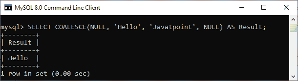

* * *

### 57)我们如何使用 DISTINCT 语句？它有什么用？

DISTINCT 关键字用于确保提取的值始终具有唯一的值。它不允许有重复的值。DISTINCT 关键字与 SELECT 语句一起使用，并从表的列中检索不同的值。我们可以借助以下语法来使用它:

```

SELECT DISTINCT column_lists FROM table_name WHERE [condition];

```

假设我们有一个包含八条记录的表“customer”，其中 name 列有一些重复的值。

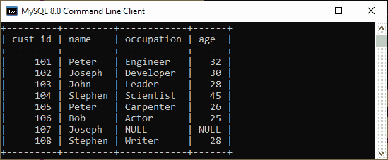

如果我们想得到没有任何重复值的名称列，那么 DISTINCT 关键字是必需的。执行以下命令将返回具有唯一值的名称列。

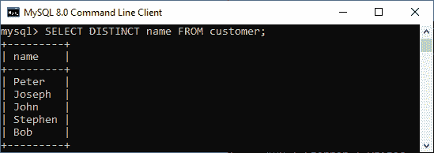

* * *

### 58)使用 ORDER BY 子句的默认数据排序是什么？怎么能改变呢？

ORDER BY 子句用于按升序或降序对表数据进行排序。默认情况下，它将按升序对表格进行排序。如果我们想改变它的默认行为，我们需要在 ORDER BY 子句中的列名后面使用 DESC 关键字。

下面给出了这样做的语法:

```

SELECT expressions FROM tables  
WHERE conditions  
ORDER BY expression [ASC | DESC];  

```

在前面的示例中，我们采用了一个客户表。现在，我们也将在上面演示 ORDER BY 条款。

在下面的输出中，我们可以看到第一个查询将根据名称列以升序对表数据进行排序。但是，如果我们通过指定 DESC 关键字运行第二个查询，表的顺序将按降序更改。

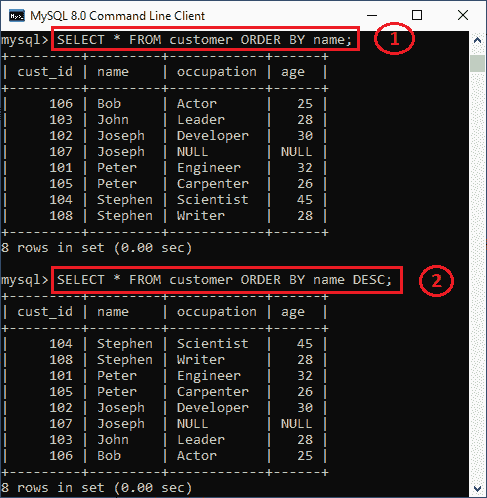

* * *

### 59)以下查询是否返回输出？

```

SELECT subject_code, AVG (marks)
FROM Students
WHERE AVG(marks) > 70
GROUP BY subject_code;

```

**回答:**否，上面的查询没有返回输出，因为我们不能使用 WHERE 子句来限制组。我们需要使用 HAVING 子句而不是 WHERE 子句来获得正确的输出。

* * *

### WHERE 和 HAVING 子句有什么区别？

主要区别在于 WHERE 子句用于在建立任何分组之前过滤记录，而 HAVING 子句用于过滤组中的值。下面的对比图解释了最常见的差异:

| 在哪里 | 拥有 |
| 该子句在行操作中实现。 | 此子句在列操作中实现。 |
| 它不允许使用聚合函数。 | 它可以与聚合函数一起使用。 |
| 该子句可以与 SELECT、UPDATE 和 DELETE 语句一起使用。 | 此子句只能与 SELECT 语句一起使用。 |

要了解更多区别，[点击这里](https://www.javatpoint.com/where-vs-having)。

* * *

### 61)SQL 中有多少聚合函数可用？

聚合函数用于确定和计算表中的几个值，并将结果作为一个数字返回。例如，所有值的平均值、所有值的总和以及特定值分组中的最大值和最小值。

以下语法说明了如何使用聚合函数:

```

function_name (DISTINCT | ALL expression)  

```

**SQL 提供七(7)个聚合函数，如下所示:**

*   **AVG():** 此函数用于返回指定列的平均值。
*   **COUNT():** 此函数用于返回表行数，包括空值的行。
*   **MAX():** 此函数用于返回组中最大的值。
*   **MIN():** 此函数用于返回组中的最小值。
*   **SUM():** 此函数用于返回指定列的合计值(非空)。
*   **FIRST()** :此函数用于返回表达式的第一个值。
*   **LAST()** :此函数用于返回表达式的最后一个值。

* * *

### 62)什么是 SQL 注入？

SQL 注入是网站和 web 应用程序代码中的一种漏洞，允许攻击者控制后端操作，并访问、检索和销毁数据库中的敏感数据。在这种技术中，恶意的 SQL 语句被插入到数据库条目字段中，一旦它们被执行，数据库就容易受到攻击者的攻击。这种技术通常用于通过利用数据驱动的应用程序来访问敏感数据和在数据库上执行管理活动。又称为 **SQLi 攻击。**

SQL 注入的一些常见例子是:

*   访问机密数据来修改 SQL 查询以获得所需的结果。
*   UNION 攻击从不同的数据库表中窃取数据。
*   检查数据库以提取关于数据库版本和结构的信息。

* * *

### 63)RANK()和 DENSE_RANK()函数有什么区别？

**RANK 函数**确定结果集中有序分区内每一行的等级。如果这两行被分配了相同的排名，那么排名中的下一个数字将是它的前一个排名加上一些重复的数字。例如，如果我们有三个排名为 4 的记录，则列出的下一个排名将是排名 7。

函数的作用是:根据指定的列值，为分区内的每一行分配一个唯一的秩，并且没有任何间隙。它总是以连续的顺序指定排名。如果这两行被赋予相同的等级，这个函数将赋予它相同的等级，下一个等级是下一个序号。例如，如果我们有 3 个排名为 4 的记录，则列出的下一个排名将是排名 5。

* * *

### 64)是否可以为标识列隐式插入一行？

是的。我们可以为标识列隐式插入一行。下面是一个这样做的例子:

```

SET IDENTITY_INSERT TABLE1 ON
INSERT INTO demo_table1 (id, name, branch)
SELECT id, name, branch FROM demo_table2
SET IDENTITY_INSERT OFF

```

* * *

### 65)什么是 SQL 注释？

注释是程序员可读的 SQL 查询中的解释或注释。它用来让人类更容易理解 SQL 语句。在解析 SQL 代码的过程中，它将被忽略。注释可以写在一行，也可以跨越几行。

*   **单行注释:**以两个连续的连字符(-)开始。
*   **多行注释:**以/*开头，以*/结尾。

## 高级 SQL MCQ 问答

本节提供基于高级查询优化的选择题和答案。

1)当您想要包含值不匹配的行时，需要什么类型的连接？

1.  等结合
2.  外部连接
3.  自然连接
4.  以上所有。

<button class="showanswer" onclick="showhide(1)">Show Answer</button> <button class="workspace" onclick="showworkspace(1)">Workspace</button>

**回答:** b

**说明:** Outer Join 返回符合指定条件的所有行，包括一个或两个表中不匹配的行。因此，选项(B)是正确的答案，因为外部联接是唯一可以显示不匹配记录的联接。

2)以下哪个选项与 CASE SQL 语句匹配？

1.  一种在 SQL 中建立 IF-THEN-ELSE 的方法。
2.  一种在 SQL 中建立循环的方法。
3.  一种在 SQL 中建立数据定义的方法。
4.  以上都不是。

<button class="showanswer" onclick="showhide(2)">Show Answer</button> <button class="workspace" onclick="showworkspace(2)">Workspace</button>

**回答:** a

**说明:**CASE 表达式是一个控制流函数，它评估一组条件，并在第一个条件满足时显示输出。它主要用于处理条件语句，与其他编程语言中的 IF-THEN-ELSE 语句相同。因此，选项(A)是正确的答案。

3)以下哪一项是 SQL 中的非法数据类型？

1.  数字
2.  泥炭田
3.  一滴
4.  线头

<button class="showanswer" onclick="showhide(3)">Show Answer</button> <button class="workspace" onclick="showworkspace(3)">Workspace</button>

**回答:** d

**说明:NUMBER** 数据类型用于定义精确或近似的数值。 **CLOB** 代表用于存储大量文本数据的字符大对象。 **BLOB** 代表二进制大对象，充当文件、图像、视频等对象的引用或指针。 **LINT** 是一个 SQL 方言 linter。它强调错误，解释它们有什么问题，为什么它们可能是错误的，以及作为开发人员，您可以做些什么来修复它们。因此，选项(D)是正确的答案。

4)如果视图定义中使用的实际关系发生变化，视图会立即更新。这些观点被称为 ______。

1.  即时视图
2.  瞬时视图
3.  物化视图
4.  唯物主义观点

<button class="showanswer" onclick="showhide(4)">Show Answer</button> <button class="workspace" onclick="showworkspace(4)">Workspace</button>

**回答:** c

**说明:**物化视图是存储在磁盘上的表，包含来自查询结果集的数据。这有助于保持数据库的最新状态。当视图定义中使用的实际关系发生变化时，视图被称为实体化视图，视图会立即更新。

5)处理 SQL 支持结构的 SQL 部分称为 _ _ _ _ _ _ _ _ _。

1.  持续构建经销商
2.  持续支持中心
3.  主存储介质
4.  持久存储模块

<button class="showanswer" onclick="showhide(5)">Show Answer</button> <button class="workspace" onclick="showworkspace(5)">Workspace</button>

**回答:** d

**说明:**持久存储模块(SQL/PSM)是一个功能，允许用户通过自己的添加来扩展基本的 SQL 功能。

6)关于相关子查询，下列哪一项是正确的？

1.  使用外部查询的结果来确定内部查询的处理。
2.  使用内部查询的结果来确定外部查询的处理。
3.  使用内部查询的结果来确定内部查询的处理。
4.  使用外部查询的结果来确定外部查询的处理。

<button class="showanswer" onclick="showhide(6)">Show Answer</button> <button class="workspace" onclick="showworkspace(6)">Workspace</button>

**回答:** a

**说明:**相关子查询用于逐行处理。它引用了外部查询中的一列，并对外部查询(父语句)处理的每一行计算一次，如 SELECT、UPDATE 或 DELETE 语句。另一方面，不相关的子查询首先评估子查询，然后确定外部查询的处理。

7)每当修改数据库时，系统都会执行一个名为 _ _ _ _ _ _ _ _ _ _ _ 的语句。

1.  功能
2.  引发
3.  包裹
4.  草案

<button class="showanswer" onclick="showhide(7)">Show Answer</button> <button class="workspace" onclick="showworkspace(7)">Workspace</button>

**回答:** b

**解释:**触发器是驻留在系统目录中的一组 SQL 查询。它是一种特殊类型的存储过程，在响应事件时自动调用。因此，选项(B)是正确的，因为触发器是每当数据库被修改时系统执行的语句。

8)交易开始于

1.  发出一个 COMMIT 语句
2.  发出回滚语句
3.  使用了 CREATE 语句
4.  上述全部

<button class="showanswer" onclick="showhide(8)">Show Answer</button> <button class="workspace" onclick="showworkspace(8)">Workspace</button>

**回答:** d

**说明:**一个交易有一个开始和结束的语句。当下列事件之一发生时，它开始:CREATE、COMMIT、ROLLBACK 等。因此，选项(D)是正确的。

9)以下哪些顺序语句不能在函数中使用？

1.  如果
2.  等待
3.  情况
4.  环

<button class="showanswer" onclick="showhide(9)">Show Answer</button> <button class="workspace" onclick="showworkspace(9)">Workspace</button>

**回答:** b

**解释:**函数可以使用任何类型的顺序语句，如 IF、CASE、LOOP、NEXT、EXIT 或 NULL 语句。但是，它有一个例外:它不允许使用 WAIT 语句，因为它不能在函数内部使用。WAIT 语句用于安排系统工作。

10)在数据类型 TIME(p)中，p 代表什么？

1.  需要添加到时间中的延迟量
2.  允许的最大小时数
3.  秒的小数位数
4.  以上都不是

<button class="showanswer" onclick="showhide(10)">Show Answer</button> <button class="workspace" onclick="showworkspace(10)">Workspace</button>

**回答:** c

**说明:**SQL TIME 数据类型使用 24 小时制表示一天的时间。p 表示秒的小数部分的位数。它的值范围从 0 到 7。如果我们不指定 p，默认为 7。因此，选项(C)是正确答案。

11)以下哪一项是 SQL 标准中的特权？

1.  挑选
2.  插入
3.  更新
4.  上述全部

<button class="showanswer" onclick="showhide(11)">Show Answer</button> <button class="workspace" onclick="showworkspace(11)">Workspace</button>

**回答:** d

**说明:**特权允许用户对特定的数据库对象执行一组活动。特权分为两类:

*   **系统权限**:这表示用户有能力创建、更改或“删除”数据库组件。
*   **对象权限**:这使用户能够以权限执行、选择、插入或删除数据库对象中的数据。

12)以下哪一项表示引用完整性约束的另一个名称？

1.  功能依赖
2.  子集依赖关系
3.  超集依赖关系
4.  主要依赖关系

<button class="showanswer" onclick="showhide(12)">Show Answer</button> <button class="workspace" onclick="showworkspace(12)">Workspace</button>

**回答:** b

**说明:**参照完整性指定两个表之间的关系。每个表都必须有一个主键。它也被称为子集依赖关系，因为表 2 的表 1 中的外键值集必须是表 2 中主键值集的子集。

13)触发器是存储的代码块，必须调用它们才能运行。

1.  真实的
2.  错误的

<button class="showanswer" onclick="showhide(13)">Show Answer</button> <button class="workspace" onclick="showworkspace(13)">Workspace</button>

**回答:** b

**解释:**选项(B)是正确的，因为触发器是一组 SQL 语句，以唯一的名称驻留在系统内存中，并在数据库服务器事件发生时自动执行。

14)外部联接与等联接相同，只是删除了结果表中的一个重复列。

1.  真实的
2.  错误的

<button class="showanswer" onclick="showhide(14)">Show Answer</button> <button class="workspace" onclick="showworkspace(14)">Workspace</button>

**回答:** b

**说明:**等联接是使用等比较运算符来匹配两个表的键的联接。相比之下，外部联接是一种联接，其中一个表中没有匹配行的行在另一个表中被选择，未知列的值为空。

15)事务是密切相关的更新命令的集合，必须全部完成，或者根本不完成，数据库才能有效。

1.  真实的
2.  错误的

<button class="showanswer" onclick="showhide(15)">Show Answer</button> <button class="workspace" onclick="showworkspace(15)">Workspace</button>

**回答:** a

**说明:**事务是在数据库中执行单个或多个任务的一组语句。在 SQL 中，每个事务必须发生两件事:

*   提交事务时，要么所有修改都成功。
*   或者，当事务回滚时，所有修改都被撤消。

* * *