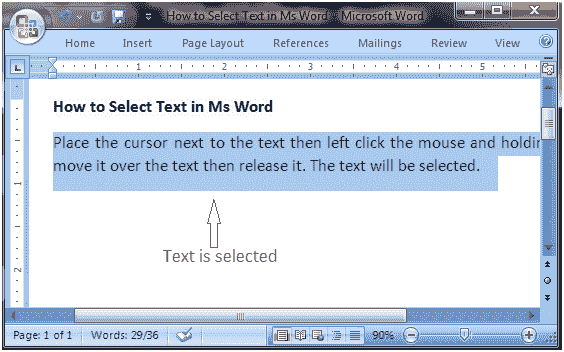

# 如何在微软 Word 中选择文本

> 原文:[https://www.javatpoint.com/to-select-text-in-ms-word](https://www.javatpoint.com/to-select-text-in-ms-word)

将光标放在文本旁边，然后左键单击鼠标并按住它，在文本上移动它，然后释放它。文本将被选中。

选择文本的一些快捷方式有:

*   要选择单个单词，请双击该单词
*   要选择整个段落，请在段落内双击
*   要选择整个文档，请在“主页”选项卡的“编辑”组中，单击“选择”，然后选择“全选”选项或按 CTRL+A
*   Osh ft+Arrow；按住 shift 键然后按下箭头键，单词将选择箭头键方向的文本。有三个箭头键，因此您可以从三个不同的方向选择文本。

**见图；**

