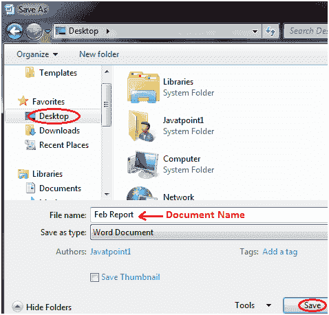

# 如何在微软 Word 中保存文档

> 原文：<https://www.javatpoint.com/to-save-the-document-in-ms-word>

创建文档时，保存文档以便以后查看或重用非常重要。保存文档的基本步骤如下所示；

*   单击“微软办公”按钮
*   将出现不同命令的列表
*   单击“另存为”命令
*   它显示“另存为”对话框
*   用所需的名称将文档保存到所需的位置

您也可以从列表中选择“保存”命令，以相同的标题将文档保存到当前位置。如果您正在保存新文档，它会显示“另存为”对话框。

保存文档的快捷方式是按“Ctrl+S”键。它会打开“另存为”对话框，您可以在其中命名文档并将其保存到所需位置。

**见图:**

 