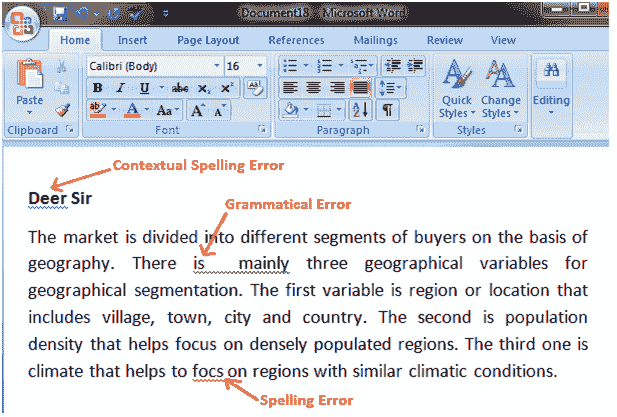
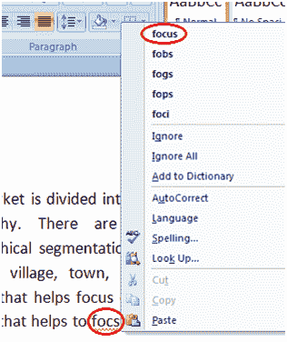

# 如何纠正微软 Word 中的错误

> 原文:[https://www.javatpoint.com/to-correct-errors-in-ms-word](https://www.javatpoint.com/to-correct-errors-in-ms-word)

当您在文档中键入文本时，默认情况下，如果有任何上下文、拼写或语法错误，Word 会通知您。Word 以不同的方式通知你不同的错误；

如果文档中有任何上下文错误，它将用蓝线给文本加下划线。

如果文档中有任何拼写错误，它会用红线给文本加下划线。

如果文档中有任何语法错误，它将在文本下面加绿色下划线。

**见图:**

**纠正错误的步骤:**

*   将光标放在要更正的文本上
*   右键单击鼠标
*   将出现一个建议列表
*   左键点击选择正确的单词

**见图:**

