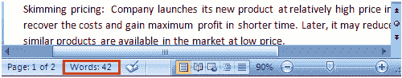

# 如何检查微软 Word 中的字数

> 原文:[https://www.javatpoint.com/to-check-word-count-ms-word](https://www.javatpoint.com/to-check-word-count-ms-word)

当您开始键入时，Word 会自动计算字数和页数，并在状态栏上显示信息。如果状态栏上没有字数统计，您可以右键单击状态栏并从菜单中选择字数统计选项。下面列出了检查字数的基本步骤；

*   打开文档
*   查看文档的左下角
*   您将看到世界总数和页数

**见图:**

要知道特定行或段落的字数，您必须选择它，然后 word 将显示其字数以及总字数，例如 15/40。在本例中，所选内容在总字数(40)中有 15 个单词。