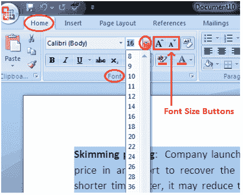

# 如何在微软 Word 中更改字体大小

> 原文:[https://www.javatpoint.com/to-format-font-size-in-ms-word](https://www.javatpoint.com/to-format-font-size-in-ms-word)

您可以轻松更改文档中文本的字体大小。下面列出了更改字体大小的基本步骤；

*   选择要修改的文本
*   在“主页”选项卡中，找到“字体”组
*   在字体组中，单击字体大小框旁边的下拉箭头
*   出现字体大小菜单
*   左键单击选择所需的字体大小
*   选择文本，然后单击增大或减小字体大小按钮

**见图:**

