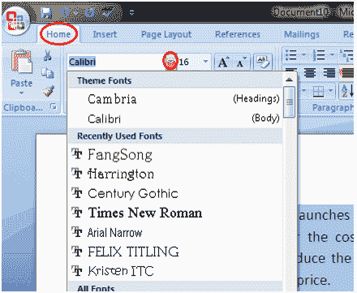

# 如何改变微软 Word 中的字体样式

> 原文:[https://www.javatpoint.com/to-format-font-style-in-ms-word](https://www.javatpoint.com/to-format-font-style-in-ms-word)

下面给出了更改文档中文本字体的基本步骤；

*   选择要修改的文本
*   选择主页选项卡并找到字体组
*   单击字体样式框旁边的下拉箭头
*   出现字体样式菜单
*   左键单击选择所需的字体样式
*   如果要将字体更改为粗体或斜体，请单击格式栏上的“B”或“I”图标。

**见图:**

