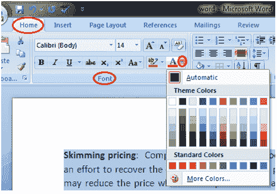

# 如何格式化微软 Word 中的字体颜色

> 原文：<https://www.javatpoint.com/to-format-font-color-in-ms-word>

微软 Word 允许您更改文本的字体颜色。如果要强调某个特定的单词或短语，可以更改其字体颜色。下面给出了改变字体颜色的基本步骤；

*   选择要修改的文本
*   在“主页”选项卡中，找到“字体”组
*   单击字体颜色按钮旁边的下拉箭头
*   出现字体颜色菜单
*   左键单击选择所需的字体颜色
*   Word 将更改选定文本的字体颜色。

**见图:**

