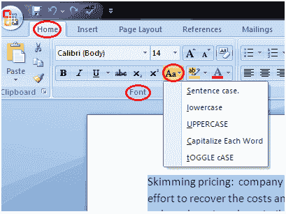

# 如何改变微软 Word 中的文本大小写

> 原文:[https://www.javatpoint.com/to-change-text-case-in-ms-word](https://www.javatpoint.com/to-change-text-case-in-ms-word)

您可以按照下面给出的步骤轻松更改文档中的文本大小写；

*   选择要更改的文本
*   在“主页”选项卡中，找到“字体”组
*   单击“更改案例”按钮中的下拉箭头
*   它显示文本大小写菜单
*   左键单击选择所需的案例

案例菜单提供四个选项；

**句子大小写:**把每个句子的第一个字母大写。

**小写:**将文字从大写改为小写。

**大写:**它将你的文本的所有字母大写。

**大写每个单词:**它将每个单词的第一个字母大写。

**切换大小写:**它允许你在两个大小写视图之间切换，例如在大写每个单词和大写每个单词之间切换。

**见图:**

