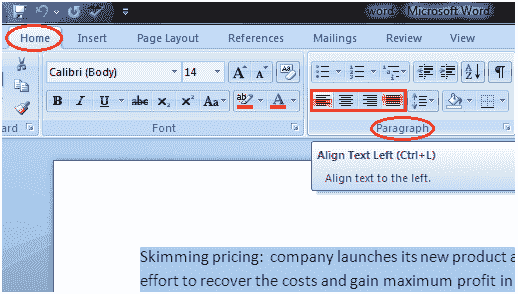

# 如何更改微软 Word 中的文本对齐方式

> 原文：<https://www.javatpoint.com/to-format-text-alignment-in-ms-word>

您可以更改文档中的文本对齐方式，使其更具代表性和可读性。下面给出了更改文本对齐方式的基本步骤；

*   选择要修改的内容
*   在“主页”选项卡中，找到“段落”组
*   它有四个对齐选项；

**向左对齐文本:**向左对齐文本

**居中:**使文本居中

**向右对齐文本:**向右对齐文本

**对齐:**将文本左右对齐

*   左键单击选择所需的对齐选项

**见图:**

