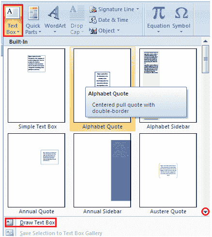

# 如何在微软 Word 中插入文本框

> 原文：<https://www.javatpoint.com/to-insert-a-text-box-in-ms-word>

文本框允许您控制文档中文本块的位置。您也可以用边框和底纹来设置它们的格式。插入文本框的两种常用方法如下:

方法 1:

*   选择“插入”选项卡
*   找到文本组
*   单击文本框按钮
*   它显示内置文本框菜单和绘制表格的选项
*   左键单击从菜单中选择所需的文本框格式

方法 2:

*   选择“绘制文本框”选项*   出现一个十字形光标*   左键单击鼠标并按住不放，拖动鼠标以绘制所需尺寸的方框

**见图:**

