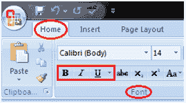

# 微软 Word 中的粗体、斜体和下划线命令

> 原文：<https://www.javatpoint.com/bold-italic-and-underline-command-in-ms-word>

这些命令在“主页”选项卡的“字体”组中给出。它们的功能如下:

*   **粗体:**它允许您加粗文档的文本
*   **斜体:**它允许您对文档文本进行斜体处理
*   **下划线:**它允许您给文档的文本加下划线

**见图:**

