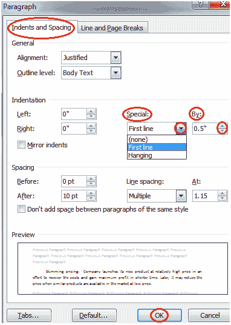

# 如何在微软 Word 中创建首行缩进

> 原文：<https://www.javatpoint.com/to-create-first-time-line-indent-in-ms-word>

您可以按照以下步骤在段落中创建缩进；

*   选择段落或将光标放在段落中的任何位置
*   选择“主页”选项卡
*   找到“段落”组，然后单击右下角的箭头
*   出现“段落”对话框
*   在“缩进和间距”部分，单击“特殊”字段中的下拉箭头
*   选择“第一行”选项
*   在“依据”字段中输入所需的缩进量，然后单击“确定”

**见图:**

