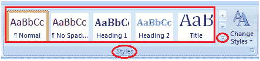
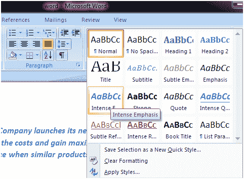

# 如何在微软 Word 中应用风格

> 原文：<https://www.javatpoint.com/to-apply-style-in-ms-word>

通过应用不同的样式，您可以在 MS Word 中创建专业且可呈现的文档。下面列出了在文档中应用样式的基本步骤；

*   选择要应用样式的文本
*   选择“主页”选项卡
*   在样式组中，您将看到不同的样式；

*   要查看更多样式，请单击下拉箭头
*   它显示样式菜单
*   左键单击选择所需的样式

**见图:**

