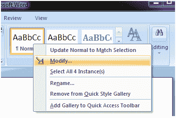
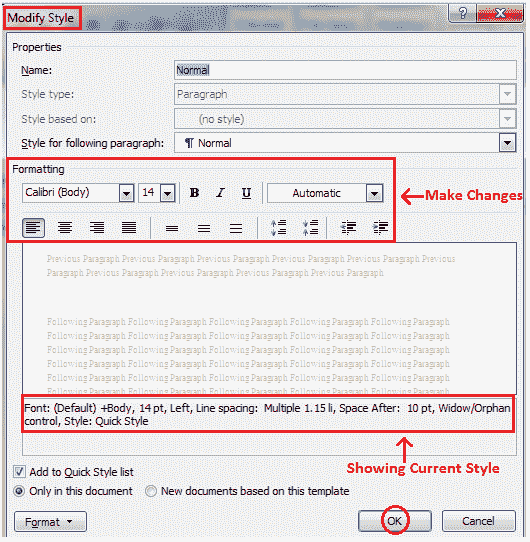

# 如何在微软 Word 中自定义样式

> 原文：<https://www.javatpoint.com/to-customize-style-in-ms-word>

如果您正在寻找内置样式中没有的格式选项，您可以修改或自定义现有样式以满足您的需求。自定义样式的步骤如下:

*   选择要修改的样式
*   右键单击鼠标
*   它显示不同命令的列表
*   选择“修改”选项；

*   出现“修改样式”对话框

**见图:**

*   对格式进行所需的更改
*   单击“确定”将更改应用于样式