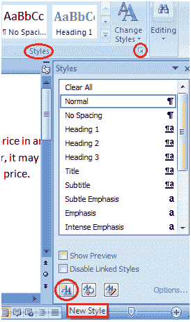
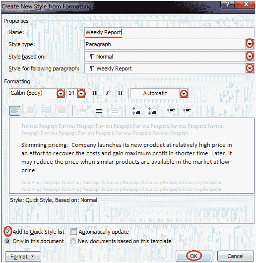

# 如何在微软 Word 中创建新样式

> 原文：<https://www.javatpoint.com/to-create-new-style-in-ms-word>

您可以在样式列表中添加新样式，例如，Word 允许您设置字体、图形、段落等样式。它有助于你在一个主题的所有文档中保持一致性。创建新样式的步骤如下所示；

*   选择“主页”选项卡
*   在“样式”组中，单击该组右下角的箭头
*   它显示“样式”任务窗格；

在“样式”任务窗格中，单击“新建样式”按钮

它显示“从格式创建新样式”对话框；

*   输入新样式的名称，并进行所有所需的更改
*   单击确定，新样式将被添加到样式列表中