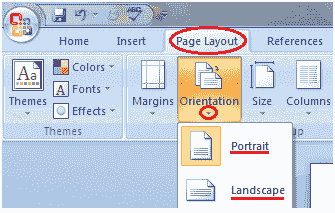

# 如何在微软 Word 中改变页面方向

> 原文：<https://www.javatpoint.com/to-change-page-orientation-in-ms-word>

页面方向是指文档显示的方向。它有两种类型；纵向(垂直)和横向(水平)。默认方向是纵向；可以通过以下步骤将其更改为横向；

*   选择页面布局选项卡
*   找到页面设置组
*   在“页面设置”组中，单击“方向”命令
*   它显示两个选项，纵向和横向
*   选择所需的页面方向

**见此图:**

