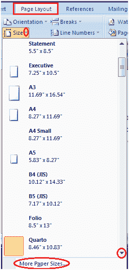

# 如何在微软 Word 中更改页面大小

> 原文:[https://www.javatpoint.com/to-change-page-size-in-ms-word](https://www.javatpoint.com/to-change-page-size-in-ms-word)

Word 中的默认纸张尺寸是 8.5 x 11 英寸，很容易适合打印机。这个大小不是固定的；如果您想要不同纸张大小的文档，可以更改它。改变纸张尺寸的步骤如下:

*   单击页面布局选项卡
*   在页面设置组中，单击大小命令
*   将出现纸张尺寸菜单
*   左键单击选择所需的纸张尺寸
*   要自定义页面尺寸，请单击“更多纸张尺寸”选项

**见此图:**

