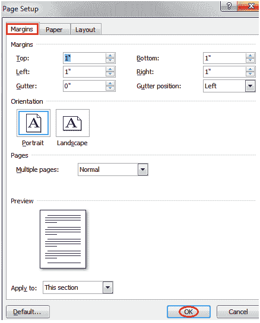

# 如何在微软 Word 中更改页边距

> 原文：<https://www.javatpoint.com/to-change-page-margins-in-ms-word>

边距是文档文本和边框之间的空间。默认情况下，它是一英寸的空间。根据您的需要，可以按照下列步骤进行更改；

*   选择页面布局选项卡
*   在“页面设置”组中，单击“边距”命令
*   将出现一个边距列表
*   左键单击选择所需的边距

**见图:**

要自定义页边距，请选择“自定义页边距”。它显示一个“页面设置”对话框。输入所需的边距大小，然后单击“确定”。

**见图:**

