# 如何在 Microsoft Word 文档中插入页眉和页脚

> 原文:[https://www . javatpoint . com/to-insert-ms-word 中的页眉和页脚](https://www.javatpoint.com/to-insert-header-and-footer-in-ms-word)

在 Microsoft Word 中，页眉和页脚用于插入附加信息，如**标题、文件名、日期、页码等。**Word 文档中页眉和页脚的存在使您的文档更加专业，更容易阅读和理解。

**页眉**出现在 Word 文档的**上边距，而**页脚**出现在 Word 文档**的**下边距。**

要在 [Microsoft Word](https://www.javatpoint.com/ms-word-tutorial) 中插入页眉和页脚，请遵循下面给出的基本步骤-

**步骤 1:** 打开要插入页眉和页脚的新 Word 文档或现有 Word 文档。

**步骤 2:** 转到功能区顶部的**插入**标签。

**第三步:**点击**页眉&页脚部分的**页眉或页脚**下拉菜单。**

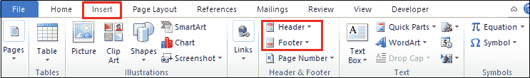

#### 注意:在我们的例子中，我们将使用标题下拉选项。

**步骤 4:** 屏幕上将显示一个页眉或页脚下拉菜单，其中包含内置页眉或页脚选项的列表。从内置列表中选择您想要的选项。

#### 注意:在我们的情况下，我们选择空白选项。

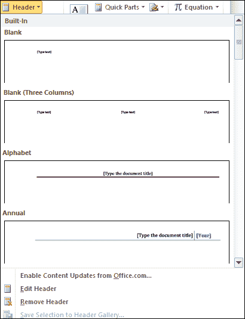

**第五步:**文档顶部(功能区)会出现一个带有页眉&页脚选项的**设计**标签，如下图截图所示。

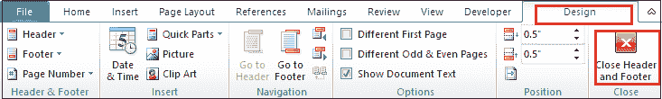

**第 6 步:**在页眉或页脚部分输入您想要的信息。

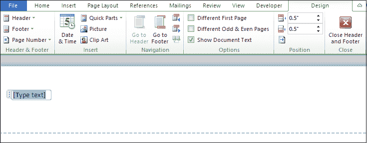

**步骤 7:** 在页眉部分键入所需文本后，单击功能区设计部分下的关闭页眉和页脚，或按键盘上的 Esc 键删除虚线下划线。现在，您可以看到标题被插入到 Word 文档中。

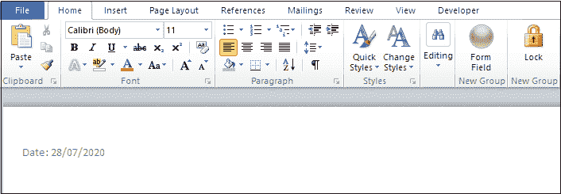

### 在页眉或页脚中插入日期或时间

要在页眉或页脚中插入日期或时间，请遵循以下说明-

1.转到功能区的**插入**选项卡，点击**文本**部分的**日期&时间**选项。

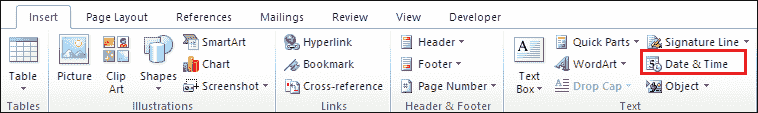

2.屏幕上将出现一个日期和时间对话框，在其中执行以下操作-

*   从可用格式中选择日期格式。
*   选择您想要的语言。
*   勾选自动更新复选框。
*   单击对话框底部的确定按钮。

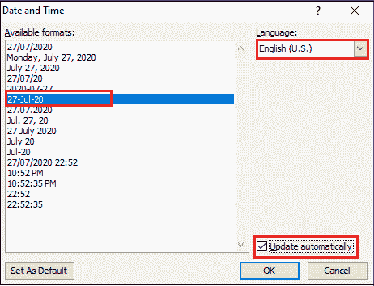

现在，您可以看到您选择的格式将出现在 Word 文档中。

### 编辑 Word 文档中的页眉和页脚

一旦在 Word 文档中创建了页眉和页脚，您也可以根据需要对其进行编辑。

在 Word 文档中编辑页眉和页脚有以下步骤。

**第一步:**进入功能区的**插入**选项卡，点击想要编辑的**页眉或页脚**下拉菜单。

#### 注意:在我们的例子中，我们要编辑一个标题，所以我们选择标题下拉选项。

**第二步:**屏幕上会出现一个**内置**表头选项窗口。点击**编辑标题**选项。

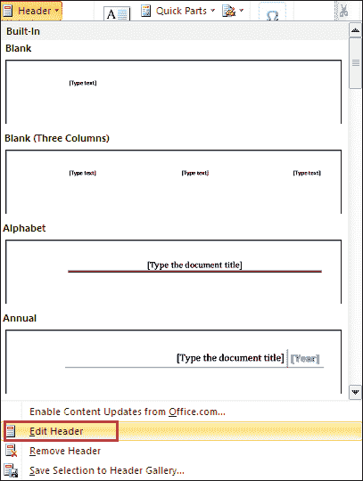

**第三步:**根据您的需求编辑表头。编辑页眉后，点击文档右上角的**关闭**页眉和页脚选项，蓝色虚线消失。

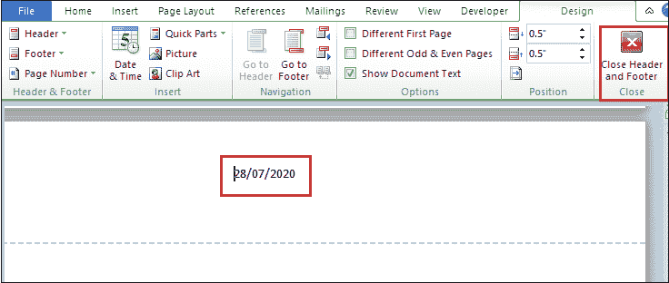

现在，您可以看到 Header 是根据您的需求进行编辑的。

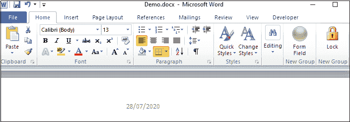

### 从 Word 文档中删除页眉和页脚

要从 Word 文档中删除页眉和页脚，请执行以下步骤-

1.  转到功能区的**插入**选项卡，点击**页眉&页脚选项。**
2.  屏幕上将出现页眉或页脚对话框。点击**移除页眉或移除页脚选项。**

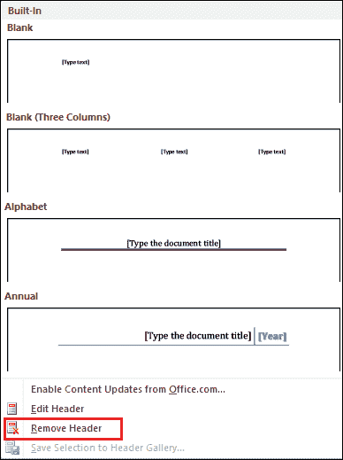

* * *