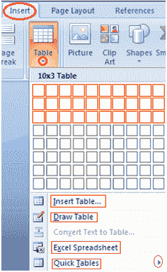

# 如何在微软 Word 中插入表格

> 原文:[https://www.javatpoint.com/to-insert-table-in-ms-word](https://www.javatpoint.com/to-insert-table-in-ms-word)

表格是微软 Word 的一个通用工具。它允许你组织你的信息，也就是说，你可以对齐文本，显示数字数据，创建表格和日历。插入表格的步骤如下；

*   将光标放在要插入表格的位置
*   选择“插入”选项卡
*   在表格组中，单击表格命令
*   它显示插入表格的不同选项
*   选择所需选项以插入表格

**见图:**

