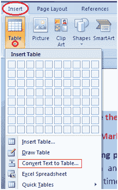
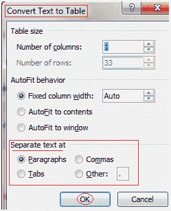

# 将文本转换为表格

> 原文:[https://www . javatpoint . com/to-convert-text-to-table-in-ms-word](https://www.javatpoint.com/to-convert-text-to-table-in-ms-word)

*   选择文本
*   选择“插入”选项卡
*   在表格组中，单击表格命令
*   选择“将文本转换为表格”选项；

*   它会显示一个对话框
*   在“分隔文本于”部分选择所需选项
*   单击“确定”，文本将转换为表格

**见此图:**

