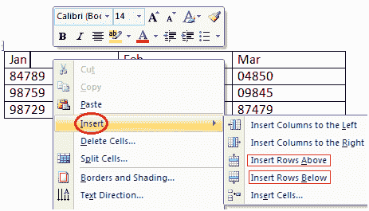

# 如何在表格中添加行

> 原文:[https://www.javatpoint.com/to-add-row-in-table-in-ms-word](https://www.javatpoint.com/to-add-row-in-table-in-ms-word)

如果要在表中增加或添加新行，可以按照下面给出的步骤操作；

*   将光标放在要添加行的上方或下方的行中
*   右键单击鼠标
*   出现一个菜单
*   将箭头放在插入选项上
*   它将显示一个菜单
*   根据需要，选择“在上方插入行”或“在下方插入行”

**见此图:**

