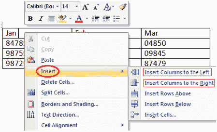

# 如何在表中添加列

> 原文：<https://www.javatpoint.com/to-add-column-in-table-in-ms-word>

如果要在表中增加或添加新列，可以按照以下步骤操作；

*   将光标放在要添加列的相邻列中
*   右键单击鼠标
*   它显示一个菜单
*   将箭头放在插入选项上
*   它显示了命令列表
*   根据需要，选择“向右插入列”或“向左插入列”

**见图:**

