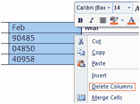
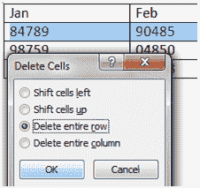

# 如何删除表中的列或行

> 原文:[https://www . javatpoint . com/to-delete-栏-行-表格-in-ms-word](https://www.javatpoint.com/to-delete-column-or-row-in-table-in-ms-word)

table 命令还允许您删除表中的列或行。您可以按照以下步骤删除不需要的列或行；

*   选择表格的列或行
*   右键单击鼠标
*   出现一个菜单
*   根据需要选择“删除列”或“删除行”

**见图:**

 