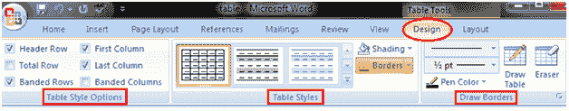
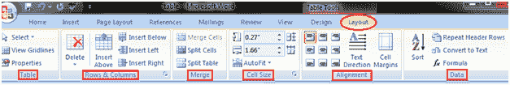

# 如何修改表格

> 原文:[https://www.javatpoint.com/to-modify-table-in-ms-word](https://www.javatpoint.com/to-modify-table-in-ms-word)

Word 允许您根据需要自定义表格。您可以用不同的方式修改您的表格，即您可以选择表格样式、表格设计、绘制边框。修改表格的步骤如下:

*   选择表格
*   功能区上将出现两个新选项卡“设计”和“布局”
*   在“设计”选项卡上，您将看到三组修改表格的命令；表格样式选项、表格样式和绘制边框；

*   布局选项卡有六组命令来格式化表格；

