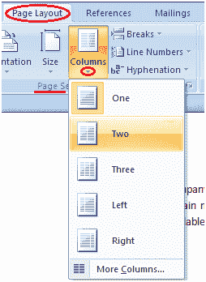

# 如何将文本拆分为列

> 原文：<https://www.javatpoint.com/to-split-text-to-column-in-ms-word>

您可以将文本拆分为列，如下图所示。它有助于你让你的文本更易读、更形象。下面给出了该过程中涉及的步骤；

*   打开文档
*   选择页面布局选项卡
*   在页面设置组中，单击列命令
*   它显示了将文本拆分为列的选项列表
*   选择所需选项

**见图:**

