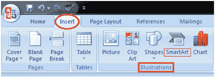
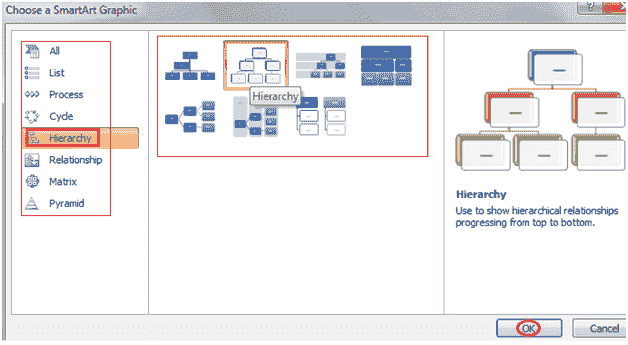

# 如何插入智能艺术图形

> 原文:[https://www . javatpoint . com/to-insert-smart-art-graphics-in-ms-word](https://www.javatpoint.com/to-insert-smart-art-graphics-in-ms-word)

您可以在文档中插入智能艺术图形，以有效地传达您的信息。您可以插入流程、关系或组织层次结构。插入智能艺术图形的步骤如下；

*   将光标放在文档中要插入图形的位置
*   选择“插入”选项卡
*   在插图组中，选择“智能艺术”命令；

*   在左侧，将出现一个包含类别列表的对话框
*   在中间，你会看到一个类别中的插图
*   选择所需的插图，然后单击“确定”

**见图:**

