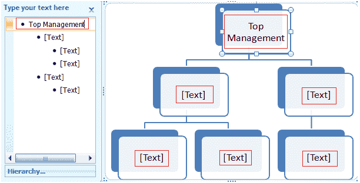

# 如何在智能艺术图形中添加文本

> 原文：<https://www.javatpoint.com/to-add-text-in-smart-art-graphics-in-ms-word>

Word 还允许您在智能艺术图形中添加文本；你可以添加事实、数字和任何其他信息。添加智能艺术图形的步骤如下；

*   选择图形
*   如果任务窗格不可见，则显示在左侧，然后单击图形左侧的箭头
*   在任务窗格字段中键入将出现在图形中的文本
*   您也可以直接在文本区域的图形中键入文本
*   输入文本后关闭任务窗格，并在图形外单击

**见图:**

