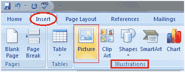
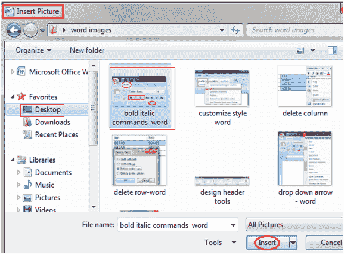

# 如何在文档中插入图片

> 原文：<https://www.javatpoint.com/to-insert-picture-in-document-in-ms-word>

图片使我们的文字更有吸引力和可读性。您可以按照以下步骤在文本中插入相关图片；

*   将光标放在要插入图片的位置
*   选择功能区上的“插入”选项卡
*   在插图组中，单击图片命令；

*   它显示“插入图片”对话框
*   选择所需的图像
*   单击插入插入图片

**见图:**

