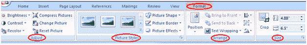

# 如何格式化图片或剪贴画

> 原文：<https://www.javatpoint.com/to-format-picture-or-clip-art-in-ms-word>

您可以更改图片或剪贴画的外观，以增强其视觉效果。“格式”选项卡为您提供了各种设置图片格式的选项，如对比度、更改颜色、线条样式、裁剪等。格式化图片或剪贴画的步骤如下；

*   选择要格式化的图片或剪贴画
*   “格式”选项卡出现在功能区中
*   单击格式选项卡
*   它显示四组相关命令来修改或格式化图片或剪贴画

**见图:**

