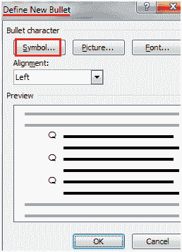
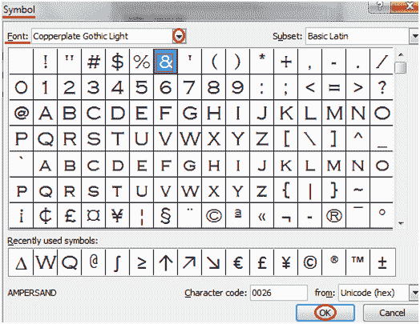

# 如何将符号用作项目符号

> 原文:[https://www . javatpoint . com/to-use-symbols-in-ms-word](https://www.javatpoint.com/to-use-symbols-as-bullets-in-ms-word)

您可以用符号替换项目符号，使您的列表更有意义和吸引力。下面给出了该过程中涉及的步骤；

*   选择要转换为项目符号列表的文本
*   选择“主页”选项卡
*   在段落组中，单击项目符号命令
*   单击“定义新项目符号”选项
*   出现“定义新项目符号”对话框；

*   单击“符号”命令
*   它显示“符号”对话框
*   选择所需的符号
*   有关更多选项，请单击字体字段旁边的下拉箭头

**见图:**

