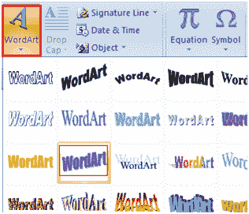
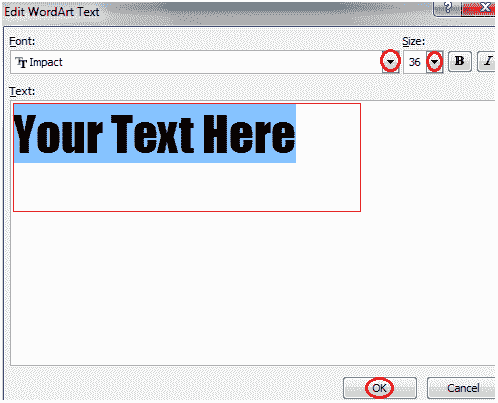

# 如何插入艺术字

> 原文：<https://www.javatpoint.com/to-insert-wordart-in-ms-word>

Word Art 旨在让您的文本更具吸引力；您可以格式化文本，使其看起来像图片，并以不同的方式增强其外观。插入艺术字的步骤如下；

*   将光标放在要插入艺术字的位置
*   选择“插入”选项卡
*   在文本组中，单击“艺术字”按钮
*   出现艺术字菜单；

*   选择所需的艺术字样式
*   出现“编辑艺术字文本”对话框
*   在文本区域中键入文本，然后单击确定

**见图:**

