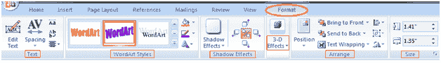

# 如何格式化艺术字

> 原文:[ms 字 https://www.javatpoint.com/to-format-wordart](https://www.javatpoint.com/to-format-wordart--in-ms-word)

Word 还允许您自定义艺术字。您可以根据需要更改艺术字的形状、字体和大小以及颜色。格式化艺术字的步骤如下；

*   选择文档中的艺术字
*   “格式”选项卡出现在功能区中
*   它提供了五组相关的命令
*   单击合适的命令在艺术字中进行所需的更改

**见图:**

