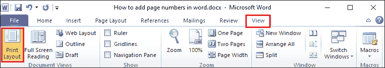
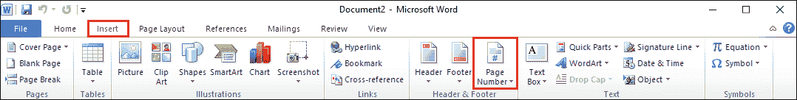
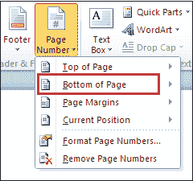
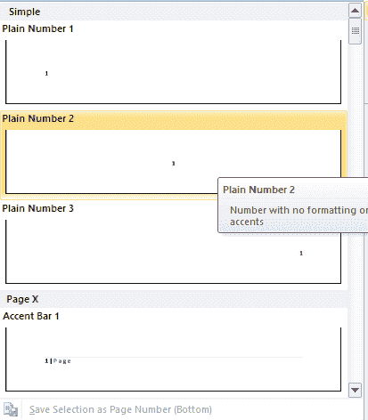
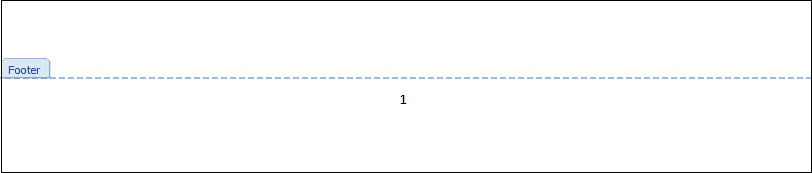
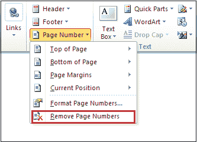

# 如何在 Word 中添加页码

> 原文:[https://www.javatpoint.com/how-to-add-page-numbers-in-word](https://www.javatpoint.com/how-to-add-page-numbers-in-word)

当我们写大型文档时，如**论文、书籍、项目报告等**，页码是最重要的选择。与内容表相关联的页码，帮助我们轻松找到想要阅读的特定内容或主题。

Microsoft word 提供了在 word 文档中添加页码的最简单方法。

**第一步:**打开要添加页码的 word 文档。

**第二步:**转到屏幕顶部的**查看**选项卡，选择**打印布局**，如下图截图所示。

**第三步:**现在，点击功能区上的**插入标签，然后从**页眉&页脚**部分点击**页码**。**

**第四步:**屏幕上出现不同页码选项的列表，从下拉菜单中点击**页面底部**在页面底部添加页码。

**第五步:**屏幕出现**页码设计**窗口，根据您的要求选择页码设计。选择页码设计后，它会自动在页面上添加页码。

下面的截图显示页码被添加到页脚中。

## 从 Word 中删除页码

从 Word 中删除页码有以下步骤-

**第一步:**点击功能区上的**插入标签，点击**页眉&页脚**部分的**页码**。**

**第二步:**屏幕上出现不同页码选项的列表，点击下拉菜单中的**删除页码**删除页码。

* * *